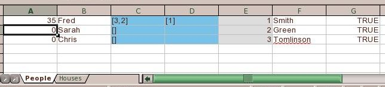
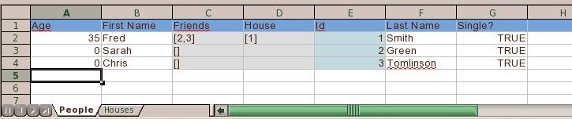

[[odf]]
= ODF Datastores
:_basedir: ../
:_imagesdir: images/

DataNucleus supports persistence to ODF _spreadsheets_ using the https://github.com/datanucleus/datanucleus-odf[datanucleus-odf] plugin, 
which makes use of the ODFDOM project. Simply specify your "connectionURL" as follows

-----
datanucleus.ConnectionURL=odf:file:myfile.ods
-----

replacing `myfile.ods` with your filename, which can be absolute or relative. This connects to a file on your local machine. 
You need to have the _org.odftoolkit_ `odfdom-java.jar` in the CLASSPATH.

Things to bear in mind with ODF usage :-

* Relations : A spreadsheet cannot store related objects directly, since each object is a row of a particular worksheet. 
DataNucleus gets around this by storing the String-form of the identity of the related object in the relation cell.
See this 

== Worksheet Headers

A typical spreadsheet has many rows of data. It contains no names of columns tying the data back to the input object (field names). 
DataNucleus allows an extension specified at _class_ level called *include-column-headers* (should be set to true). 
When the table is then created it will include an extra row (the first row) with the column names from the metadata (or field names if no column names were defined).
For example

