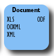
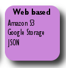
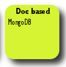

[[datastores]]
= Datastores Guide
:_basedir: ../
:_imagesdir: images/

The DataNucleus AccessPlatform is designed for flexibility to operate with any type of datastore. 
We already support a very wide range of datastores and this will only increase in the future. 
In this section you can find the specifics for particular supported datastores over and above what was already addressed for JDO and JPA persistence.

[cols="1,7a"]
|===
|image:../images/datastore/datastore_rdbms.png[RDBMS]
|link:#rdbms[RDBMS] : tried and tested since the 1970s, relational databases form an integral component of many systems. 
They incorporate optimised querying mechanisms, yet also can suffer from object-relational impedance mismatch in some situations. 
They also require an extra level of configuration to map from objects across to relational tables/columns.

|image:../images/datastore/datastore_mapbased.png[Map-Based]
|* link:#hbase[HBase] : HBase is a map-based datastore originated within Hadoop, following the model of BigTable.
* link:#cassandra[Cassandra] : Cassandra is a distributed robust clustered datastore.

|image:../images/datastore/datastore_graphbased.png[Graph-Based]
|link:#neo4j[Neo4J] : plugin providing persistence to the Neo4j graph store

|
|* link:#odf[Open Document Format (ODF)] : ODF is an international standard document format, and its spreadsheets provide a widely used form for publishing of data, making it available to other groups.
* link:#excel[Excel (XLS)] : Excel spreadsheets provide a widely used format allowing publishing of data, making it available to other groups (XLS format).
* link:#ooxml[Excel (OOXML)] : Excel spreadsheets provide a widely used format allowing publishing of data, making it available to other groups (OOXML format).
* link:#xml[XML] : XML defines a document format and, as such, is a key data transfer medium.

|
|* link:#json[JSON] : another format of document for exchange, in this case with particular reference to web contexts.
* link:#amazons3[Amazon S3] : Amazon Simple Storage Service.
* link:#googlestorage[Google Storage] : Google Storage.

|
|link:#mongodb[MongoDB] : plugin providing persistence to the MongoDB NoSQL datastore

|image:../images/datastore/datastore_others.png[Others]
|* link:#ldap[LDAP] : an internet standard datastore for indexed data that is not changing significantly.
* _NeoDatis_ : an open source object datastore. Fast persistence of large object graphs, without the necessity of any object-relational mapping (no longer supported, use DataNucleus 5.0).
|===

link:../extensions/extensions.html#store_manager[image:../images/nucleus_plugin.png[]]

If you have a requirement for persistence to some other datastore, then it would likely be easily provided by creation of a DataNucleus _StoreManager_. 
Please contact us via the forum so that you can provide this and contribute it back to the community.

include::_datastores_rdbms.adoc[leveloffset=+1]

include::_datastores_cassandra.adoc[leveloffset=+1]
include::_datastores_excel.adoc[leveloffset=+1]
include::_datastores_ooxml.adoc[leveloffset=+1]
include::_datastores_odf.adoc[leveloffset=+1]
include::_datastores_xml.adoc[leveloffset=+1]

include::_datastores_json.adoc[leveloffset=+1]
include::_datastores_amazons3.adoc[leveloffset=+1]
include::_datastores_googlestorage.adoc[leveloffset=+1]

include::_datastores_hbase.adoc[leveloffset=+1]
include::_datastores_mongodb.adoc[leveloffset=+1]
include::_datastores_neo4j.adoc[leveloffset=+1]

include::_datastores_ldap.adoc[leveloffset=+1]

