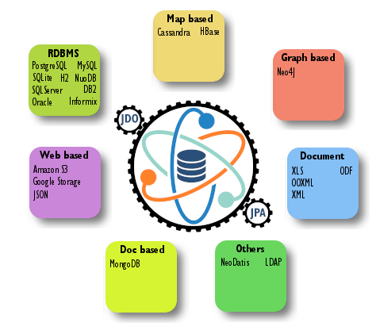

[[index]]
= DataNucleus
:_basedir: 
:_imagesdir: images/
:notoc:
:titlepage:
:grid: cols

There are two standard API's for persistence in Java - link:jdo/persistence.html[Java Data Objects (JDO)] and link:jpa/persistence.html[Java Persistence API (JPA)]. 
DataNucleus v{version} supports both, fully, and also provides support for a link:rest/rest.html[REST API].

* *APIs Supported* : link:jdo/persistence.html[JDO 3.2], link:jpa/persistence.html[JPA 2.2+], link:rest/rest.html[REST]
* *Mapping Supported* : link:jdo/mapping.html[JDO], link:jpa/mapping.html[JPA]
* *Datastores Supported* : link:datastores/datastores.html#rdbms[RDBMS], link:datastores/datastores.html#excel[Excel],
link:datastores/datastores.html#ooxml[OOXML], link:datastores/datastores.html#odf[ODF], link:datastores/datastores.html#xml[XML],
link:datastores/datastores.html#hbase[HBase], link:datastores/datastores.html#mongodb[MongoDB], link:datastores/datastores.html#cassandra[Cassandra],
link:datastores/datastores.html#neo4j[Neo4j], link:datastores/datastores.html#json[JSON], link:datastores/datastores.html#amazons3[Amazon S3],
link:datastores/datastores.html#googlestorage[GoogleStorage], link:datastores/datastores.html#ldap[LDAP]
* *JRE required* : 1.8 or above

*Are you migrating to this version from an older version? : if so, please link:migration.html[read this first] about how to upgrade*

Documentation for all aspects of DataNucleus v{version} support for the JDO and JPA APIs are shown below, including PDF downloads.

[cols="1a,1a",frame="none", options="noheader"]
|===
|*JDO Guides*

* link:jdo/getting_started.html[JDO Getting Started Guide] icon:file-pdf-o[link="./jdo/getting_started.pdf"]
* link:jdo/mapping.html[JDO Mapping Guide] icon:file-pdf-o[link="./jdo/mapping.pdf"]
* link:jdo/enhancer.html[JDO Enhancer Guide] icon:file-pdf-o[link="./jdo/enhancer.pdf"]
* link:jdo/persistence.html[JDO Persistence Guide] icon:file-pdf-o[link="./jdo/persistence.pdf"]
* link:jdo/query.html[JDO Query Guide] icon:file-pdf-o[link="./jdo/query.pdf"]
* link:jdo/tools.html[JDO Tools Guide] icon:file-pdf-o[link="./jdo/tools.pdf"]

|*JPA Guides*

* link:jpa/getting_started.html[JPA Getting Started Guide] icon:file-pdf-o[link="./jpa/getting_started.pdf"]
* link:jpa/mapping.html[JPA Mapping Guide] icon:file-pdf-o[link="./jpa/mapping.pdf"]
* link:jpa/enhancer.html[JPA Enhancer Guide] icon:file-pdf-o[link="./jpa/enhancer.pdf"]
* link:jpa/persistence.html[JPA Persistence Guide] icon:file-pdf-o[link="./jpa/persistence.pdf"]
* link:jpa/query.html[JPA Query Guide] icon:file-pdf-o[link="./jpa/query.pdf"]
* link:jpa/tools.html[JPA Tools Guide] icon:file-pdf-o[link="./jpa/tools.pdf"]

|===

[cols="1a,1a",frame="none", options="noheader"]
|===
|*JDO References*

* link:jdo/annotations.html[JDO Annotations Reference] icon:file-pdf-o[link="./jdo/annotations.pdf"]
* link:jdo/metadata_xml.html[JDO XML MetaData Reference] icon:file-pdf-o[link="./jdo/metadata_xml.pdf"]
* link:jdo/metadata_api.html[JDO MetaData API Reference] icon:file-pdf-o[link="./jdo/metadata_api.pdf"]

|*JPA References*

* link:jpa/annotations.html[JPA Annotations Reference] icon:file-pdf-o[link="./jpa/annotations.pdf"]
* link:jpa/metadata_xml.html[JPA XML MetaData Reference] icon:file-pdf-o[link="./jpa/metadata_xml.pdf"]

|===

In addition to the JDO and JPA API support, we also provide a link:rest/rest.html[REST API Guide] icon:file-pdf-o[link="./rest/rest.pdf"] 
which approaches persistence from a different viewpoint.

The various aspects specific to datastores are covered in a link:datastores/datastores.html[Datastores Guide] icon:file-pdf-o[link="./datastores/datastores.pdf"] 

== Persistence API choice

When choosing the persistence API to use in your application you should bear the following factors in mind.

* *Target datastore* : JDO is designed for all datastores, whereas JPA is just designed around RDBMS and explicitly uses RDBMS/SQL terminology. 
If using RDBMS then you have the choice. If using, for example, a NoSQL store then JDO makes much more sense, though we have made efforts to make DataNucleus JPA adaptable to non-RDBMS features
* *Datastore interoperability* : are you likely to change your datastore type at some point in the future ? If so you likely ought to use JDO due to its design
* *Persistence API* : both persistence APIs are very similar. JDO provides more options and control though for basic persistence and retrieval, and there are differences only in the methods
* *ORM* : JDO has a more complete ORM definition, as shown on http://db.apache.org/jdo/jdo_v_jpa_orm.html[Apache JDO ORM Guide]
* *Query API* : do you need a flexible query language that is object-oriented and extensible ? JDOQL provides this and the implementation in DataNucleus allows extensions. 
JPQL is more closely aligned with RDBMS concepts and SQL. If you just want SQL then you can use either JDO or JPA since both provide this
* *Fetch Control* : do you need full control of what is fetched, and when ? JDO provides Fetch Groups, whereas JPA now provides Entity Graphs (a subset of Fetch Groups). 
Use JDO if full fetch groups is an important factor for your design, otherwise either
* *Developer Experience* : do your developers know a particular API already ? As mentioned the persistence API's themselves are very similar, though the metadata definition is different. 
Remember that you can use JPA metadata with the JDO persistence API, and vice-versa. You are more likely to find developers with JPA experience.

Read more over at http://db.apache.org/jdo/jdo_v_jpa.html[Apache JDO].

== Development Process

With all APIs supported by DataNucleus the development process is as follows.

* Develop your classes that are going to be involved in the persistence process as you would do normally. DataNucleus imposes little to no constraints on what you do in this respect.
* Define the persistence *mapping* for your classes, using either JDO annotations, JDO XML metadata, JPA annotations or JPA XML metadata, or a mixture of these.
* Set up your compile process to have a _post-compile_ step that will invoke the DataNucleus enhancer to *bytecode enhance* your classes for use in persistence.
* Develop your *persistence* and *query* code itself, that uses your persistable classes, and their involvement in the persistence process.
* Run your application!

== Contributing

If you find something that DataNucleus Access Platform can't handle you can always extend it using link:extensions/extensions.html[its extension mechanism] for one of its defined interfaces.
Just look for the image:images/nucleus_extensionpoint.png[] icon.

We provide an link:extensions/extensions.html[Extension Points Guide] icon:file-pdf-o[link="./extensions/extensions.pdf"] describing the points where the DataNucleus codebase 
can be extended with ease.

include::dependencies.adoc[leveloffset=+1]
