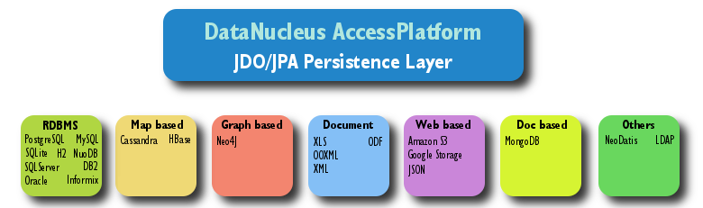

[[index]]
= DataNucleus
:_basedir: 
:_imagesdir: images/
:notoc:

DataNucleus AccessPlatform v5.1 provides persistence and retrieval of Java objects to a range of datastores using 
link:jdo/index.html[JDO]/link:jpa/mapping.html[JPA]/link:rest/rest.html[REST] APIs, 
with a range of query languages and is fully-compliant with JDO and JPA specifications. 

It is http://www.datanucleus.org/documentation/license.html[Apache 2 licensed]. 
*No other persistence solution offers the same range of APIs, datastores and query languages whilst also being fully compliant.*

*DataNucleus AccessPlatform 5.1 Checklist*

* *APIs Supported* : link:jdo/persistence.html[JDO 3.2], link:jpa/persistence.html[JPA 2.1+], link:rest/rest.html[REST]
* *MetaData/Mapping Supported* : link:jdo/mapping.html#class[JDO], link:jpa/mapping.html#class[JPA]
* *Datastores Supported* : link:datastores/index.html#rdbms[RDBMS], link:datastores/index.html#excel[Excel],
link:datastores/index.html#ooxml[OOXML], link:datastores/index.html#odf[ODF], link:datastores/index.html#xml[XML],
link:datastores/index.html#hbase[HBase], link:datastores/index.html#mongodb[MongoDB], link:datastores/index.html#cassandra[Cassandra],
link:datastores/index.html#neo4j[Neo4j], link:datastores/index.html#json[JSON], link:datastores/index.html#amazons3[Amazon S3],
link:datastores/index.html#googlestorage[GoogleStorage], link:datastores/index.html#ldap[LDAP]
* *JRE required* : 1.8 or above

*Beginners : The first thing to do is to visit the link:getting_started.html[Getting Started Guide]*

*Migrating from older version : please link:migration.html[read this first] about how to upgrade*

If you find something that DataNucleus Access Platform can't handle you can always extend it using link:extensions/extensions.html[its plugin mechanism] for one of its defined interfaces.
Just look for the image:images/nucleus_plugin.png[] icon.
