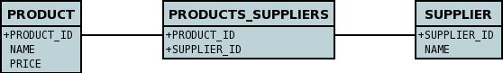

[[many_many_relations]]
= M-N Relations
:_basedir: ../
:_imagesdir: images/

You have a M-to-N (or Many-to-Many) relationship if an object of a class A has associated objects of class B,
and class B has associated objects of class A. This relationship may be achieved through Java Collection, 
Set, List or subclasses of these, although the only one that supports a true M-N is Set.

With DataNucleus this can be set up as described in this section, using what is called a _Join Table_ 
relationship. Let's take the following example and describe how to model it with the different types of 
collection classes. We have 2 classes, *Product* and *Supplier* as below.

[source,java]
-----
public class Product
{
    Set<Supplier> suppliers;

    ...
}

public class Supplier
{
    Set<Product> products;

    ...
}
-----

Here the *Product* class knows about the *Supplier* class. In addition the *Supplier* knows about the *Product* class, however with these relationships are really independent.

NOTE: Please note that RDBMS supports the full range of options on this page, whereas other datastores (ODF, Excel, HBase, MongoDB, etc) persist the Collection in a 
column in the owner object (as well as a column in the non-owner object when bidirectional) rather than using join-tables or foreign-keys since those concepts are RDBMS-only.

WARNING: when adding objects to an M-N relation, you MUST add to the owner side as a minimum, and optionally also add to the non-owner side. 
Just adding to the non-owner side will not add the relation.

WARNING: If you want to delete an object from one end of a M-N relationship you will have to remove it first from the other objects relationship. 
If you don't you will get an error message that the object to be deleted has links to other objects and so cannot be deleted.

TIP: If you want to have a M-N relation between classes and think of adding extra information to the join table, please think about where in your 
Java model that "extra information" is stored, and consider how Jakarta can know where to persist it. 
You would model this situation by creating an intermediate persistable class containing the extra information and make the relations to this intermediate class.

The various possible relationships are described below.

* link:#many_many_set[M-N Set relation]
* link:#many_many_list_ordered[M-N Ordered List relation]

== equals() and hashCode()

*Important : The element of a Collection ought to define the methods _equals_ and _hashCode_ so that updates are detected correctly.* 
This is because any Java Collection will use these to determine equality and whether an element is _contained_ in the Collection.
Note also that the _hashCode()_ should be consistent throughout the lifetime of a persistable object. 
By that we mean that it should *not* use some basis before persistence and then use some other basis (such as the object identity) after persistence in the equals/hashCode methods.

[[many_many_set]]
== Using Set

NOTE: Supported for RDBMS. Other datastores simply ignore the join table and store the relation in a column in the table of the object with the field.

If you define the Meta-Data for these classes as follows

[source,java]
-----
public class Product
{
    ...

    @ManyToMany(mappedBy="products")
    @JoinTable(name="PRODUCTS_SUPPLIERS",
        joinColumns={@JoinColumn(name="PRODUCT_ID")},
        inverseJoinColumns={@JoinColumn(name="SUPPLIER_ID")})
    Set<Supplier> suppliers
}

public class Supplier
{
    ...

    @ManyToMany
    Set<Product> products;

    ...
}
-----

or using XML metadata

[source,xml]
-----
<entity-mappings>
    <entity class="mydomain.Product">
        <table name="PRODUCT"/>
        <attributes>
            <id name="id">
                <column name="PRODUCT_ID"/>
            </id>
            ...
            <many-to-many name="suppliers" mapped-by="products">
                <join-table name="PRODUCTS_SUPPLIERS">
                    <join-column name="PRODUCT_ID"/>
                    <inverse-join-column name="SUPPLIER_ID"/>
                </join-table>
            </many-to-many>
        </attributes>
    </entity>

    <entity class="mydomain.Supplier">
        <table name="SUPPLIER"/>
        <attributes>
            <id name="id">
                <column name="SUPPLIER_ID"/>
            </id>
            ...
            <many-to-many name="products"/>
        </attributes>
    </entity>
</entity-mappings>
-----

Note how we have specified the information only once regarding join table name, and join column names as well as the `<join-table>`/`@JoinTable`. 
This is the Jakarta Persistence standard way of specification, and results in a single join table. The "mapped-by" ties the two fields together.

[[many_many_list_ordered]]
== Using Ordered Lists

NOTE: Supported for RDBMS. Other datastores simply ignore the join table and store the relation in a column in the table of the object with the field.

In this case our fields are of type List instead of Set used above. If you define the annotations for these classes as follows

[source,java]
-----
public class Product
{
    ...

    @ManyToMany
    @JoinTable(name="PRODUCTS_SUPPLIERS",
        joinColumns={@JoinColumn(name="PRODUCT_ID")},
        inverseJoinColumns={@JoinColumn(name="SUPPLIER_ID")})
    @OrderBy("id")
    List<Supplier> suppliers
}

public class Supplier
{
    ...

    @ManyToMany
    @OrderBy("id")
    List<Product> products
}
-----

or using XML metadata

[source,xml]
-----
<entity-mappings>
    <entity class="mydomain.Product">
        <table name="PRODUCT"/>
        <attributes>
            <id name="id">
                <column name="PRODUCT_ID"/>
            </id>
            ...
            <many-to-many name="suppliers" mapped-by="products">
                <order-by>name</order-by>
                <join-table name="PRODUCTS_SUPPLIERS">
                    <join-column name="PRODUCT_ID"/>
                    <inverse-join-column name="SUPPLIER_ID"/>
                </join-table>
            </many-to-many>
        </attributes>
    </entity>

    <entity class="mydomain.Supplier">
        <table name="SUPPLIER"/>
        <attributes>
            <id name="id">
                <column name="SUPPLIER_ID"/>
            </id>
            ...
            <many-to-many name="products">
                <order-by>name</order-by>
            </many-to-many>
        </attributes>
    </entity>
</entity-mappings>
-----

There will be 3 tables, one for *Product*, one for *Supplier*, and the join table. The difference from the Set example is that we now have `<order-by>`/`@OrderBy` at both sides of the relation. 
This has no effect in the datastore schema but when the Lists are retrieved they are ordered using the specified _order-by_.

NOTE: You cannot have a many-to-many relation using indexed lists since both sides would need its own index.

