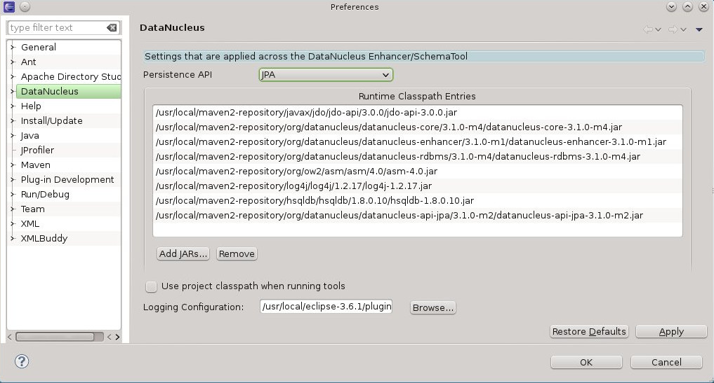
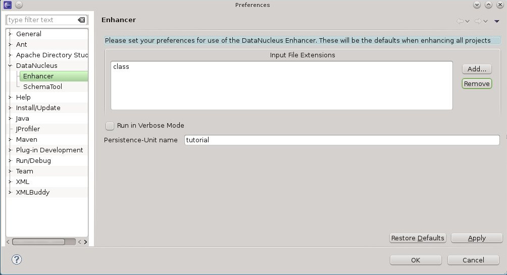
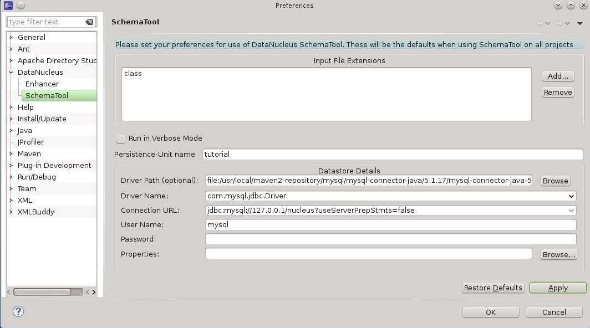
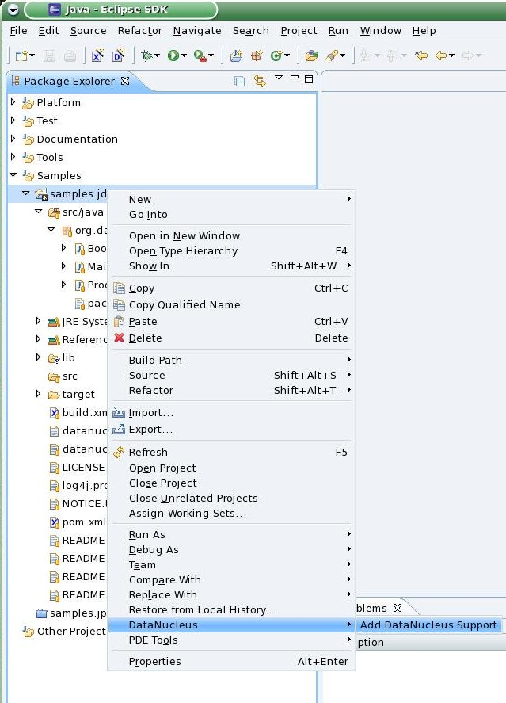
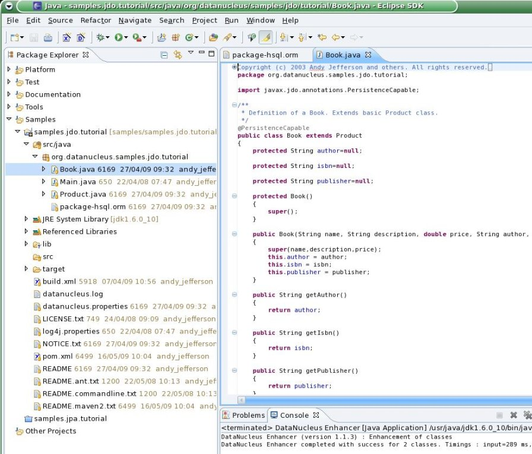
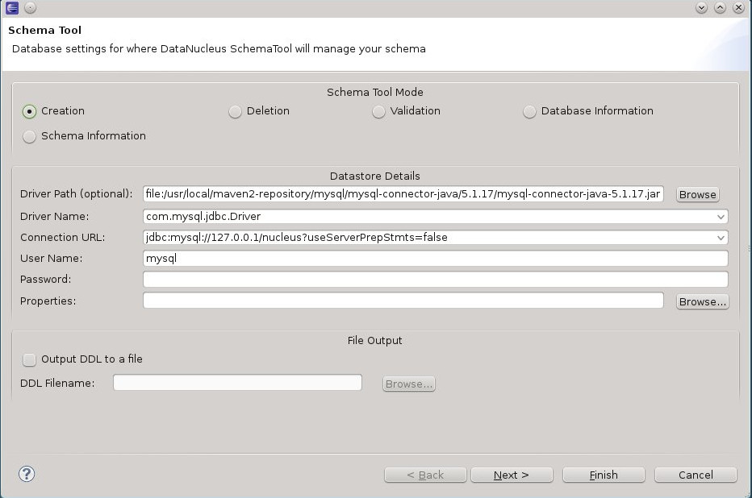

[[eclipse]]
= Eclipse Plugin
:_basedir: ../
:_imagesdir: images/

Eclipse provides a powerful development environment for Java systems. 
DataNucleus provides its own plugin for use within Eclipse, giving access to many features of DataNucleus Jakarta from the convenience of your development environment.

* link:tools.html#eclipse_install[Installation]
* link:tools.html#eclipse_preferences_general[General Preferences]
* link:tools.html#eclipse_preferences_enhancer[Preferences : Enhancer]
* link:tools.html#eclipse_preferences_schematool[Preferences : SchemaTool]
* link:tools.html#eclipse_enable[Enable DataNucleus Support]
* link:tools.html#eclipse_persistence_xml[Generate persistence.xml]
* link:tools.html#eclipse_enhancer[Run the Enhancer]
* link:tools.html#eclipse_schematool[Run SchemaTool]

[[eclipse_install]]
== Plugin Installation

The DataNucleus plugin requires Eclipse 3.1 or above. To obtain and install the DataNucleus Eclipse plugin select

-----
Help -> Software Updates -> Find and Install
-----

On the panel that pops up select _Search for new features to install_.
The select _New Remote Site_ and in that new window set the URL as 
*http://www.datanucleus.org/downloads/eclipse-update/* and the name as DataNucleus. 

Now select the site it has added "DataNucleus", and click "Finish". This will then find the releases of the DataNucleus plugin.
*Select the latest version of the DataNucleus Eclipse plugin*. 
Eclipse then downloads and installs the plugin. Easy!

[[eclipse_preferences]]
== Plugin configuration

The DataNucleus Eclipse plugin allows saving of preferences so that you get nice defaults for all subsequent usage. 
You can set the preferences at two levels :-

* *Globally for the Plugin* : Go to _Window -> Preferences -> DataNucleus Eclipse Plugin_ and see the options below that
* *For a Project* : Go to _{your project} -> Properties -> DataNucleus Eclipse Plugin_ and select "Enable project-specific properties"

[[eclipse_preferences_general]]
== Plugin configuration - General

Firstly open the main plugin preferences page, set the API to be used, and configure the libraries needed by DataNucleus. 
These are in addition to whatever you already have in your projects CLASSPATH, but to run the DataNucleus Enhancer/SchemaTool you will require the following

* `jakarta.persistence.jar` the Jakarta Persistence API jar
* `datanucleus-core`
* `datanucleus-api-jakarta` providing DataNucleus Jakarta Persistence API implementation
* `datanucleus-rdbms` (or other DataNucleus store plugin): for running SchemaTool
* Datastore driver jar (e.g JDBC) : for running SchemaTool

Below this you can set the location of a configuration file for Log4j to use.
This is useful when you want to debug the Enhancer/SchemaTool operations.

[[eclipse_preferences_enhancer]]
== Plugin configuration - Enhancer

Open the "Enhancer" page. You have the following settings

* *Input file extensions* : the enhancer accepts input defining the classes to be enhanced. 
With Jakarta Persistence you will typically just specify the "persistence-unit" and list the classes and mapping files in there. 
You can alternatively specify the suffices of files that define what will be enhanced (e.g "class" for annotated classes, and "xml" for the ORM mapping file defining entities)
* *Verbose* : selecting this means you get much more output from the enhancer
* *PersistenceUnit* : Name of the persistence unit if enhancing a persistence-unit

[[eclipse_preferences_schematool]]
== Plugin configuration - SchemaTool

Open the "SchemaTool" page. You have the following settings

* *Input file extensions* : SchemaTool accepts input defining the classes to have their schema generated. As for the enhancer, you can run this from a "persistence-unit"
* *Verbose* : selecting this means you get much more output from SchemaTool
* *PersistenceUnit* : Name of the persistence unit if running SchemaTool on a persistence-unit
* *Datastore details* : You can either specify the location of a properties file defining the location of your datastore, or you supply the driver name, URL, username and password.

[[eclipse_enable]]
== Enabling DataNucleus support

First thing to note is that the DataNucleus plugin is for Eclipse "Java project"s only.
After having configured the plugin you can now add DataNucleus support on your projects. 
Simply right-click on your project in *Package Explorer* and select _DataNucleus->"Add DataNucleus Support"_ from the context menu. 

[[eclipse_persistence_xml]]
== Defining 'persistence.xml'

You can also use the DataNucleus plugin to generate a `persistence.xml`. 
You do this by right-clicking on a package in your project, and selecting the option. 
The `persistence.xml` is generated under META-INF for the source folder.
Please note that the wizard will overwrite existing files without further notice.

[[eclipse_enhancer]]
== Enhancing the classes

The DataNucleus Eclipse plugin allows you to easily byte-code enhance your classes using the DataNucleus enhancer. 
Right-click on your project and select "Enable Auto-Enhancement" from the DataNucleus context menu. 
Now that you have the enhancer set up you can enable enhancement of your classes. 
The DataNucleus Eclipse plugin currently works by enabling/disabling automatic enhancement as a follow on process for the Eclipse build step. 
This means that when you enable it, every time Eclipse builds your classes it will then enhance the classes defined by the available mapping files or what is annotated. 
Thereafter every time that you build your classes the Jakarta Persistence enabled ones will be enhanced. 
Easy! Messages from the enhancement process will be written to the Eclipse Console.
*Make sure that you have your Java files in a source folder, and that the binary class files are written elsewhere*
If everything is set-up right, you should see the output below.

[[eclipse_schematool]]
== Generating your database schema

Once your classes have been enhanced you are in a position to create the database schema 
(assuming you will be using a new schema - omit this step if you already have your schema). 
Click on the project under "Package Explorer" and under "DataNucleus" there is an option 
"Run SchemaTool". This brings up a panel to define your database location (URL, login, password etc). 
You enter these details and the schema will be generated.

Messages from the SchemaTool process will be written to the Eclipse Console.

