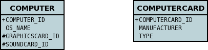
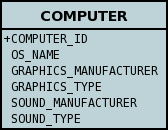
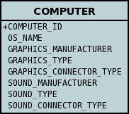
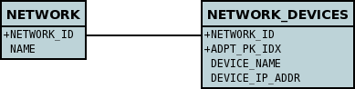

[[embedded]]
= Embedded Fields
:_basedir: ../
:_imagesdir: images/

The JDO persistence strategy typically involves persisting the fields of any class into its own table, 
and representing any relationships from the fields of that class across to other tables. 
There are occasions when this is undesirable, maybe due to an existing datastore schema, or because a more convenient datastore model is required. 
JDO allows the persistence of fields as _embedded_ typically into the same table as the "owning" class.

One important decision when defining objects of a type to be embedded into another type is whether objects of that type will ever be persisted 
in their own right into their own table, and have an identity. JDO provides a MetaData attribute that you can use to signal this.

[source,java]
-----
@PersistenceCapable(embeddedOnly="true")
public class MyClass 
{
    ...
}
-----

or using XML metadata

[source,xml]
-----
<jdo>
    <package name="com.mydomain.samples.embedded">
        <class name="MyClass" embedded-only="true">
            ...
        </class>
    </package>
</jdo>
-----

With the above MetaData (using the _embedded-only_ attribute), in our application any objects of the class *MyClass* *cannot* be persisted in their own right. 
They can only be embedded into other objects.

JDO's definition of embedding encompasses several types of fields. These are described below

* link:#embedded_pc[Embedded PCs] - where you have a 1-1 relationship and you want to embed the other persistable into the same table as the your object
* link:#embedded_pc_nested[Embedded Nested PCs] - like the first example except that the other object also has another persistable that also should be embedded
* link:#embedded_collection[Embedded Collection elements] - where you want to embed the elements of a collection into a join table (instead of persisting them into their own table)
* link:#embedded_map[Embedded Map keys/values] - where you want to embed the keys/values of a map into a join table (instead of persisting them into their own table)

With respect to what types of fields you can have in an embedded class, DataNucleus supports all basic types, as well as 1-1/N-1 relations 
(where the _foreign-key_ is at the embedded object side) and some 1-N/M-N relations.

NOTE: whilst nested embedded members are supported, you cannot use recursive embedded objects since that would require potentially infinite columns 
in the owner table, or infinite embedded join tables.

[[embedded_pc]]
== Embedding persistable objects (1-1)

NOTE: Applicable to RDBMS, Excel, OOXML, ODF, HBase, MongoDB, Neo4j, Cassandra, JSON

In a typical 1-1 relationship between 2 classes, the 2 classes in the relationship are persisted to their own table, and a foreign key is managed between them. 
With JDO and DataNucleus you can persist the related persistable object as embedded into the same table. 
This results in a single table in the datastore rather than one for each of the 2 classes.

Let's take an example. We are modelling a *Computer*, and in our simple model our *Computer* has a graphics card and a sound card. 
So we model these cards using a *ComputerCard* class. So our classes become

[source,java]
-----
public class Computer
{
    private String operatingSystem;

    private ComputerCard graphicsCard;

    private ComputerCard soundCard;

    public Computer(String osName, ComputerCard graphics, ComputerCard sound)
    {
        this.operatingSystem = osName;
        this.graphicsCard = graphics;
        this.soundCard = sound;
    }

    ...
}

public class ComputerCard
{
    public static final int ISA_CARD = 0;
    public static final int PCI_CARD = 1;
    public static final int AGP_CARD = 2;

    private String manufacturer;

    private int type;

    public ComputerCard(String manufacturer, int type)
    {
        this.manufacturer = manufacturer;
        this.type = type;
    }

    ...
}
-----

The traditional (default) way of persisting these classes would be to have a table to represent each class. So our datastore will look like this

However we decide that we want to persist *Computer* objects into a table called COMPUTER and we also want to persist the PC cards into the _same table_. 
We define our MetaData like this
[source,java]
-----
public class Computer
{
    @Embedded(nullIndicatorColumn="GRAPHICS_MANUFACTURER", members={
        @Persistent(name="manufacturer", column="GRAPHICS_MANUFACTURER"),
        @Persistent(name="type", column="GRAPHICS_TYPE")})
    private ComputerCard graphicsCard;

    @Embedded(nullIndicatorColumn="SOUND_MANUFACTURER", members={
        @Persistent(name="manufacturer", column="SOUND_MANUFACTURER"),
        @Persistent(name="type", column="SOUND_TYPE")})
    private ComputerCard soundCard;

    ...
}

@PersistenceCapable(embeddedOnly="true")
public class ComputerCard
{
    ...
}
-----

or using XML metadata

[source,xml]
-----
<jdo>
    <package name="com.mydomain.samples.embedded">
        <class name="Computer" identity-type="datastore" table="COMPUTER">
            ...
            <field name="graphicsCard" persistence-modifier="persistent">
                <embedded null-indicator-column="GRAPHICS_MANUFACTURER">
                    <field name="manufacturer" column="GRAPHICS_MANUFACTURER"/>
                    <field name="type" column="GRAPHICS_TYPE"/>
                </embedded>
            </field>
            <field name="soundCard" persistence-modifier="persistent">
                <embedded null-indicator-column="SOUND_MANUFACTURER">
                    <field name="manufacturer" column="SOUND_MANUFACTURER"/>
                    <field name="type" column="SOUND_TYPE"/>
                </embedded>
            </field>
        </class>

        <class name="ComputerCard" embedded-only="true">
            ...
        </class>
    </package>
</jdo>
-----

So here we will end up with a TABLE called "COMPUTER" with columns "COMPUTER_ID", "OS_NAME", "GRAPHICS_MANUFACTURER", "GRAPHICS_TYPE", "SOUND_MANUFACTURER", "SOUND_TYPE". 
If we call _makePersistent()_ on any objects of type *Computer*, they will be persisted into this table.

You will notice in the MetaData our use of the attribute _null-indicator-column_. This is used when retrieving objects from the datastore and detecting if it is a NULL embedded object. 
In the case we have here, if the column GRAPHICS_MANUFACTURER is null at retrieval, then the embedded "graphicsCard" field will be set as null. 
Similarly for the "soundCard" field when SOUND_MANUFACTURER is null.

If the *ComputerCard* class above has a reference back to the related *Computer*, JDO defines a mechanism whereby this will be populated. 
You would add the XML element _owner-field_ to the _<embedded>_ tag defining the field within *ComputerCard* that represents the *Computer* it relates to. 
When this is specified DataNucleus will populate it automatically, so that when you retrieve the *Computer* and access the
*ComputerCard* objects within it, they will have the link in place.

It should be noted that in this latter (embedded) case we can still persist objects of type *ComputerCard* into their own table - the MetaData definition for *ComputerCard* is used 
for the table definition in this case.

Please note that if, instead of specifying the <embedded> block we had specified *embedded* in the field element we would have ended up with the same thing, 
just that the fields and columns would have been mapped using their default mappings, and that the <embedded> provides control over how they are mapped.

NOTE: by default the embedded objects cannot have inheritance. Inheritance in embedded objects is only support for RDBMS and MongoDB, 
and involves defining a discriminator in the metadata of the embedded type.

See also :-

* link:metadata_xml.html#embedded[MetaData reference for <embedded> element]
* link:annotations.html#Embedded[Annotations reference for @Embedded]

[[embedded_pc_nested]]
== Embedding Nested persistable objects

NOTE: Applicable to RDBMS, Excel, OOXML, ODF, HBase, MongoDB, Neo4j, Cassandra, JSON

In the above example we had an embedded persistable object within a persisted object. What if our embedded persistable object also contain another persistable object. 
So, using the above example what if *ComputerCard* contains an object of type *Connector* ? 

[source,java]
-----
@PersistenceCapable(embeddedOnly="true")
public class ComputerCard
{
    Connector connector;

    public ComputerCard(String manufacturer, int type, Connector conn)
    {
        this.manufacturer = manufacturer;
        this.type = type;
        this.connector = conn;
    }

    ...
}

@PersistenceCapable(embeddedOnly="true")
public class Connector
{
    int type;
}
-----

Well we want to store all of these objects into the same record in the COMPUTER table, so we define our XML metadata like this

[source,xml]
-----
<jdo>
    <package name="com.mydomain.samples.embedded">
        <class name="Computer" identity-type="datastore" table="COMPUTER">
            ....
            <field name="graphicsCard" persistence-modifier="persistent">
                <embedded null-indicator-column="GRAPHICS_MANUFACTURER">
                    <field name="manufacturer" column="GRAPHICS_MANUFACTURER"/>
                    <field name="type" column="GRAPHICS_TYPE"/>
                    <field name="connector">
                        <embedded>
                            <field name="type" column="GRAPHICS_CONNECTOR_TYPE"/>
                        </embedded>
                    </field>
                </embedded>
            </field>
            <field name="soundCard" persistence-modifier="persistent">
                <embedded null-indicator-column="SOUND_MANUFACTURER">
                    <field name="manufacturer" column="SOUND_MANUFACTURER"/>
                    <field name="type" column="SOUND_TYPE"/>
                    <field name="connector">
                        <embedded>
                            <field name="type" column="SOUND_CONNECTOR_TYPE"/>
                        </embedded>
                    </field>
                </embedded>
            </field>
        </class>

        <class name="ComputerCard" table="COMPUTER_CARD">
            ....
        </class>

        <class name="Connector" embedded-only="true">
            <field name="type"/>
        </class>
    </package>
</jdo>
-----

So we simply nest the embedded definition of the *Connector* objects within the embedded definition of the *ComputerCard* definitions for *Computer*. 
JDO supports this to as many levels as you require! The *Connector* objects will be persisted into the GRAPHICS_CONNECTOR_TYPE, and SOUND_CONNECTOR_TYPE columns in the COMPUTER table.

NOTE: you cannot specify *nested* embedded column information using JDO annotations; use XML metadata instead.

[[embedded_collection]]
== Embedding Collection Elements

NOTE: Applicable to RDBMS, MongoDB

In a typical 1-N relationship between 2 classes, the 2 classes in the relationship are persisted to their own table, and either a join table or a 
foreign key is used to relate them. With JPA and DataNucleus you have a variation on the join table relation where you can persist the objects of 
the "N" side into the join table itself so that they don't have their own identity, and aren't stored in the table for that class.
*This is supported in DataNucleus with the following provisos*

* You can have inheritance in embedded keys/values and a discriminator is added (you must define the discriminator in the metadata of the embedded type).
* When retrieving embedded elements, all fields are retrieved in one call. That is, fetch plans are not utilised. This is because the embedded element has 
no identity so we have to retrieve all initially.

It should be noted that where the collection "element" is not an entity or of a "reference" type (Interface or Object) it will *always* be embedded, and 
this functionality here applies to embeddable entity elements only. DataNucleus doesn't support the embedding of "reference type" objects currently.

Let's take an example. We are modelling a *Network*, and in our simple model our *Network* has collection of *Device*s. So we define our classes as

[source,java]
-----
public class Network
{
    private String name;
    private Collection<Device> devices = new HashSet<>();

    ...
}

public class Device
{
    private String name;
    private String ipAddress;

    ...
}
-----

We decide that instead of *Device* having its own table, we want to persist them into the join table of its relationship with the *Network* since they are only used by the network itself.
We define our XML MetaData like this

[source,java]
-----
public class Network
{
    @Element(embeddedMapping={
        @Embedded(members={
            @Persistent(name="name", column="DEVICE_NAME"),
            @Persistent(name="ipAddress", column="DEVICE_IP_ADDR")})
    })
    private Collection<Device> devices = new HashSet<>();

    ...
}

@PersistenceCapable(embeddedOnly="true")
public class Device
{
    private String name;
    private String ipAddress;

    ...
}
-----

or using XML metadata

[source,xml]
-----
<jdo>
    <package name="com.mydomain.samples.embedded">
        <class name="Network" identity-type="datastore" table="NETWORK">
            ...
            <field name="devices" persistence-modifier="persistent" table="NETWORK_DEVICES">
                <collection element-type="com.mydomain.samples.embedded.Device"/>
                <join>
                    <column name="NETWORK_ID"/>
                </join>
                <element>
                    <embedded>
                        <field name="name">
                            <column name="DEVICE_NAME" allows-null="true"/>
                        </field>
                        <field name="ipAddress">
                            <column name="DEVICE_IP_ADDR" allows-null="true"/>
                        </field>
                    </embedded>
                </element>
            </field>
        </class>

        <class name="Device" table="DEVICE" embedded-only="true">
            <field name="name">
                <column name="NAME"/>
            </field>
            <field name="ipAddress">
                <column name="IP_ADDRESS"/>
            </field>
        </class>
    </package>
</jdo>
-----

So here we will end up with a table called "NETWORK" with columns "NETWORK_ID", and "NAME", and a table called "NETWORK_DEVICES" with columns 
"NETWORK_ID", "ADPT_PK_IDX", "DEVICE_NAME", "DEVICE_IP_ADDR". When we persist a *Network* object, any devices are persisted into the NETWORK_DEVICES table.

Please note that if, instead of specifying the <embedded> block we had specified *embedded-element* in the collection element we would have ended up with the same thing, 
just that the fields and columns would be mapped using their default mappings, and that the <embedded> provides control over how they are mapped.

You note that in our example above DataNucleus has added an extra column "ADPT_PK_IDX" to provide the primary key of the join table now that we're storing the elements as embedded. 
A variation on this would have been if we wanted to maybe use the "DEVICE_IP_ADDR" as the other part of the primary key, 
in which case the "ADPT_PK_IDX" would not be needed. You would specify XML metadata like this

[source,xml]
-----
<field name="devices" persistence-modifier="persistent" table="NETWORK_DEVICES">
    <collection element-type="com.mydomain.samples.embedded.Device"/>
    <join>
        <primary-key name="NETWORK_DEV_PK">
            <column name="NETWORK_ID"/>
            <column name="DEVICE_IP_ADDR"/>
        </primary-key>
        <column name="NETWORK_ID"/>
    </join>
    <element>
        <embedded>
            <field name="name">
                <column name="DEVICE_NAME" allows-null="true"/>
            </field>
            <field name="ipAddress">
                <column name="DEVICE_IP_ADDR" allows-null="true"/>
            </field>
        </embedded>
    </element>
</field>
-----

This results in the join table only having the columns "NETWORK_ID", "DEVICE_IP_ADDR", and "DEVICE_NAME", and having a primary key as the composite of "NETWORK_ID" and "DEVICE_IP_ADDR". 

See also :-

* link:metadata_xml.html#embedded[MetaData reference for <embedded> element]
* link:metadata_xml.html#element[MetaData reference for <element> element]
* link:metadata_xml.html#join[MetaData reference for <join> element]
* link:annotations.html#Embedded[Annotations reference for @Embedded]
* link:annotations.html#Element[Annotations reference for @Element]

[[embedded_map]]
== Embedding Map Keys/Values

NOTE: Applicable to RDBMS, MongoDB

In a typical 1-N map relationship between classes, the classes in the relationship are persisted to their own table, and a join table forms the map linkage. 
With JDO and DataNucleus you have a variation on the join table relation where you can persist either the key class or the value class, or both key class 
and value class into the join table. *This is supported in DataNucleus with the following provisos*

* You can have inheritance in embedded keys/values and a discriminator is added (you must define the discriminator in the metadata of the embedded type).
* When retrieving embedded keys/values, all fields are retrieved in one call. That is, fetch plans are not utilised. 
This is because the embedded key/value has no identity so we have to retrieve all initially.

It should be noted that where the map "key"/"value" is not _persistable_ or of a "reference" type (Interface or Object) it will *always* be embedded, 
and this functionality here applies to _persistable_ keys/values only. DataNucleus doesn't support embedding reference type elements currently.

Let's take an example. We are modelling a *FilmLibrary*, and in our simple model our *FilmLibrary* has map of *Film*s, keyed by a String alias. So we define our classes as

[source,java]
-----
public class FilmLibrary
{
    private String owner;
    private Map<String, Film> films = new HashMap<>();

    ...
}

public class Film
{
    private String name;
    private String director;

    ...
}
-----

We decide that instead of *Film* having its own table, we want to persist them into the join table of its map relationship with the *FilmLibrary* since they are 
only used by the library itself. We define our XML MetaData like this

[source,java]
-----
public class FilmLibrary
{
    @Key(column="FILM_ALIAS")
    @Value(embeddedMapping={
        @Embedded(members={
            @Persistent(name="name", column="FILM_NAME"),
            @Persistent(name="director", column="FILM_DIRECTOR")})
    })
    private Map<String, Film> films = new HashMap<>();

    ...
}

@PersistenceCapable(embeddedOnly="true")
public class Film
{
    private String name;
    private String director;

    ...
}
-----

or using XML metadata

[source,xml]
-----
<jdo>
    <package name="com.mydomain.samples.embedded">
        <class name="FilmLibrary" identity-type="datastore" table="FILM_LIBRARY">
            ...
            <field name="films" persistence-modifier="persistent" table="FILM_LIBRARY_FILMS">
                <map/>
                <join>
                    <column name="FILM_LIBRARY_ID"/>
                </join>
                <key>
                    <column name="FILM_ALIAS"/>
                </key>
                <value>
                    <embedded>
                        <field name="name">
                            <column name="FILM_NAME"/>
                        </field>
                        <field name="director">
                            <column name="FILM_DIRECTOR" allows-null="true"/>
                        </field>
                    </embedded>
                </value>
            </field>
        </class>

        <class name="Film" embedded-only="true">
            <field name="name"/>
            <field name="director"/>
        </class>
    </package>
</jdo>
-----

So here we will end up with a table called "FILM_LIBRARY" with columns "FILM_LIBRARY_ID", and "OWNER", 
and a table called "FILM_LIBRARY_FILMS" with columns "FILM_LIBRARY_ID", "FILM_ALIAS", "FILM_NAME", "FILM_DIRECTOR".
When we persist a *FilmLibrary* object, any films are persisted into the FILM_LIBRARY_FILMS table.

Please note that if, instead of specifying the <embedded> block we had specified *embedded-key* of *embedded-value* in the map element we would 
have ended up with the same thing, just that the fields and columns would be mapped using their default mappings, and that the <embedded> provides control over
how they are mapped.

See also :-

* link:metadata_xml.html#embedded[MetaData reference for <embedded> element]
* link:metadata_xml.html#key[MetaData reference for <key> element]
* link:metadata_xml.html#value[MetaData reference for <value> element]
* link:metadata_xml.html#join[MetaData reference for <join> element]
* link:annotations.html#Embedded[Annotations reference for @Embedded]
* link:annotations.html#Key[Annotations reference for @Key]
* link:annotations.html#Value[Annotations reference for @Value]

