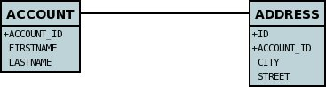
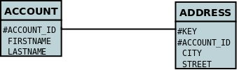

[[identity]]
= Identity
:_basedir: ../
:_imagesdir: images/

All JDO-enabled persistable classes need to have an "identity" to be able to identify an object for retrieval and relationships. 
There are three types of identity defineable using JDO. These are

* link:#datastore_identity[Datastore Identity] : a surrogate column is added to the persistence of the persistable type, and objects of this type are identified by
the class plus the value in this surrogate column.
* link:#application_identity[Application Identity] : a field, or several fields of the persistable type are assigned as being (part of) the primary key.
* link:#nondurable_identity[Nondurable Identity] : the persistable type has no identity as such, so the only way to lookup objects of this type would be
via query for values of specific fields. This is useful for storing things like log messages etc.

A further complication is where you use _application identity_ but one of the fields forming the primary key is a relation field. 
This is known as link:#compound_identity[Compound Identity].

NOTE: When you have an inheritance hierarchy, you should specify the identity type in the _base instantiable_ class for the inheritance tree. 
This is then used for all persistent classes in the tree. 
This means that you can have superclass(es) without any identity defined but using _subclass-table_ inheritance, and then the base instantiable 
class is the first persistable class which has the identity.

NOTE: The JDO _identity_ is not the same as the type of the field(s) marked as the primary key. The _identity_ will always have an identity class name. If you specify the object-id class
then it will be this, otherwise will use a built-in type.

[[datastore_identity]]
== Datastore Identity

NOTE: Applicable to RDBMS, ODF, Excel, OOXML, HBase, Neo4j, MongoDB, XML, Cassandra, JSON

With *datastore identity* you are leaving the assignment of id's to DataNucleus and your class will *not* have a field for this identity - it will be added to the 
datastore representation by DataNucleus. 
It is, to all extents and purposes, a _surrogate key_ that will have its own column in the datastore. 
To specify that a class is to use *datastore identity* with JDO, you do it like this

[source,java]
-----
@PersistenceCapable(identityType=IdentityType.DATASTORE)
public class MyClass
{
    ...
}
-----

or using XML metadata

[source,xml]
-----
<class name="MyClass" identity-type="datastore">
...
</class>
-----

So you are specifying the *identity-type* as _datastore_. 
You don't need to add this because _datastore_ is the default, so in the absence of any value, it will be assumed to be 'datastore'.

=== Datastore Identity : Generating identities

By choosing *datastore identity* you are handing the process of identity generation to the JDO implementation. 
This does not mean that you haven't got any control over how it does this. 
JDO defines many ways of generating these identities and DataNucleus supports all of these and provides some more of its own besides.

Defining which one to use is a simple matter of specifying its metadata, like this

[source,java]
-----
@PersistenceCapable
@DatastoreIdentity(strategy="sequence", sequence="MY_SEQUENCE")
public class MyClass
{
    ...
}
-----

or using XML metadata

[source,xml]
-----
<class name="MyClass" identity-type="datastore">
    <datastore-identity strategy="sequence" sequence="MY_SEQUENCE"/>
    ...
</class>
-----

Some of the datastore identity strategies require additional attributes, but the specification is straightforward.

See also :-

* link:mapping.html#value_generation[Value Generation] - strategies for generating ids
* link:metadata_xml.html#datastore-identity[MetaData reference for <datastore-identity> element]
* link:annotations.html#DatastoreIdentity[Annotations reference for @DatastoreIdentity]

=== Datastore Identity : Accessing the Identity

When using *datastore identity*, the class has no associated field so you can't just access a field of the class to see its identity.
If you need a field to be able to access the identity then you should be using link:mapping.html#application_identity[application identity]. 
There are, however, ways to get the identity for the datastore identity case, if you have the object.

[source,java]
-----
// Via the PersistenceManager
Object id = pm.getObjectId(obj);

// Via JDOHelper
Object id = JDOHelper.getObjectId(obj);
-----

You should be aware however that the "identity" is in a complicated form, and is not available as a simple integer value for example. 
Again, if you want an identity of that form then you should use link:mapping.html#application_identity[application identity]

=== Datastore Identity : Implementation

When implementing *datastore identity* all JDO implementations have to provide a public class that represents this identity. 
If you call _pm.getObjectId(...)_ for a class using datastore identity you will be passed an object which, in the case of DataNucleus will be of type _org.datanucleus.identity.OIDImpl_. 
If you were to call "toString()" on this object you would get something like 

-----
1[OID]mydomain.MyClass
This is made up of :-
    1 = identity number of this object
    class-name
-----

NOTE: The definition of this datastore identity is JDO implementation dependent. 
As a result you should not use the _org.datanucleus.identity.OID_ class in your application if you want to remain implementation independent.

DataNucleus allows you the luxury of being able to link:../extensions/extensions.html#datastoreidentity[provide your own datastore identity class] 
so you can have whatever formatting you want for identities.

=== Datastore Identity : Accessing objects by Identity

If you have the JDO identity then you can access the object with that identity like this

[source,java]
-----
Object obj = pm.getObjectById(id);
-----

You can also access the object from the object class name and the toString() form of the datastore identity (e.g "1[OID]mydomain.MyClass") like this

[source,java]
-----
Object obj = pm.getObjectById(MyClass.class, mykey);
-----

[[application_identity]]
== Application Identity

NOTE: Applicable to all datastores.

With *application identity* you are taking control of the specification of id's to DataNucleus. 
Application identity requires a primary key class _(unless you have a single primary-key field in which case the PK class is provided for you)_, 
and each persistent capable class may define a different class for its primary key, and different persistent capable classes can use the same primary key class, 
as appropriate. With *application identity* the field(s) of the primary key will be present as field(s) of the class itself. 
To specify that a class is to use *application identity*, you add the following to the MetaData for the class.

[source,xml]
-----
<class name="MyClass" objectid-class="MyIdClass">
    <field name="myPrimaryKeyField" primary-key="true"/>
    ...
</class>
-----

For JDO we specify the *primary-key* and *objectid-class*. 
The *objectid-class* is optional, and is the class defining the identity for this class (again, if you have a single primary-key field then you can omit it). 
Alternatively, if we are using annotations

[source,java]
-----
@PersistenceCapable(objectIdClass=MyIdClass.class)
public class MyClass
{
    @Persistent(primaryKey="true")
    private long myPrimaryKeyField;
}
-----

See also :-

* link:metadata_xml.html#field[MetaData reference for <field> element]
* link:annotations.html#Persistent[Annotations reference for @Persistent]

[[application_identity_primarykey]]
=== Application Identity : PrimaryKey Classes

When you choose application identity you are defining which fields of the class are part of the primary key, and you are taking control of the specification of id's to DataNucleus. 
Application identity requires a primary key (PK) class, and each persistent capable class may define a different class for its 
primary key, and different persistent capable classes can use the same primary key class, as appropriate. 
If you have only a single primary-key field then there are built-in PK classes so you can forget this section. 
Where you have more than 1 primary key field, you would define the PK class like this

[source,xml]
-----
<class name="MyClass" identity-type="application" objectid-class="MyIdClass">
...
</class>
-----

or using annotations

[source,java]
-----
@PersistenceCapable(objectIdClass=MyIdClass.class)
public class MyClass
{
    ...
}
-----

You now need to define the PK class to use. This is simplified for you because *if you have only one 
PK field then you dont need to define a PK class* and you only define it when you have a composite PK.

An important thing to note is that the PK can only be made up of fields of the following Java types

* Primitives : *boolean*, *byte*, *char*, *int*, *long*, *short*
* java.lang : *Boolean*, *Byte*, *Character*, *Integer*, *Long*, *Short*, *String*, *Enum*, StringBuffer
* java.math : *BigInteger*
* java.sql : *Date*, *Time*, *Timestamp*
* java.util : *Date*, *Currency*, *Locale*, TimeZone, UUID
* java.net : URI, URL
* _persistable_

Note that the types in *bold* are JDO standard types. Any others are DataNucleus extensions and, as always, link:../datastores/datastores.html[check the specific datastore docs]
to see what is supported for your datastore.

*Single PrimaryKey field*

The simplest way of using *application identity* is where you have a single PK field, and in this case you use *SingleFieldIdentity* 
http://www.datanucleus.org/javadocs/javax.jdo/3.2/javax/jdo/identity/SingleFieldIdentity.html[] mechanism. 
This provides a PrimaryKey and you don't need to specify the _objectid-class_. Let's take an example

[source,java]
-----
public class MyClass
{
    long id;
    ...
}
-----

[source,xml]
-----
<class name="MyClass" identity-type="application">
    <field name="id" primary-key="true"/>
    ...
</class>
-----

or using annotations

[source,java]
-----
@PersistenceCapable
public class MyClass
{
    @PrimaryKey
    long id;
    ...
}
-----

So we didn't specify the JDO "objectid-class". 
You will, of course, have to give the field a value before persisting the object, either by setting it yourself, or by using a link:mapping.html#value_generation[value-strategy] on that field.

If you need to create an identity of this form for use in querying via _pm.getObjectById()_ then you can create the identities in the following way

[source,java]
-----
// For a "long" type :
javax.jdo.identity.LongIdentity id = new javax.jdo.identity.LongIdentity(myClass, 101);

// For a "String" type :
javax.jdo.identity.StringIdentity id = new javax.jdo.identity.StringIdentity(myClass, "ABCD");
-----

We have shown an example above for type "long", but you can also use this for the following

-----
short, Short       - javax.jdo.identity.ShortIdentity
int, Integer       - javax.jdo.identity.IntIdentity
long, Long         - javax.jdo.identity.LongIdentity
String             - javax.jdo.identity.StringIdentity
char, Character    - javax.jdo.identity.CharIdentity
byte, Byte         - javax.jdo.identity.ByteIdentity
java.util.Date     - javax.jdo.identity.ObjectIdentity
java.util.Currency - javax.jdo.identity.ObjectIdentity
java.util.Locale   - javax.jdo.identity.ObjectIdentity
-----

TIP: It is however better *not* to make explicit use of these JDO classes and instead to just use the _pm.getObjectById_ taking in the class and the value and then 
you have no dependency on these classes.

=== PrimaryKey : Rules for User-Defined classes

If you wish to use *application identity* and don't want to use the "SingleFieldIdentity" builtin PK classes then you must define a Primary Key class of your own. 
You can't use classes like java.lang.String, or java.lang.Long directly. You must follow these rules when defining your primary key class.

* the Primary Key class must be public
* the Primary Key class must implement Serializable
* the Primary Key class must have a public no-arg constructor, which might be the default constructor
* the field types of all non-static fields in the Primary Key class must be serializable, and are recommended to be primitive, String, Date, or Number types
* all serializable non-static fields in the Primary Key class must be public
* the names of the non-static fields in the Primary Key class must include the names of the primary key fields in the JDO class, and the types of the common fields must be identical
* the _equals()_ and _hashCode()_ methods of the Primary Key class must use the value(s) of all the fields corresponding to the primary key fields in the JDO class
* if the Primary Key class is an inner class, it must be static
* the Primary Key class must override the _toString()_ method defined in Object, and return a String that can be used as the parameter of a constructor
* the Primary Key class must provide a String constructor that returns an instance that compares equal to an instance that returned that String by the toString() method.
* the Primary Key class must be only used within a single inheritence tree.

Please note that if one of the fields that comprises the primary key is in itself a persistable object then you have link:mapping.html#compound_identity[Compound Identity]
and should consult the documentation for that feature which contains its own example.

NOTE: Since there are many possible combinations of primary-key fields it is impossible for JDO to provide a series of builtin composite primary key classes. 
However the link:enhancer.html[DataNucleus enhancer] provides a mechanism for auto-generating a primary-key class for a persistable class. 
It follows the rules listed below and should work for all cases. Obviously if you want to tailor the output of things like the PK toString() method then you ought to define your own. 
The enhancer generation of primary-key class is only enabled if you don't define your own class.

=== PrimaryKey Example - Multiple Field

Here's an example of a composite (multiple field) primary key class

[source,java]
-----
@PersistenceCapable(objectIdClass=ComposedIdKey.class)
public class MyClass
{
    @PrimaryKey
    String field1;

    @PrimaryKey
    String field2;
    ...
}

public class ComposedIdKey implements Serializable
{
    public String field1;
    public String field2;

    public ComposedIdKey ()
    {
    }

    /**
     * Constructor accepting same input as generated by toString().
     */
    public ComposedIdKey(String value) 
    {
        StringTokenizer token = new StringTokenizer (value, "::");
        token.nextToken();               // className
        this.field1 = token.nextToken(); // field1
        this.field2 = token.nextToken(); // field2
    }

    public boolean equals(Object obj)
    {
        if (obj == this)
        {
            return true;
        }
        if (!(obj instanceof ComposedIdKey))
        {
            return false;
        }
        ComposedIdKey c = (ComposedIdKey)obj;

        return field1.equals(c.field1) && field2.equals(c.field2);
    }

    public int hashCode ()
    {
        return this.field1.hashCode() ^ this.field2.hashCode();
    }

    public String toString ()
    {
        // Give output expected by String constructor
        return this.getClass().getName() + "::"  + this.field1 + "::" + this.field2;
    }
}
-----

=== Application Identity : Generating identities

By choosing *application identity* you are controlling the process of identity generation for this class. 
This does not mean that you have a lot of work to do for this. 
JDO defines many ways of generating these identities and DataNucleus supports all of these and provides some more of its own besides.

See also :-

* link:mapping.html#value_generation[Value Generation] - strategies for generating ids

=== Application Identity : Accessing the Identity

When using *application identity*, the class has associated field(s) that equate to the identity. 
As a result you can simply access the values for these field(s). Alternatively you could use a JDO identity-independent way

[source,java]
-----
// Using the PersistenceManager
Object id = pm.getObjectId(obj);

// Using JDOHelper
Object id = JDOHelper.getObjectId(obj);
-----

=== Application Identity : Changing Identities

JDO allows implementations to support the changing of the identity of a persisted object.
*This is an optional feature and DataNucleus doesn't currently support it.*

=== Application Identity : Accessing objects by Identity

If you have the JDO identity then you can access the object with that identity like this

[source,java]
-----
Object obj = pm.getObjectById(id);
-----

If you are using SingleField identity then you can access it from the object class name and the key value like this

[source,java]
-----
Object obj = pm.getObjectById(MyClass.class, mykey);
-----

If you are using your own PK class then the _mykey_ value is the toString() form of the identity of your PK class.

[[nondurable_identity]]
== Nondurable Identity

NOTE: Applicable to RDBMS, ODF, Excel, OOXML, HBase, Neo4j, MongoDB.

With *nondurable identity* your objects will not have a unique identity in the datastore. 
This type of identity is typically for log files, history files etc where you aren't going to access the object by key, but instead by a different parameter. 
In the datastore the table will typically not have a primary key. To specify that a class is to use *nondurable identity* with JDO you would define metadata like this

[source,java]
-----
@PersistenceCapable(identityType=IdentityType.NONDURABLE)
public class MyClass
{
    ...
}
-----

or using XML metadata

[source,xml]
-----
<class name="MyClass" identity-type="nondurable">
...
</class>
-----

What this means for something like RDBMS is that the table (or view) of the class will not have a primary-key.

[[compound_identity]]
== Compound Identity Relationships

A JDO "compound identity relationship" is a relationship between two classes in which the child object must coexist with the parent object 
and where the primary key of the child includes the persistable object of the parent. The key aspect of this type of relationship is that 
the primary key of one of the classes includes a persistable field (hence why is is referred to as _Compound Identity_). 
This type of relation is available in the following forms

* xref:mapping.html#compound_identity_1_1_uni[1-1 unidirectional]
* xref:mapping.html#compound_identity_1_N_coll_bi[1-N collection bidirectional using ForeignKey]
* xref:mapping.html#compound_identity_1_N_map_bi[1-N map bidirectional using ForeignKey (key stored in value)]

NOTE: In the identity class of the compound persistable class you should define the _object-idclass_ of the 
persistable type being contained and use that type in the identity class of the compound persistable type.

NOTE: The persistable class that is contained cannot be using _datastore identity_, and must be using _application identity_ with an objectid-class

TIP: When using compound identity, it is best practice to define an _object-idclass_ for any persistable classes that are part of the primary key, and *not* rely
on the built-in identity types.

[[compound_identity_1_1_uni]]
=== 1-1 Relationship

Lets take the same classes as we have in the link:mapping.html#one_one[1-1 Relationships].
In the 1-1 relationships guide we note that in the datastore representation of the *User* and *Account* the *ACCOUNT* table has a primary key as well as a foreign-key to *USER*. 
In our example here we want to just have a primary key that is also a foreign-key to *USER*. 
To do this we need to modify the classes slightly and add primary-key fields and use "application-identity".

[source,java]
-----
public class User
{
    long id;

    ...
}

public class Account
{
    User user;

    ...
}
-----

In addition we need to define primary key classes for our *User* and *Account* classes

[source,java]
-----
public class User
{
    long id;

    ... (remainder of User class)

    /**
     * Inner class representing Primary Key
     */
    public static class PK implements Serializable
    {
        public long id;

        public PK()
        {
        }

        public PK(String s)
        {
            this.id = Long.valueOf(s).longValue();
        }

        public String toString()
        {
            return "" + id;
        }

        public int hashCode()
        {
            return (int)id;
        }

        public boolean equals(Object other)
        {
            if (other != null && (other instanceof PK))
            {
                PK otherPK = (PK)other;
                return otherPK.id == this.id;
            }
            return false;
        }
    }
}

public class Account
{
    User user;
                
    ... (remainder of Account class)

    /**
     * Inner class representing Primary Key
     */
    public static class PK implements Serializable
    {
        public User.PK user; // Use same name as the real field above

        public PK()
        {
        }

        public PK(String s)
        {
            StringTokenizer token = new StringTokenizer(s,"::");

            this.user = new User.PK(token.nextToken());
        }

        public String toString()
        {
            return "" + this.user.toString();
        }

        public int hashCode()
        {
            return user.hashCode();
        }

        public boolean equals(Object other)
        {
            if (other != null && (other instanceof PK))
            {
                PK otherPK = (PK)other;
                return this.user.equals(otherPK.user);
            }
            return false;
        }
    }
}
-----

To achieve what we want with the datastore schema we define the MetaData like this

[source,xml]
-----
<package name="mydomain">
    <class name="User" identity-type="application" objectid-class="User$PK">
        <field name="id" primary-key="true"/>
        <field name="login" persistence-modifier="persistent">
            <column length="20" jdbc-type="VARCHAR"/>
        </field>
    </class>

    <class name="Account" identity-type="application" objectid-class="Account$PK">
        <field name="user" persistence-modifier="persistent" primary-key="true">
            <column name="USER_ID"/>
        </field>
        <field name="firstName" persistence-modifier="persistent">
            <column length="50" jdbc-type="VARCHAR"/>
        </field>
        <field name="secondName" persistence-modifier="persistent">
            <column length="50" jdbc-type="VARCHAR"/>
        </field>
    </class>
</package>
-----

So now we have the following datastore schema

Things to note :-

* You must use "application-identity" in both parent and child classes
* In the child Primary Key class, you must have a field with the same name as the relationship in the child class, 
and the field in the child Primary Key class must be the same type as the Primary Key class of the parent
* See also the link:mapping.html#application_identity_primarykey[general instructions for Primary Key classes]
* You can only have one "Account" object linked to a particular "User" object since the FK to the "User" is now the primary key of "Account". 
To remove this restriction you could also add a "long id" to "Account" and make the "Account.PK" a composite primary-key

[[compound_identity_1_N_coll_bi]]
=== 1-N Collection Relationship

Lets take the same classes as we have in the link:mapping.html#one_many_fk_bi[1-N Relationships (FK)]. 
In the 1-N relationships guide we note that in the datastore representation of the *Account* and *Address* classes the *ADDRESS* table has a primary key as well as a 
foreign-key to *ACCOUNT*. In our example here we want to have the primary-key to *ACCOUNT* to _include_ the foreign-key. 
To do this we need to modify the classes slightly, adding primary-key fields to both classes, and use "application-identity" for both.

[source,java]
-----
public class Account
{
    long id;

    Set<Address> addresses;

    ...
}

public class Address
{
    long id;

    Account account;

    ...
}
-----

In addition we need to define primary key classes for our *Account* and *Address* classes

[source,java]
-----
public class Account
{
    long id; // PK field

    Set addresses = new HashSet();

    ... (remainder of Account class)

    /**
     * Inner class representing Primary Key
     */
    public static class PK implements Serializable
    {
        public long id;

        public PK()
        {
        }

        public PK(String s)
        {
            this.id = Long.valueOf(s).longValue();
        }

        public String toString()
        {
            return "" + id;
        }

        public int hashCode()
        {
            return (int)id;
        }

        public boolean equals(Object other)
        {
            if (other != null && (other instanceof PK))
            {
                PK otherPK = (PK)other;
                return otherPK.id == this.id;
            }
            return false;
        }
    }
}

public class Address
{
    long id;
    Account account;

    .. (remainder of Address class)

    /**
     * Inner class representing Primary Key
     */
    public static class PK implements Serializable
    {
        public long id; // Same name as real field above
        public Account.PK account; // Same name as the real field above

        public PK()
        {
        }

        public PK(String s)
        {
            StringTokenizer token = new StringTokenizer(s,"::");
            this.id = Long.valueOf(token.nextToken()).longValue();
            this.account = new Account.PK(token.nextToken());
        }

        public String toString()
        {
            return "" + id + "::" + this.account.toString();
        }

        public int hashCode()
        {
            return (int)id ^ account.hashCode();
        }

        public boolean equals(Object other)
        {
            if (other != null && (other instanceof PK))
            {
                PK otherPK = (PK)other;
                return otherPK.id == this.id && this.account.equals(otherPK.account);
            }
            return false;
        }
    }
}
-----

To achieve what we want with the datastore schema we define the MetaData like this

[source,xml]
-----
<package name="mydomain">
    <class name="Account" identity-type="application" objectid-class="Account$PK">
        <field name="id" primary-key="true"/>
        <field name="firstName" persistence-modifier="persistent">
            <column length="50" jdbc-type="VARCHAR"/>
        </field>
        <field name="secondName" persistence-modifier="persistent">
            <column length="50" jdbc-type="VARCHAR"/>
        </field>
        <field name="addresses" persistence-modifier="persistent" mapped-by="account">
            <collection element-type="Address"/>
        </field>
    </class>

    <class name="Address" identity-type="application" objectid-class="Address$PK">
        <field name="id" primary-key="true"/>
        <field name="account" persistence-modifier="persistent" primary-key="true">
            <column name="ACCOUNT_ID"/>
        </field>
        <field name="city" persistence-modifier="persistent">
            <column length="50" jdbc-type="VARCHAR"/>
        </field>
        <field name="street" persistence-modifier="persistent">
            <column length="50" jdbc-type="VARCHAR"/>
        </field>
    </class>
</package>
-----

So now we have the following datastore schema

Things to note :-

* You must use "application-identity" in both parent and child classes
* In the child Primary Key class, you must have a field with the same name as the relationship in the child class, 
and the field in the child Primary Key class must be the same type as the Primary Key class of the parent
* See also the link:mapping.html#application_identity_primarykey[general instructions for Primary Key classes]
* If we had omitted the "id" field from "Address" it would have only been possible to have one "Address" in the "Account" "addresses" collection due to PK constraints. 
For that reason we have the "id" field too.

            
[[compound_identity_1_N_map_bi]]
=== 1-N Map Relationship

Lets take the same classes as we have in the link:mapping.html#one_many_map_fk_bi_key[1-N Relationships (FK)]. 
In this guide we note that in the datastore representation of the *Account* and *Address* classes the *ADDRESS* table has a primary key as well as a foreign-key to *ACCOUNT*. 
In our example here we want to have the primary-key to *ACCOUNT* to _include_ the foreign-key. 
To do this we need to modify the classes slightly, adding primary-key fields to both classes, and use "application-identity" for both.

[source,java]
-----
public class Account
{
    long id;

    Map<String, Address> addresses;

    ...
}

public class Address
{
    long id;

    String alias;

    Account account;

    ...
}
-----

In addition we need to define primary key classes for our *Account* and *Address* classes

[source,java]
-----
public class Account
{
    long id; // PK field

    Set addresses = new HashSet();

    ... (remainder of Account class)

    /**
     * Inner class representing Primary Key
     */
    public static class PK implements Serializable
    {
        public long id;

        public PK()
        {
        }

        public PK(String s)
        {
            this.id = Long.valueOf(s).longValue();
        }

        public String toString()
        {
            return "" + id;
        }

        public int hashCode()
        {
            return (int)id;
        }

        public boolean equals(Object other)
        {
            if (other != null && (other instanceof PK))
            {
                PK otherPK = (PK)other;
                return otherPK.id == this.id;
            }
            return false;
        }
    }
}

public class Address
{
    String alias;
    Account account;

    .. (remainder of Address class)

    /**
     * Inner class representing Primary Key
     */
    public static class PK implements Serializable
    {
        public String alias; // Same name as real field above
        public Account.PK account; // Same name as the real field above

        public PK()
        {
        }

        public PK(String s)
        {
            StringTokenizer token = new StringTokenizer(s,"::");
            this.alias = Long.valueOf(token.nextToken()).longValue();
            this.account = new Account.PK(token.nextToken());
        }

        public String toString()
        {
            return alias + "::" + this.account.toString();
        }

        public int hashCode()
        {
            return alias.hashCode() ^ account.hashCode();
        }

        public boolean equals(Object other)
        {
            if (other != null && (other instanceof PK))
            {
                PK otherPK = (PK)other;
                return otherPK.alias.equals(this.alias) && this.account.equals(otherPK.account);
            }
            return false;
        }
    }
}
-----

To achieve what we want with the datastore schema we define the MetaData like this

[source,xml]
-----
<package name="com.mydomain">
    <class name="Account" objectid-class="Account$PK">
        <field name="id" primary-key="true"/>
        <field name="firstname" persistence-modifier="persistent">
            <column length="100" jdbc-type="VARCHAR"/>
        </field>
        <field name="lastname" persistence-modifier="persistent">
            <column length="100" jdbc-type="VARCHAR"/>
        </field>
        <field name="addresses" persistence-modifier="persistent" mapped-by="account">
            <map key-type="java.lang.String" value-type="com.mydomain.Address"/>
            <key mapped-by="alias"/>
        </field>
    </class>

    <class name="Address" objectid-class="Address$PK>
        <field name="account" persistence-modifier="persistent" primary-key="true"/>
        <field name="alias" null-value="exception" primary-key="true">
            <column name="KEY" length="20" jdbc-type="VARCHAR"/>
        </field>
        <field name="city" persistence-modifier="persistent">
            <column length="50" jdbc-type="VARCHAR"/>
        </field>
        <field name="street" persistence-modifier="persistent">
            <column length="50" jdbc-type="VARCHAR"/>
        </field>
    </class>
</package>
-----

So now we have the following datastore schema

Things to note :-

* You must use "application-identity" in both parent and child classes
* In the child Primary Key class, you must have a field with the same name as the relationship in the child class, 
and the field in the child Primary Key class must be the same type as the Primary Key class of the parent
* See also the link:mapping.html#application_identity_primarykey[general instructions for Primary Key classes]
* If we had omitted the "alias" field from "Address" it would have only been possible to have one "Address" in the "Account" "addresses" collection due to PK constraints. 
For that reason we have the "alias" field too as part of the PK.

