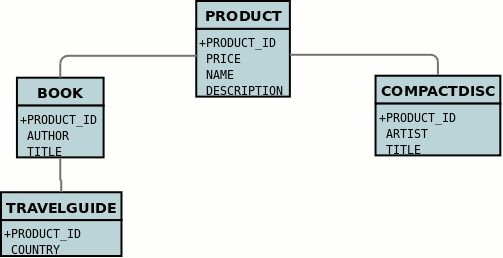

[[inheritance]]
= Inheritance
:_basedir: ../
:_imagesdir: images/

In Java it is a normal situation to have inheritance between classes. 
With JDO you have choices to make as to how you want to persist your classes for the inheritance tree. 
For each class you select how you want to persist that classes information. You have the following choices.

* The first and simplest to understand option is where each class has its own table in the datastore. In JDO this is referred to as link:#inheritance_newtable[*new-table*].
* The second way is to select a class to have its fields persisted in the table of its subclass. In JDO this is referred to as link:#inheritance_subclasstable[*subclass-table*]
* The third way is to select a class to have its fields persisted in the table of its superclass. In JDO this is known as link:#inheritance_superclasstable[superclass-table*]
* The final way is for all classes in an inheritance tree to have their own table containing all fields. 
This is known as link:#inheritance_completetable[*complete-table*] and is enabled by setting the inheritance strategy of the root class to use this.

In order to demonstrate the various inheritance strategies we need an example. Here are a few simple classes representing products in a (online) store. 
We have an abstract base class, extending this to to provide something that we can represent any product by. 
We then provide a few specialisations for typical products. We will use these classes later when defining how to persistent these objects in the different inheritance strategies.

image:../images/inheritance_classes.png[]

JDO imposes a "default" inheritance strategy if none is specified for a class. 
If the class is a base class and no inheritance strategy is specified then it will be set to *new-table* for that class. 
If the class has a superclass and no inheritance strategy is specified then it will be set to *superclass-table*. 
This means that, when no strategy is set for the classes in an inheritance tree, they will default to using a single table managed by the base class.

You can control the "default" strategy chosen by way of the persistence property *datanucleus.defaultInheritanceStrategy*. 
The default is _JDO2_ which will give the above default behaviour for all classes that have no strategy specified. 
The other option is _TABLE_PER_CLASS_ which will use "new-table" for all classes which have no strategy specified

NOTE: At runtime, when you start up your PersistenceManagerFactory, JDO will only _know about_ the classes that the persistence API has been introduced to via method calls. 
To alleviate this, particularly for subclasses of classes in an inheritance relationship, you should make use of one of the many available
link:persistence.html#autostart[Auto Start Mechanisms]

NOTE: You must specify the identity of objects in the root persistable class of the inheritance hierarchy. You cannot redefine it down the inheritance tree

See also :-

* link:metadata_xml.html#inheritance[MetaData reference for <inheritance> element]
* link:metadata_xml.html#discriminator[MetaData reference for <discriminator> element]
* link:annotations.html#Inheritance[Annotations reference for @Inheritance]
* link:annotations.html#Discriminator[Annotations reference for @Discriminator]

[[inheritance_discriminator]]
== Discriminator

NOTE: Applicable to RDBMS, HBase, MongoDB

A _discriminator_ is an extra "column" stored alongside data to identify the class of which that information is part. 
It is useful when storing objects which have inheritance to provide a quick way of determining the object type on retrieval. 
There are two types of discriminator supported by JDO

* *class-name* : where the actual name of the class is stored as the discriminator
* *value-map* : where a (typically numeric) value is stored for each class in question, allowing simple look-up of the class it equates to

You specify a discriminator as follows
                
[source,xml]
-----
<class name="Product">
    <inheritance>
        <discriminator strategy="class-name"/>
    </inheritance>
    ...
</class>
-----

or with annotations

[source,java]
-----
@PersistenceCapable
@Discriminator(strategy=DiscriminatorStrategy.CLASS_NAME)
public class Product {...}
-----

Alternatively if using _value-map_ strategy then you need to provide the value map for all classes in the inheritance tree that will be persisted in their own right.

[source,java]
-----
@PersistenceCapable
@Discriminator(strategy=DiscriminatorStrategy.VALUE_MAP, value="PRODUCT")
public class Product {...}

@PersistenceCapable
@Discriminator(value="BOOK")
public class Book {...}

...
-----

[[inheritance_newtable]]
== New Table

NOTE: Applicable to RDBMS

Here we want to have a separate table for each class. This has the advantage of being the most normalised data definition. 
It also has the disadvantage of being slower in performance since multiple tables will need to be accessed to retrieve an object of a sub type. 
Let's try an example using the simplest to understand strategy *new-table*. 
We have the classes defined above, and we want to persist our classes each in their own table. We define the Meta-Data for our classes like this 

[source,xml]
-----
<class name="AbstractProduct">
    <inheritance strategy="new-table"/>
    <field name="id" primary-key="true">
        <column name="PRODUCT_ID"/>
    </field>
    <field name="name">
        <column name="NAME"/>
    </field>
    <field name="description">
        <column name="DESCRIPTION"/>
    </field>
</class>
<class name="Product">
    <inheritance strategy="new-table"/>
    <field name="price">
        <column name="PRICE"/>
    </field>
</class>
<class name="Book">
    <inheritance strategy="new-table"/>
    <field name="isbn">
        <column name="ISBN"/>
    </field>
    <field name="author">
        <column name="AUTHOR"/>
    </field>
    <field name="title">
        <column name="TITLE"/>
    </field>
</class>
<class name="TravelGuide">
    <inheritance strategy="new-table"/>
    <field name="country">
        <column name="COUNTRY"/>
    </field>
</class>
<class name="CompactDisc">
    <inheritance strategy="new-table"/>
    <field name="artist">
        <column name="ARTIST"/>
    </field>
    <field name="title">
        <column name="TITLE"/>
    </field>
</class>
-----

or with annotations

[source,java]
-----
@PersistenceCapable
@Inheritance(strategy=InheritanceStrategy.NEW_TABLE)
public class AbstractProduct {...}

@PersistenceCapable
@Inheritance(strategy=InheritanceStrategy.NEW_TABLE)
public class Product {...}

@PersistenceCapable
@Inheritance(strategy=InheritanceStrategy.NEW_TABLE)
public class Book {...}

@PersistenceCapable
@Inheritance(strategy=InheritanceStrategy.NEW_TABLE)
public class TravelGuide {...}

@PersistenceCapable
@Inheritance(strategy=InheritanceStrategy.NEW_TABLE)
public class CompactDisc {...}
-----

We use the _inheritance_ element to define the persistence of the inherited classes.
                
    
In the datastore, each class in an inheritance tree is represented in its own datastore table (tables ABSTRACTPRODUCT, PRODUCT, BOOK, TRAVELGUIDE, and COMPACTDISC), 
with the subclasses tables' having foreign keys between the primary key and the primary key of the superclass' table. 

image:../images/inheritance_db_newtable.png[]

In the above example, when we insert a TravelGuide object into the datastore, a row will be inserted into ABSTRACTPRODUCT, PRODUCT, BOOK, and TRAVELGUIDE.

[[inheritance_subclasstable]]
== Subclass table

NOTE: Applicable to RDBMS

DataNucleus supports persistence of classes in the tables of subclasses where this is required. 
This is typically used where you have an abstract base class and it doesn't make sense having a separate table for that class. 
In our example we have no real interest in having a separate table for the *AbstractProduct* class. 
So in this case we change one thing in the Meta-Data quoted above. 
We now change the definition of *AbstractProduct* as follows 

[source,xml]
-----
<class name="AbstractProduct">
    <inheritance strategy="subclass-table"/>
    <field name="id" primary-key="true">
        <column name="PRODUCT_ID"/>
    </field>
    <field name="name">
        <column name="NAME"/>
    </field>
    <field name="description">
        <column name="DESCRIPTION"/>
    </field>
</class>
-----

or with annotations

[source,java]
-----
@PersistenceCapable
@Inheritance(strategy=InheritanceStrategy.SUBCLASS_TABLE)
public class AbstractProduct {...}
-----

This subtle change of use the *inheritance* element has the effect of using the PRODUCT table for both the *Product* and *AbstractProduct* classes, containing the fields of both classes.
                

In the above example, when we insert a TravelGuide object into the datastore, a row will be inserted into PRODUCT, BOOK, and TRAVELGUIDE.

NOTE: DataNucleus doesn't currently fully support the use of classes defined with _subclass-table_ strategy as having relationships where there are more than a single subclass that has a table. 
If the class has a single subclass with its own table then there should be no problem.

[[inheritance_superclasstable]]
== Superclass table

NOTE: Applicable to RDBMS
 
DataNucleus supports persistence of classes in the tables of superclasses where this is required. 
This has the advantage that retrieval of an object is a single SQL call to a single table. 
It also has the disadvantage that the single table can have a very large number of columns, and database readability and performance can suffer, and additionally 
that a discriminator column is required. In our example, lets ignore the *AbstractProduct* class for a moment and assume that *Product* is the base class.
We have no real interest in having separate tables for the *Book* and *CompactDisc* classes and want everything stored in a single table _PRODUCT_. 
We change our MetaData as follows

[source,xml]
-----
<class name="Product">
    <inheritance strategy="new-table">
        <discriminator strategy="class-name">
            <column name="PRODUCT_TYPE"/>
        </discriminator>
    </inheritance>
    <field name="id" primary-key="true">
        <column name="PRODUCT_ID"/>
    </field>
    <field name="price">
        <column name="PRICE"/>
    </field>
</class>
<class name="Book">
    <inheritance strategy="superclass-table"/>
    <field name="isbn">
        <column name="ISBN"/>
    </field>
    <field name="author">
        <column name="AUTHOR"/>
    </field>
    <field name="title">
        <column name="TITLE"/>
    </field>
</class>
<class name="TravelGuide">
    <inheritance strategy="superclass-table"/>
    <field name="country">
        <column name="COUNTRY"/>
    </field>
</class>
<class name="CompactDisc">
    <inheritance strategy="superclass-table"/>
    <field name="artist">
        <column name="ARTIST"/>
    </field>
    <field name="title">
        <column name="DISCTITLE"/>
    </field>
</class>
-----

or with annotations

[source,java]
-----
@PersistenceCapable
@Inheritance(strategy=InheritanceStrategy.NEW_TABLE)
public class AbstractProduct {...}

@PersistenceCapable
@Inheritance(strategy=InheritanceStrategy.SUPERCLASS_TABLE)
public class Product {...}

@PersistenceCapable
@Inheritance(strategy=InheritanceStrategy.SUPERCLASS_TABLE)
public class Book {...}

@PersistenceCapable
@Inheritance(strategy=InheritanceStrategy.SUPERCLASS_TABLE)
public class TravelGuide {...}

@PersistenceCapable
@Inheritance(strategy=InheritanceStrategy.SUPERCLASS_TABLE)
public class CompactDisc {...}
-----

This change of use of the *inheritance* element has the effect of using the PRODUCT table for all classes, containing the fields of *Product*, *Book*, *CompactDisc*, and *TravelGuide*.
You will also note that we used a _discriminator_ element for the *Product* class. 
The specification above will result in an extra column (called PRODUCT_TYPE) being added to the PRODUCT table, and containing the class name of the object stored. 
So for a Book it will have "com.mydomain.samples.store.Book" in that column. This column is used in discriminating which row in the database is of which type. 
The final thing to note is that in our classes *Book* and *CompactDisc* we have a field that is identically named. 
With *CompactDisc* we have defined that its column will be called DISCTITLE since both of these fields will be persisted into the same table and would have had 
identical names otherwise - this gets around the problem.

image:../images/inheritance_db_superclasstable.png[]

In the above example, when we insert a TravelGuide object into the datastore, a row will be inserted into the PRODUCT table only.

JDO allows two types of discriminators. The example above used a discriminator strategy of _class-name_. 
This inserts the class name into the discriminator column so that we know what the class of the object really is. 
The second option is to use a discriminator strategy of _value-map_. With this we will define a "value" to be stored in this column for each of our classes.
The only thing here is that we have to define the "value" in the MetaData for ALL classes that use that strategy. So to give the equivalent example :-

[source,xml]
-----
<class name="Product">
    <inheritance strategy="new-table">
        <discriminator strategy="value-map" value="PRODUCT">
            <column name="PRODUCT_TYPE"/>
        </discriminator>
    </inheritance>
    <field name="id" primary-key="true">
        <column name="PRODUCT_ID"/>
    </field>
    <field name="price">
        <column name="PRICE"/>
    </field>
</class>
<class name="Book">
    <inheritance strategy="superclass-table">
        <discriminator value="BOOK"/>
    </inheritance>
    <field name="isbn">
        <column name="ISBN"/>
    </field>
    <field name="author">
        <column name="AUTHOR"/>
    </field>
    <field name="title">
        <column name="TITLE"/>
    </field>
</class>
<class name="TravelGuide">
    <inheritance strategy="superclass-table">
        <discriminator value="TRAVELGUIDE"/>
    </inheritance>
    <field name="country">
        <column name="COUNTRY"/>
    </field>
</class>
<class name="CompactDisc">
    <inheritance strategy="superclass-table">
        <discriminator value="COMPACTDISC"/>
    </inheritance>
    <field name="artist">
        <column name="ARTIST"/>
    </field>
    <field name="title">
        <column name="DISCTITLE"/>
    </field>
</class>
-----

As you can see from the MetaData DTD it is possible to specify the column details for the _discriminator_. 
DataNucleus supports this, but only currently supports the following values of _jdbc-type_ : VARCHAR, CHAR, INTEGER, BIGINT, NUMERIC. The default column type will be a VARCHAR.

[[inheritance_completetable]]
== Complete table

NOTE: Applicable to RDBMS, Neo4j, NeoDatis, Excel, OOXML, ODF, HBase, JSON, AmazonS3, GoogleStorage, MongoDB, LDAP

With "complete-table" we define the strategy on the root class of the inheritance tree and it applies to all subclasses. 
Each class is persisted into its own table, having columns for all fields (of the class in question plus all fields of superclasses). So taking the same classes as used above

[source,xml]
-----
<class name="Product">
    <inheritance strategy="complete-table"/>
    <field name="id" primary-key="true">
        <column name="PRODUCT_ID"/>
    </field>
    <field name="price">
        <column name="PRICE"/>
    </field>
</class>
<class name="Book">
    <field name="isbn">
        <column name="ISBN"/>
    </field>
    <field name="author">
        <column name="AUTHOR"/>
    </field>
    <field name="title">
        <column name="TITLE"/>
    </field>
</class>
<class name="TravelGuide">
    <field name="country">
        <column name="COUNTRY"/>
    </field>
</class>
<class name="CompactDisc">
    <field name="artist">
        <column name="ARTIST"/>
    </field>
    <field name="title">
        <column name="DISCTITLE"/>
    </field>
</class>
-----

or with annotations

[source,java]
-----
@PersistenceCapable
@Inheritance(strategy=InheritanceStrategy.COMPLETE_TABLE)
public class AbstractProduct {...}
-----

So the key thing is the specification of inheritance strategy at the root only. This then implies a datastore schema as follows
                
image:../images/inheritance_db_completetable.png[]

So any object of explicit type *Book* is persisted into the table "BOOK". 
Similarly any *TravelGuide* is persisted into the table "TRAVELGUIDE".
In addition if any class in the inheritance tree is abstract then it won't have a table since there cannot be any instances of that type.
*DataNucleus currently has limitations when using a class using this inheritance as the element of a collection.*

== Retrieval of inherited objects
 
JDO provides particular mechanisms for retrieving inheritance trees. These are accessed via the Extent/Query interface. Taking our example above, we can then do

[source,java]
-----
tx.begin();
Extent e = pm.getExtent(com.mydomain.samples.store.Product.class, true);
Query  q = pm.newQuery(e);
Collection c=(Collection)q.execute();
tx.commit();
-----

The second parameter passed to _pm.getExtent_ relates to whether to return subclasses. 
So if we pass in the root of the inheritance tree (Product in our case) we get all objects in this inheritance tree returned. 
You can, of course, use far more elaborate queries using JDOQL, but this is just to highlight the method of retrieval of subclasses.
