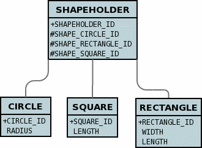
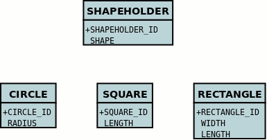

[[interfaces]]
= Interfaces
:_basedir: ../
:_imagesdir: images/

JDO requires that implementations support the persistence of interfaces as first class objects (FCO's). DataNucleus provides this capability. 
It follows the same general process as for link:mapping.html#objects[java.lang.Object] since both interfaces and java.lang.Object are basically _references_ to some persistable object.

To demonstrate interface handling let's introduce some classes.
Let's suppose you have an interface with a selection of classes implementing the interface something like this

[source,java]
-----
public interface Shape
{
    double getArea();
}

public class Circle implements Shape
{
    double radius;
    ...
}

public class Square implements Shape
{
    double length;
    ...
}

public Rectange implements Shape
{
    double width;
    double length;
    ...
}
-----

You then have a class that contains an object of this interface type

[source,java]
-----
public class ShapeHolder
{
    protected Shape shape=null;
    ...
}
-----

JDO doesn't define how an interface is persisted in the datastore. Obviously there can be many implementations and so no obvious solution. DataNucleus allows the following

* *per-implementation* : a FK is created for each implementation so that the datastore can provide referential integrity. 
The other advantage is that since there are FKs then querying can be performed. The disadvantage is that if there are many
implementations then the table can become large with many columns not used
* *identity* : a single column is added and this stores the class name of the implementation stored, as well as the identity of the object. 
The advantage is that if you have large numbers of implementations then this can cope with no schema change.
The disadvantages are that no querying can be performed, and that there is no referential integrity.
* *xcalia* : a slight variation on "identity" whereby there is a single column yet the contents of that column are consistent with 
what Xcalia XIC JDO implementation stored there.

The user controls which one of these is to be used by specifying the _extension_ *mapping-strategy* on the field containing the interface. The default is _per-implementation_.

In terms of the implementations of the interface, you can either leave the field to accept any _known about_ implementation, or you can restrict it to only accept some implementations
(see *implementation-classes* metadata extension).
If you are leaving it to accept any persistable implementation class, then you need to be careful that such implementations are known to DataNucleus at the point of encountering the interface
field. By this we mean, DataNucleus has to have encountered the metadata for the implementation so that it can allow for the implementation when handling the field. 
You can force DataNucleus to know about a persistable class by using an autostart mechanism, or using `persistence.xml`, or by placement of the `package.jdo` file so that 
when the owning class for the interface field is encountered so is the metadata for the implementations. 

[[interface_one_one]]
== 1-1 Interface Relation

To allow persistence of this interface field with DataNucleus you have 2 levels of control. The first level is global control. Since all of our _Square_, _Circle_, 
_Rectangle_ classes implement _Shape_ then we just define them in the MetaData as we would normally.

[source,java]
-----
@Entity
public class Square implement Shape
{
    ...
}
@Entity
public class Circle implement Shape
{
    ...
}
@Entity
public class Rectangle implement Shape
{
    ...
}
-----

The global way means that when mapping that field DataNucleus will look at all persistable classes it knows about that implement the specified interface.

JDO also allows users to specify a list of classes implementing the interface on a field-by-field basis, defining which of these implementations are accepted 
for a particular interface field. To do this you define the Meta-Data like this

[source,java]
-----
@Entity
public class ShapeHolder
{
    @Extension(key="implementation-classes", value="mydomain.Circle,mydomain.Rectangle,mydomain.Square")
    @Extension(key="mapping-strategy", value="identity")
    Shape shape;

    ...
}
-----

or using XML metadata

[source,xml]
-----
<package name="mydomain">
    <class name="ShapeHolder">
        <field name="shape" persistence-modifier="persistent"
               field-type="mydomain.Circle,mydomain.Rectangle,mydomain.Square"/>
</class>
-----

That is, for any interface object in a class to be persisted, you define the possible implementation classes that can be stored there. 
DataNucleus interprets this information and will map the above example classes to the following in the database

So DataNucleus adds foreign keys from the containers table to all of the possible implementation tables for the _shape_ field.

If we use *mapping-strategy* of _identity_ then we get a different datastore schema.

[source,xml]
-----
<class name="ShapeHolder">
    <field name="shape" persistence-modifier="persistent">
        <extension vendor-name="datanucleus" key="mapping-strategy" value="identity"/>
    </field>
</class>
-----

and the datastore schema becomes

and the column "SHAPE" will contain strings such as _mydomain.Circle:1_ allowing retrieval of the related implementation object.

[[interface_one_many]]
== 1-N Interface Relation

You can have a Collection/Map containing elements of an interface type. 
You specify this in the same way as you would any Collection/Map. *You can have a Collection of interfaces as long as you use a join table relation and it is unidirectional.*
The "unidirectional" restriction is that the interface is not persistent on its own and so cannot store the reference back to the owner object.
Use the 1-N relationship guides for the metadata definition to use.

You need to use a DataNucleus extension tag "implementation-classes" if you want to restrict the collection to only contain particular implementations of an interface.
For example

[source,java]
-----
public class ShapeHolder
{
    @Join
    @Extension(key="implementation-classes", value="mydomain.Circle,mydomain.Rectangle,mydomain.Square")
    @Extension(key="mapping-strategy", value="identity")
    Collection<Shape> shapes;

    ...
}
-----

[source,xml]
-----
<class name="ShapeHolder">
    <field name="shapes" persistence-modifier="persistent">
        <collection element-type="mydomain.Shape"/>
        <join/>
        <extension vendor-name="datanucleus" key="implementation-classes" 
            value="mydomain.Circle,mydomain.Rectangle,mydomain.Square,mydomain.Triangle"/>
    </field>
</class>
-----

So the _shapes_ field is a Collection of _mydomain.Shape_ and it will accept the implementations of type *Circle*, *Rectangle*, *Square* and *Triangle*.
If you omit the _implementation-classes_ tag then you have to give DataNucleus a way of finding the metadata for the implementations prior to encountering this field.

== Dynamic Schema Updates

The default mapping strategy for interface fields and collections of interfaces is
to have separate FK column(s) for each possible implementation of the interface.
Obviously if you have an application where new implementations are added over time
the schema will need new FK column(s) adding to match. This is possible if you enable
the persistence property *datanucleus.rdbms.dynamicSchemaUpdates*, setting it
to _true_. With this set, any insert/update operation of an interface related field
will do a check if the implementation being stored is known about in the schema and,
if not, will update the schema accordingly.

