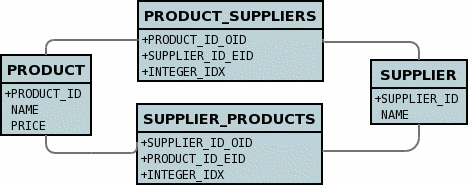
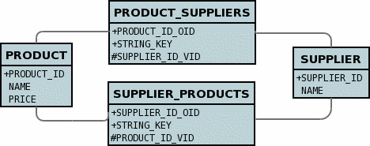

[[many_many_relations]]
= M-N Relations
:_basedir: ../
:_imagesdir: images/

You have a M-to-N (or Many-to-Many) relationship if an object of a class A has associated objects of class B, and class B has associated objects of class A. 
This relationship may be achieved through Java Set, Map, List or subclasses of these, although the only one that supports a true M-N is for a Set/Collection.

With DataNucleus this can be set up as described in this section, using what is called a _Join Table_ relationship. 
Let's take the following example and describe how to model it with the different types of collection classes. We have 2 classes, *Product* and *Supplier* as below.

[source,java]
-----
public class Product
{
    Set<Supplier> suppliers;

    ...
}

public class Supplier
{
    Set<Product> products;

    ...
}
-----

Here the *Product* class knows about the *Supplier* class. In addition the *Supplier* knows about the *Product* class, however with these relationships are really independent.

NOTE: Please note that RDBMS supports the full range of options on this page, whereas other datastores (ODF, Excel, HBase, MongoDB, etc) persist the Collection in a 
column in the owner object (as well as a column in the non-owner object when bidirectional) rather than using join-tables or foreign-keys since those concepts are RDBMS-only.

WARNING: When adding objects to an M-N relation, you MUST add to the owner side as a minimum, and optionally also add to the non-owner side. 
Just adding to the non-owner side will not add the relation.

WARNING: If you want to delete an object from one end of a M-N relationship you will have to remove it first from the other objects relationship. 
If you don't you will get an error message that the object to be deleted has links to other objects and so cannot be deleted.

TIP: If you want to have a M-N relation between classes and think of adding extra information to the join table, please think about where in your Java model that "extra information"
is stored, and consider how JDO can know where to persist it. You would model this situation by creating an intermediate persistable class containing the extra information
and make the relations to this intermediate class.

The various possible relationships are described below.

* link:#many_many_set[M-N Set relation]
* link:#many_many_list_ordered[M-N Ordered List relation]
* link:#many_many_list_indexed[M-N Indexed List - modelled as 2 1-N Unidirectional relations using Join Table]
* link:#many_many_map[M-N Map - modelled as 2 1-N Unidirectional using Join Table]

== equals() and hashCode()

*Important : The element of a Collection ought to define the methods _equals()_ and _hashCode()_ so that updates are detected correctly.* 
This is because any Java Collection will use these to determine equality and whether an element is _contained_ in the Collection.
Note also that the _hashCode()_ should be consistent throughout the lifetime of a persistable object. 
By that we mean that it should *not* use some basis before persistence and then use some other basis (such as the object identity) after persistence, 
for this reason we do not recommend usage of _JDOHelper.getObjectId(obj)_ in the _equals()_/_hashCode()_ methods.

[[many_many_set]]
== Using Set

If you define the Meta-Data for these classes as follows

[source,java]
-----
public class Product
{
    ...

    @Persistent(table="PRODUCTS_SUPPLIERS")
    @Join(column="PRODUCT_ID")
    @Element(column="SUPPLIER_ID")
    Set<Supplier> suppliers;
}

public class Supplier
{
    ...

    @Persistent(mappedBy="suppliers")
    Set<Products> products;
}
-----

or using XML metadata

[source,xml]
-----
<package name="mydomain">
    <class name="Product" identity-type="datastore">
        ...
        <field name="suppliers" table="PRODUCTS_SUPPLIERS">
            <collection element-type="mydomain.Supplier"/>
            <join>
                <column name="PRODUCT_ID"/>
            </join>
            <element>
                <column name="SUPPLIER_ID"/>
            </element>
        </field>
    </class>

    <class name="Supplier" identity-type="datastore">
        ...
        <field name="products" mapped-by="suppliers">
            <collection element-type="mydomain.Product"/>
        </field>
    </class>
</package>
-----

Note how we have specified the information only once regarding join table name, and join column names as well as the `<join>`/`@Join`. 
This is the JDO standard way of specification, and results in a single join table.

image:../images/relationship_M_N_singlejoin_db.png[]

[[many_many_list_ordered]]
== Using Ordered Lists

In this case our fields are of type List instead of Set used above. If you define the annotations for these classes as follows

[source,java]
-----
public class Product
{
    ...

    @Persistent(table="PRODUCTS_SUPPLIERS")
    @Join(column="PRODUCT_ID")
    @Element(column="SUPPLIER_ID")
    @Order(extensions=@Extension(vendorName="datanucleus", key="list-ordering", value="id ASC"))
    List<Supplier> suppliers
}

public class Supplier
{
    ...

    @Persistent
    @Order(extensions=@Extension(vendorName="datanucleus", key="list-ordering", value="id ASC"))
    List<Product> products
}
-----

or using XML metadata

[source,xml]
-----
<package name="mydomain">
    <class name="Product" identity-type="datastore">
        ...

        <field name="suppliers">
            <collection element-type="mydomain.Supplier"/>
            <order>
                <extension vendor-name="datanucleus" key="list-ordering" value="id ASC"/>
            </order>
            <join/>
        </field>
    </class>

    <class name="Supplier" identity-type="datastore">
        ...

        <field name="products">
            <collection element-type="mydomain.Product"/>
            <order>
                <extension vendor-name="datanucleus" key="list-ordering" value="id ASC"/>
            </order>
            <join/>
        </field>
    </class>
</package>
-----

There will be 3 tables, one for *Product*, one for *Supplier*, and the join table. The difference from the Set example is that we now have ordered list specification 
at both sides of the relation. This has no effect in the datastore schema but when the Lists are retrieved they are ordered using the specified ordering.

image:../images/relationship_M_N_singlejoin_db.png[]

[[many_many_list_indexed]]
== Using indexed Lists

*Firstly a true M-N relation with Lists is impossible since there are two lists, and it is undefined as to which one applies to which side etc. What is shown below is two independent
1-N unidirectional join table relations.*

If you define the Meta-Data for these classes as follows

[source,java]
-----
public class Product
{
    ...

    @Join
    List<Supplier> suppliers;
}

public class Supplier
{
    ...

    @Join
    List<Products> products;
}
-----

or using XML metadata

[source,xml]
-----
<package name="mydomain">
    <class name="Product" identity-type="datastore">
        ...
        <field name="suppliers" persistence-modifier="persistent">
            <collection element-type="mydomain.Supplier"/>
            <join/>
        </field>
    </class>

    <class name="Supplier" identity-type="datastore">
        ...
        <field name="products" persistence-modifier="persistent">
            <collection element-type="mydomain.Product"/>
            <join/>
        </field>
    </class>
</package>
-----

There will be 4 tables, one for *Product*, one for *Supplier*, and the join tables. The difference from the Set example is in the contents of the join tables. 
An index column is added to keep track of the position of objects in the Lists.

In the case of a (indexed) List at both ends it doesn't make sense to use a single join table because the ordering can only be defined at one side, so you have to have 2 join tables.

[[many_many_map]]
== Using Map

If we reformulate our classes to use Map fields.

[source,java]
-----
public class Product
{
    Map<String, Supplier> suppliers;

    ...
}

public class Supplier
{
    Map<String, Product> products;

    ...
}
-----

If you define the Meta-Data for these classes as follows

[source,java]
-----
public class Product
{
    @Join
    Map<String, Supplier> suppliers;

    ...
}

public class Supplier
{
    @Join
    Map<String, Product> products;

    ...
}
-----

or using XML metadata

[source,xml]
-----
<package name="mydomain">
    <class name="Product" identity-type="datastore">
        ...
        <field name="suppliers" persistence-modifier="persistent">
            <map/>
            <join/>
        </field>
    </class>

    <class name="Supplier" identity-type="datastore">
        ...
        <field name="products" persistence-modifier="persistent">
            <map/>
            <join/>
        </field>
    </class>
</package>
-----

This will create 4 tables in the datastore, one for *Product*, one for *Supplier*, and the join tables which also contains the keys to the Maps (a String).

