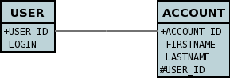
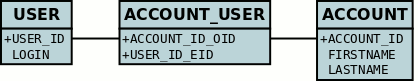

[[many_one_relations]]
= N-1 Relations
:_basedir: ../
:_imagesdir: images/

You have a N-to-1 relationship when an object of a class has an associated object of another class (only one associated object) 
and several of this type of object can be linked to the same associated object. 
From the other end of the relationship it is effectively a 1-N, but from the point of view of the object in question, it is N-1. 
You can create the relationship in 2 ways depending on whether the 2 classes know about each other (bidirectional), 
or whether only the "N" side knows about the other class (unidirectional). These are described below.

NOTE: For RDBMS a N-1 relation is stored as a foreign-key column(s). For non-RDBMS it is stored as a String "column" storing the 'id' (possibly with the class-name 
included in the string) of the related object.

[[many_one_fk]]
== Unidirectional with ForeignKey

For this case you could have 2 classes, *User* and *Account*, as below.

[source,java]
-----
public class Account
{
    User user;

    ...
}

public class User
{
    ...
}
-----

so the *Account* class ("N" side) knows about the *User* class ("1" side), but not vice-versa. A particular user could be related to several accounts. 
If you define the annotations for these classes as follows

[source,java]
-----
public class Account
{
    ...

    @Column(name="USER_ID")
    User user;
}

public class User
{
    ...
}
-----

or using XML metadata

[source,xml]
-----
<package name="mydomain">
    <class name="User" table="USER">
        <field name="id" primary-key="true">
            <column name="USER_ID"/>
        </field>
        ...
    </class>

    <class name="Account" table="ACCOUNT">
        <field name="id" primary-key="true">
            <column name="ACCOUNT_ID"/>
        </field>
        ...
        <field name="user">
            <column name="USER_ID"/>
        </field>
    </class>
</package>
-----

This will create 2 tables in the database, one for *User* (with name _USER_), and one for *Account* (with name _ACCOUNT_ and a column _USER_ID_), as shown below.

This is exactly the same as a link:mapping.html#one_one_uni[1-1 Unidirectional relation].

[[many_one_join]]
== Unidirectional with JoinTable

For this case we have the same 2 classes, *User* and *Account*, as before.

[source,java]
-----
public class Account
{
    User user;

    ...
}

public class User
{
    ...
}
-----

so the *Account* class ("N" side) knows about the *User* class ("1" side), but not vice-versa and the relation is stored using a join table. 
A particular user could be related to several accounts. If you define the annotations as follows

[source,java]
-----
public class Account
{
    ...

    @Join(table="ACCOUNT_USER")
    User user;
}
-----

or with XML metadata

[source,xml]
-----
<package name="mydomain">
    <class name="User" identity-type="datastore">
        ...
    </class>

    <class name="Account" identity-type="datastore">
        ...
        <field name="user" persistence-modifier="persistent">
            <join/>
        </field>
    </class>
</package>
-----

For RDBMS this will create 3 tables in the database, one for *User* (with name _USER_), one for *Account* (with name _ACCOUNT_), and a join table (with name _ACCOUNT_USER_) as shown below.

If you wish to specify the names of the database tables and columns for these classes, you can use the attribute _table_ (on the *class* element), the attribute _name_ 
(on the *column* element) and the attribute _name_ (on the *column* attribute under join

NOTE: In the case of non-RDBMS datastores there is no join-table, simply a "column" in the _ACCOUNT_ "table", storing the "id" of the related object

== Bidirectional

This relationship is described in the guide for link:mapping.html#one_many_relations[1-N relationships]. 
In particular there are 2 ways to define the relationship for RDBMS : the link:mapping.html#one_many_join_bi[first] uses a Join Table to hold the relationship, 
whilst the link:mapping.html#one_many_fk_bi[second] uses a Foreign Key in the "N" object to hold the relationship. 
For non-RDBMS datastores each side will have a "column" (or equivalent) in the "table" of the N side storing the "id" of the related (owning) object.
Please refer to the 1-N relationships bidirectional relations since they show this exact relationship.

