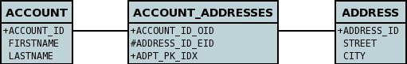
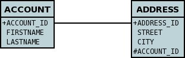
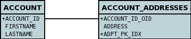
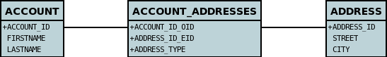
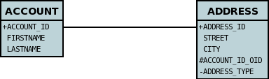
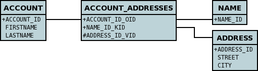
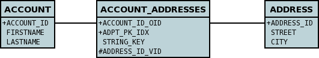
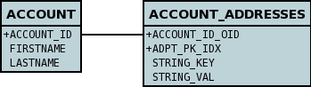
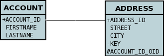
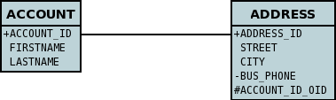

[[one_many_relations]]
= 1-N Relations
:_basedir: ../
:_imagesdir: images/

You have a 1-N (one to many) or N-1 (many to one) when you have one object of a class that has a Collection of objects of another class.
*Please note that Collections allow duplicates whilst Sets don't allow duplicates, and so the persistence process reflects this with the choice of primary keys.*. 
There are two principal ways in which you can represent this in a datastore : *Join Table* (where a join table is used to provide the relationship mapping 
between the objects), and *Foreign-Key* (where a foreign key is placed in the table of the object contained in the Collection.

The various possible relationships are described below.

* link:#one_many_join_uni[Collection<PC> Unidirectional using Join Table]
* link:#one_many_fk_uni[Collection<PC> Unidirectional using Foreign-Key]
* link:#one_many_join_bi[Collection<PC> Bidirectional using Join Table]
* link:#one_many_fk_bi[Collection<PC> Bidirectional using Foreign-Key]
* link:#one_many_list[List<PC>]
* link:#one_many_nonpc_join[Collection<Simple> using Join Table]
* link:#one_many_nonpc_converter[Collection<Simple> using AttributeConverter into single column]
* link:#one_many_shared_join[Collection<PC> using shared join table] (DataNucleus Extension)
* link:#one_many_shared_fk[Collection<PC> using shared foreign key] (DataNucleus Extension)
* link:#one_many_map_join_pc_pc[Map<PC, PC> using join table]
* link:#one_many_map_join_simple_pc[Map<Simple, PC> using join table]
* link:#one_many_map_join_simple_simple[Map<Simple, Simple> using join table]
* link:#one_many_map_converter_simple_simple[Map<Simple, Simple> using AttributeConverter into single column]
* link:#one_many_map_join_pc_simple[Map<PC, Simple> using join table]
* link:#one_many_map_fk_uni_key[Map<Simple,PC> - Unidirectional using foreign-key (key stored in the value class)]
* link:#one_many_map_fk_bi_key[Map<Simple,PC> - Bidirectional using foreign-key (key stored in the value class)]
* link:#one_many_map_fk_uni_value[Map<PC,Simple> - Unidirectional using foreign-key (value stored in the key class)]

NOTE: If you declare a field as a Collection, you can instantiate it as either Set-based or as List-based.
With a List an "ordering" column is required, whereas with a Set it isn't. Consequently DataNucleus needs to know if you plan on using it as Set-based or List-based. 
You do this by adding an "order" element to the field if it is to be instantiated as a List-based collection. If there is no "order" element, then it will be assumed to be Set-based

NOTE: Please note that RDBMS supports the full range of options on this page, whereas other datastores (ODF, Excel, HBase, MongoDB, etc) persist the Collection in a 
column in the owner object (as well as a column in the non-owner object when bidirectional) rather than using join-tables or foreign-keys since those concepts are RDBMS-only.

== equals() and hashCode()
                   
*Important : The element of a Collection ought to define the methods _equals_ and _hashCode_ so that updates are detected correctly.* 
This is because any Java Collection will use these to determine equality and whether an element is _contained_ in the Collection.
Note also that the hashCode() should be consistent throughout the lifetime of a persistable object. 
By that we mean that it should *not* use some basis before persistence and then use some other basis (such as the object identity) after persistence, 
for this reason we do not recommend usage of _JDOHelper.getObjectId(obj)_ in the equals/hashCode methods.

[[one_many_join_uni]]
== Collection<PC> Unidirectional JoinTable

We have 2 sample classes *Account* and *Address*. These are related in such a way as *Account* contains a _Collection_ of objects of type *Address*, yet each *Address* 
knows nothing about the *Account* objects that it relates to. Like this

[source,java]
-----
public class Account
{
    Collection<Address> addresses

    ...
}

public class Address
{
    ...
}
-----

If you define the annotations of the classes like this

[source,java]
-----
public class Account
{
    ...

    @Persistent(table="ACCOUNT_ADDRESSES")
    @Join(column="ACCOUNT_ID_OID")
    @Element(column="ADDRESS_ID_EID")
    Collection<Address> addresses;
}

public class Address
{
    ...
}
-----

or using XML metadata

[source,xml]
-----
<package name="com.mydomain">
    <class name="Account">
        ...
        <field name="addresses" table="ACCOUNT_ADDRESSES">
            <collection element-type="com.mydomain.Address"/>
            <join column="ACCOUNT_ID_OID"/>
            <element column="ADDRESS_ID_EID"/>
        </field>
    </class>

    <class name="Address">
        ...
    </class>
</package>
-----

NOTE: The crucial part is the _join_ element on the field element - this signals to JDO to use a join table.

This will create 3 tables in the database, one for *Address*, one for *Account*, and a join table, as shown below.

    
The join table is used to link the 2 classes via foreign keys to their primary key. This is useful where you want to retain the independence of one class from the other class.

If you wish to fully define the schema table and column names etc, follow these tips
    
* To specify the name of the table where a class is stored, specify the _table_ attribute on the `class` element
* To specify the names of the columns where the fields of a class are stored, specify the _column_ attribute on the `field` element.
* To specify the name of the join table, specify the _table_ attribute on the `field` element with the collection.
* To specify the names of the join table columns, use the _column_ attribute of `join`, `element` elements.
* To specify the foreign-key between container table and join table, specify `<foreign-key>` below the `<join>` element.
* To specify the foreign-key between join table and element table, specify <foreign-key> below either the `<field>` element or the `<element>` element.
* If you wish to share the join table with another relation then use the link:#one_many_shared_join[DataNucleus "shared join table" extension]
* The join table will, by default, be given a primary key. If you want to omit this then you can turn it off using the 
DataNucleus metadata extension "primary-key" (within `<join>`) set to false.
* The column `ADPT_PK_IDX` is added by DataNucleus so that duplicates can be stored. You can control this by adding an `<order>` element and 
specifying the column name for the order column (within `<field>`).
* If you want the set to include nulls, you can turn on this behaviour by adding the DataNucleus extension metadata "allow-nulls" to the `<field>` set to true

[[one_many_fk_uni]]
== Collection<PC> Unidirectional FK

We have the same classes *Account* and *Address* as above for the join table case, but this time we will store the "relation" as a _foreign key_ in the *Address* class. 
So we define the annotations like this

[source,java]
-----
public class Account
{
    ...

    @Element(column="ACCOUNT_ID")
    Collection<Address> addresses;
}

public class Address
{
    ...
}
-----

[source,xml]
-----
<package name="com.mydomain">
    <class name="Account">
        ...
        <field name="addresses">
            <collection element-type="com.mydomain.Address"/>
            <element column="ACCOUNT_ID"/>
        </field>
    </class>

    <class name="Address">
        ...
    </class>
</package>
-----

Again there will be 2 tables, one for *Address*, and one for *Account*.

Note that we have no "mapped-by" attribute specified, and also no "join" element. 
    
In terms of operation within your classes of assigning the objects in the relationship. You have to take your *Account* object and 
add the *Address* to the *Account* collection field since the *Address* knows nothing about the *Account*.
    
    
If you wish to fully define the schema table and column names etc, follow these tips

* To specify the name of the table where a class is stored, specify the _table_ attribute on the `class` element
* To specify the names of the columns where the fields of a class are stored, specify the _column_ attribute on the `field` element.
* To specify the foreign-key between container table and element table, specify `<foreign-key>` below either the `<field>` element or the `<element>` element.
* To specify the names of the columns used in the schema for the foreign key in the *Address* table you should use the `<element>` element within the field of the collection.

WARNING: Since each Address object can have at most one owner (due to the "Foreign Key") this mode of persistence will not allow duplicate values in the Collection.
If you want to allow duplicate Collection entries, then use the "Join Table" variant above.

[[one_many_join_bi]]
== Collection<PC> Bidirectional JoinTable

We have our 2 sample classes *Account* and *Address*. These are related in such a way as *Account* contains a _Collection_ of objects of type *Address*, 
and now each *Address* has a reference to the *Account* object that it relates to. Like this

[source,java]
-----
public class Account
{
    Collection<Address> addresses;

    ...
}

public class Address
{
    Account account;

    ...
}
-----

If you define the annotations for these classes as follows

[source,java]
-----
public class Account
{
    ...

    @Persistent(mappedBy="account")
    @Join
    Collection<Address> addresses;
}

public class Address
{
    ...
}
-----

or using XML metadata
    
[source,xml]
-----
<package name="com.mydomain">
    <class name="Account">
        ...
        <field name="addresses" mapped-by="account">
            <collection element-type="com.mydomain.Address"/>
            <join/>
        </field>
    </class>

    <class name="Address">
        ...
        <field name="account"/>
    </class>
</package>
-----

NOTE: The crucial part is the _join_ element on the field element - this signals to JDO to use a join table.

This will create 3 tables in the database, one for *Address*, one for *Account*, and a join table, as shown below.

The join table is used to link the 2 classes via foreign keys to their primary key. This is useful where you want to retain the independence of one class from the other class.

If you wish to fully define the schema table and column names etc, follow these tips

* To specify the name of the table where a class is stored, specify the _table_ attribute on the `class` element
* To specify the names of the columns where the fields of a class are stored, specify the _column_ attribute on the `field` element.
* To specify the name of the join table, specify the _table_ attribute on the `field` element with the collection.
* To specify the names of the join table columns, use the _column_ attribute of `join`, `element` elements.
* To specify the foreign-key between container table and join table, specify <foreign-key> below the `<join>` element.
* To specify the foreign-key between join table and element table, specify <foreign-key> below either the `<field>` element or the `<element>` element.
* If you wish to share the join table with another relation then use the link:#one_many_shared_join[DataNucleus "shared join table" extension]
* The join table will, by default, be given a primary key. If you want to omit this then you can turn it off using the DataNucleus metadata extension "primary-key" (within `<join>`) 
set to false.
* The column `ADPT_PK_IDX` is added by DataNucleus so that duplicates can be stored. You can control this by adding an `<order>` element and 
specifying the column name for the order column (within `<field>`).
* When forming the relation please make sure that *you set the relation at BOTH sides* since DataNucleus would have no way of knowing which end is correct if you only set one end.
* If you want the set to include nulls, you can turn on this behaviour by adding the extension metadata "allow-nulls" to the <field> set to true

[[one_many_fk_bi]]
== Collection<PC> Bidirectional FK

We have the same classes *Account* and *Address* as above for the join table case, but this time we will store the "relation" as a _foreign key_ in the *Address* class. 
If you define the annotations for these classes as follows

[source,java]
-----
public class Account
{
    ...

    @Persistent(mappedBy="account")
    Collection<Address> addresses;
}

public class Address
{
    @Column(name="ACCOUNT_ID")
    Account account;
}
-----

or using XML metadata

[source,xml]
-----
<package name="com.mydomain">
    <class name="Account">
        ...
        <field name="addresses" mapped-by="account">
            <collection element-type="com.mydomain.Address"/>
        </field>
    </class>

    <class name="Address">
        ...
        <field name="account">
            <column name="ACCOUNT_ID"/>
        </field>
    </class>
</package>
-----

NOTE: The crucial part is the _mapped-by_ on the "1" side of the relationship. This tells the JDO implementation to look for a field called _account_ on the *Address* class.

This will create 2 tables in the database, one for *Address* (including an `ACCOUNT_ID` to link to the `ACCOUNT` table), and one for *Account*.
Notice the subtle difference to this set-up to that of the *Join Table* relationship earlier.

    
If you wish to fully define the schema table and column names etc, follow these tips

* To specify the name of the table where a class is stored, specify the _table_ attribute on the `class` element
* To specify the names of the columns where the fields of a class are stored, specify the _column_ attribute on the `field` element.
* To specify the foreign-key between container table and element table, specify `<foreign-key>` below either the `<field>` element or the `<element>` element.
* When forming the relation please make sure that *you set the relation at BOTH sides* since DataNucleus would have no way of knowing which end is correct if you only set one end.

    
WARNING: Since each Address object can have at most one owner (due to the "Foreign Key") this mode of persistence will not allow duplicate values in the Collection. 
If you want to allow duplicate Collection entries, then use the "Join Table" variant above.

[[one_many_list]]
== Using a List

In the case of the relation field being a List (i.e ordered), you define the relation just like you would for a Collection (above) but then define whether 
you want the relation to be either _ordered_ or _indexed_. 

By default JDO operates with _indexed_ lists (i.e adds a surrogate column in the element or in the join table), and you simply add the following where required

[source,java]
-----
@Order
-----

or using XML

[source,xml]
-----
<order/>
-----

If you have defined the field type as a List then this is not required to be added unless you want to configure details of the order column.

DataNucleus also supports _ordered_ lists whereby the elements of the List are ordered according to some field (or fields) of the element.

If you have an element with a field called "city" then this specification will use that field for ordering (and not add a surrogate ordering column.

[source,java]
-----
@Order(extensions=@Extension(vendorName="datanucleus", key="list-ordering", value="city ASC"))
-----

[source,xml]
-----
<order>
    <extension vendor-name="datanucleus" key="list-ordering" value="city ASC"/>
</order>
-----

[[one_many_nonpc_join]]
== Collection<Simple> via JoinTable

All of the examples above show a 1-N relationship between 2 persistable classes.
If you want the element to be primitive or Object types then follow this section. For example, when you have a Collection of Strings. 
This will be persisted in the same way as the "Join Table" examples above. A join table is created to hold the collection elements. 
Let's take our example. We have an *Account* that stores a Collection of addresses. 
These addresses are simply Strings. We define the annotations like this

[source,java]
-----
public class Account
{
    ...

    @Persistent
    @Join
    @Element(column="ADDRESS")
    Collection<String> addresses;
}
-----

or using XML metadata

[source,xml]
-----
<package name="com.mydomain">
    <class name="Account">
        ...
        <field name="addresses" persistence-modifier="persistent">
            <collection element-type="java.lang.String"/>
            <join/>
            <element column="ADDRESS"/>
        </field>
    </class>
</package>
-----

In the datastore the following is created

The `ACCOUNT` table is as before, but this time we only have the "join table". In our MetaData we used the `<element>` tag to specify the column name to use for the actual address String.

NOTE: the column `ADPT_PK_IDX` is added by DataNucleus so that duplicates can be stored. You can control the name of this column by adding an `<order>` element and specifying the 
column name for the order column (within `<field>`).

[[one_many_nonpc_converter]]
== Collection<Simple> using AttributeConverter via column

Just like in the above example, here we have a Collection of simple types. In this case we are wanting to store this Collection into a single column in the owning table. 
We do this by using a JDO AttributeConverter.

[source,java]
-----
public class Account
{
    ...

    @Persistent
    @Convert(CollectionStringToStringConverter.class)
    @Column(name="ADDRESSES")
    Collection<String> addresses;
}
-----

and then define our converter. You can clearly define your conversion process how you want it. You could, for example, convert the
Collection into comma-separated strings, or could use JSON, or XML, or some other format.

[source,java]
-----
public class CollectionStringToStringConverter implements AttributeConverter<Collection<String>, String>
{
    public String convertToDatastore(Collection<String> attribute)
    {
        if (attribute == null)
        {
            return null;
        }

        StringBuilder str = new StringBuilder();
        ... convert Collection to String
        return str.toString();
    }

    public Collection<String> convertToAttribute(String columnValue)
    {
        if (columnValue == null)
        {
            return null;
        }

        Collection<String> coll = new HashSet<String>();
        ... convert String to Collection
        return coll;
    }
}
-----

[[one_many_shared_join]]
== Collection<PC> via Shared JoinTable

image:../images/nucleus_extension.png[]

The relationships using join tables shown above rely on the join table relating to the relation in question.
DataNucleus allows the possibility of sharing a join table between relations. The example below demonstrates this. 
We take the example as link:#one_many_join_uni[show above] (1-N Unidirectional Join table relation), and extend *Account* to have 2 collections of *Address* records. 
One for home addresses and one for work addresses, like this

[source,java]
-----
public class Account
{
    Collection<Address> workAddresses;

    Collection<Address> homeAddresses;

    ...
}
-----

We now change the metadata we had earlier to allow for 2 collections, but sharing the join table

[source,java]
-----
import org.datanucleus.api.jdo.annotations.SharedRelation;

public class Account
{
    ...

    @Persistent
    @Join(table="ACCOUNT_ADDRESSES", columns={@Column(name="ACCOUNT_ID_OID")})
    @Element(columns={@Column(name="ADDRESS_ID_EID")})
    @SharedRelation(column="ADDRESS_TYPE", value="work")
    Collection<Address> workAddresses;

    @Persistent
    @Join(table="ACCOUNT_ADDRESSES", columns={@Column(name="ACCOUNT_ID_OID")})
    @Element(columns={@Column(name="ADDRESS_ID_EID")})
    @SharedRelation(column="ADDRESS_TYPE", value="home")
    Collection<Address> homeAddresses;

    ...
}
-----

or using XML metadata

[source,xml]
-----
<package name="com.mydomain">
    <class name="Account">
        ...
        <field name="workAddresses" persistence-modifier="persistent" table="ACCOUNT_ADDRESSES">
            <collection element-type="com.mydomain.Address"/>
            <join column="ACCOUNT_ID_OID"/>
            <element column="ADDRESS_ID_EID"/>
            <extension vendor-name="datanucleus" key="relation-discriminator-column" value="ADDRESS_TYPE"/>
            <extension vendor-name="datanucleus" key="relation-discriminator-pk" value="true"/>
            <extension vendor-name="datanucleus" key="relation-discriminator-value" value="work"/>
        </field>
        <field name="homeAddresses" persistence-modifier="persistent" table="ACCOUNT_ADDRESSES">
            <collection element-type="com.mydomain.Address"/>
            <join column="ACCOUNT_ID_OID"/>
            <element column="ADDRESS_ID_EID"/>
            <extension vendor-name="datanucleus" key="relation-discriminator-column" value="ADDRESS_TYPE"/>
            <extension vendor-name="datanucleus" key="relation-discriminator-pk" value="true"/>
            <extension vendor-name="datanucleus" key="relation-discriminator-value" value="home"/>
        </field>
    </class>

    <class name="Address">
        ...
    </class>
</package>
-----

So we have defined the same join table for the 2 collections `ACCOUNT_ADDRESSES`, and the same columns in the join table, meaning that we will 
be sharing the same join table to represent both relations. The important step is then to define the 3 DataNucleus _extension_ tags. 
These define a column in the join table (the same for both relations), and the value that will be populated when a row of that collection is
inserted into the join table. In our case, all "home" addresses will have a value of "home" inserted into this column, and all "work" addresses will have "work" inserted. 
This means we can now identify easily which join table entry represents which relation field.

This results in the following database schema

[[one_many_shared_fk]]
== Collection<PC> via Shared FK

image:../images/nucleus_extension.png[]

The relationships using foreign keys shown above rely on the foreign key relating to the relation in question.
DataNucleus allows the possibility of sharing a foreign key between relations between the same classes. 
The example below demonstrates this. We take the example as link:#one_many_fk_uni[show above] (1-N Unidirectional Foreign Key relation), 
and extend *Account* to have 2 collections of *Address* records. One for home addresses and one for work addresses, like this

[source,java]
-----
public class Account
{
    Collection<Address> workAddresses;

    Collection<Address> homeAddresses;

    ...
}
-----

We now change the metadata we had earlier to allow for 2 collections, but sharing the join table

[source,java]
-----
import org.datanucleus.api.jdo.annotations.SharedRelation;

public class Account
{
    ...

    @Persistent
    @SharedRelation(column="ADDRESS_TYPE", value="work")
    Collection<Address> workAddresses;

    @Persistent
    @SharedRelation(column="ADDRESS_TYPE", value="home")
    Collection<Address> homeAddresses;

    ...
}
-----

or using XML metadata

[source,xml]
-----
<package name="com.mydomain">
    <class name="Account">
        ...
        <field name="workAddresses" persistence-modifier="persistent">
            <collection element-type="com.mydomain.Address"/>
            <element column="ACCOUNT_ID_OID"/>
            <extension vendor-name="datanucleus" key="relation-discriminator-column" value="ADDRESS_TYPE"/>
            <extension vendor-name="datanucleus" key="relation-discriminator-value" value="work"/>
        </field>
        <field name="homeAddresses" persistence-modifier="persistent">
            <collection element-type="com.mydomain.Address"/>
            <element column="ACCOUNT_ID_OID"/>
            <extension vendor-name="datanucleus" key="relation-discriminator-column" value="ADDRESS_TYPE"/>
            <extension vendor-name="datanucleus" key="relation-discriminator-value" value="home"/>
        </field>
    </class>

    <class name="Address">
        ...
    </class>
</package>
-----

So we have defined the same foreign key for the 2 collections `ACCOUNT_ID_OID`, The important step is then to define the 2 DataNucleus `<extension>` tags (`@SharedRelation` annotation). 
These define a column in the element table (the same for both relations), and the value that will be populated when a row of that collection is inserted into the element table. 
In our case, all "home" addresses will have a value of "home" inserted into this column, and all "work" addresses will have "work" inserted. 
This means we can now identify easily which element table entry represents which relation field.

This results in the following database schema

[[one_many_map]]

[[one_many_map_join_pc_pc]]
== Map<PC,PC> using Join Table

Here we have a Map field, with key and value as persistable classes.

[source,java]
-----
@PersistenceCapable
public class Account
{
    ...
    Map<Name, Address> addresses;
}

@PersistenceCapable
public class Name {...}

@PersistenceCapable
public class Address {...}
-----

If we define the annotations like this

[source,java]
-----
@PersistenceCapable
public class Account
{
    @Join
    Map<Name, Address> addresses;
}
-----

or using XML metadata

[source,xml]
-----
<package name="com.mydomain">
    <class name="Account" identity-type="datastore">
        ...
        <field name="addresses" persistence-modifier="persistent">
            <map/>
            <join/>
        </field>
    </class>

    <class name="Address" identity-type="datastore">
        ...
    </class>

    <class name="Name" identity-type="datastore">
    </class>
</package>
-----

NOTE: we don't need to set the keyType or valueType since we are using generics.

This will create 4 tables in the datastore, one for *Account*, one for *Address*, one for *Name* and a join table containing foreign keys to the key/value tables.

If you want to configure the names of the columns in the "join" table you would use the `<key>` and `<value>` sub-elements of `<field>`, something like this

[source,xml]
-----
<field name="addresses" persistence-modifier="persistent" table="ACCOUNT_ADDRESS">
    <map/>
    <join>
        <column name="ACCOUNT_ID"/>
    </join>
    <key>
        <column name="NAME_ID"/>
    </key>
    <value>
        <column name="ADDRESS_ID"/>
    </value>
</field>
-----

If you wish to fully define the schema table and column names etc, follow these tips

* To specify the name of the table where a class is stored, specify the _table_ attribute on the `class` element
* To specify the names of the columns where the fields of a class are stored, specify the _column_ attribute on the `field` element.
* To specify the name of the join table, specify the _table_ attribute on the *field* element.
* To specify the names of the columns of the join table, specify the _column_ attribute on the `join`, `key`, and `value` elements.
* To specify the foreign-key between container table and join table, specify `<foreign-key>` below the `<join>` element.
* To specify the foreign-key between join table and key table, specify `<foreign-key>` below the `<key>` element.
* To specify the foreign-key between join table and value table, specify `<foreign-key>` below the `<value>` element.

Which changes the names of the join table to `ACCOUNT_ADDRESS` from `ACCOUNT_ADDRESSES` and the names of the columns in the join table from 
`ACCOUNT_ID_OID` to `ACCOUNT_ID`, from `NAME_ID_KID` to `NAME_ID`, and from `ADDRESS_ID_VID` to `ADDRESS_ID`.

[[one_many_map_join_simple_pc]]
== Map<Simple,PC> using Join Table

Here our key is a simple type (in this case a String) and the values are _persistable_. Like this

[source,java]
-----
public class Account
{
    Map<String, Address> addresses;

    ...
}

public class Address {...}
-----

So we configure the Account class for persisting the Map into a join table, like this

[source,java]
-----
public class Account
{
    @Join
    Map<String, Address> addresses;
}
-----

or using XML metadata

[source,xml]
-----
<package name="com.mydomain">
    <class name="Account" identity-type="datastore">
        ...
        <field name="addresses" persistence-modifier="persistent">
            <map/>
            <join/>
        </field>
    </class>

    <class name="Address" identity-type="datastore">
        ...
    </class>
</package>
-----

This will create 3 tables in the datastore, one for *Account*, one for *Address* and a join table also containing the key.

If you want to configure the names of the columns in the "join" table you would use the `<key>` and `<value>` subelements of `<field>` as shown above.

Please note that the column `ADPT_PK_IDX` is added by DataNucleus when the column type of the key is not valid to be part of a primary key (with the RDBMS being used). 
If the column type of your key is acceptable for use as part of a primary key then you will not have this `ADPT_PK_IDX` column.

[[one_many_map_join_pcsimple]]
== Map<PC,Simple> using Join Table

Here our value is a simple type (in this case a String) and the keys are _persistable_. Like this

[source,java]
-----
public class Account
{
    Map<Address, String> addresses;

    ...
}

public class Address {...}
-----

[source,java]
-----
public class Account
{
    @Join
    Map<Address, String> addresses;
}
-----

or using XML metadata

[source,xml]
-----
<package name="com.mydomain">
    <class name="Account" identity-type="datastore">
        ...
        <field name="addresses" persistence-modifier="persistent">
            <map/>
            <join/>
        </field>
    </class>

    <class name="Address" identity-type="datastore">
        ...
    </class>
</package>
-----

This operates exactly the same as "Map<Simple, PC>" except that the additional table is for the key instead of the value.

[[one_many_map_join_simple_simple]]
== Map<Simple, Simple> using Join Table

Here our keys and values are of simple types (in this case a String). Like this

[source,java]
-----
public class Account
{
    Map<String, String> addresses;

    ...
}
-----

If you define the annotations for these classes as follows

[source,java]
-----
@PersistenceCapable
public class Account
{
    @Join
    Map<String, String> addresses;

    ...
}
-----

or using XML metadata

[source,xml]
-----
<package name="com.mydomain">
    <class name="Account" identity-type="datastore">
        ...
        <field name="addresses" persistence-modifier="persistent">
            <map key-type="java.lang.String" value-type="java.lang.String"/>
            <join/>
        </field>
    </class>
</package>
-----

This results in just 2 tables. The "join" table contains both the key AND the value.

If you want to configure the names of the columns in the "join" table you would use the `<key>` and `<value>` subelements of `<field>` as shown above.

Please note that the column `ADPT_PK_IDX` is added by DataNucleus when the column type of the key is not valid to be part of a primary key (with the RDBMS being used). 
If the column type of your key is acceptable for use as part of a primary key then you will not have this `ADPT_PK_IDX` column.

[[one_many_map_converter_simple_simple]]
== Map<Simple, Simple> using AttributeConverter via column

Just like in the above example, here we have a Map of simple types. In this case we are wanting to store this Map into a single column in the owning table. 
We do this by using a JDO AttributeConverter.

[source,java]
-----
public class Account
{
    ...

    @Persistent
    @Convert(MapStringStringToStringConverter.class)
    @Column(name="ADDRESSES")
    Map<String, String> addresses;
}
-----

and then define our converter. You can clearly define your conversion process how you want it. You could, for example, convert the
Map into comma-separated strings, or could use JSON, or XML, or some other format.

[source,java]
-----
public class MapStringStringToStringConverter implements AttributeConverter<Map<String, String>, String>
{
    public String convertToDatastore(Map<String, String> attribute)
    {
        if (attribute == null)
        {
            return null;
        }

        StringBuilder str = new StringBuilder();
        ... convert Map to String
        return str.toString();
    }

    public Map<String, String> convertToAttribute(String columnValue)
    {
        if (columnValue == null)
        {
            return null;
        }

        Map<String, String> map = new HashMap<String, String>();
        ... convert String to Map
        return map;
    }
}
-----

[[one_many_map_fk_uni_key]]
== Map<Simple,PC> Unidirectional FK (key stored in value)

In this case we have an object with a Map of objects and we're associating the objects using a foreign-key in the table of the value. 
Here we use a field of the value as the key. The classes are like this

[source,java]
-----
public class Account
{
    Map<String, Address> addresses;
}

public class Address
{
    String alias; // Use as key
}
-----

In this relationship, the *Account* class has a Map of *Address* objects, yet the *Address* knows nothing about the *Account*. 
We define the annotations like this

[source,java]
-----
public class Account
{
    ...
    @Key(mappedBy="alias")
    Map<String, Address> addresses;
}
-----

[source,xml]
-----
<package name="com.mydomain">
    <class name="Account" identity-type="datastore">
        ...
        <field name="addresses" persistence-modifier="persistent">
            <map/>
            <key mapped-by="alias"/>
            <value column="ACCOUNT_ID_OID"/>
        </field>
    </class>

    <class name="Address" identity-type="datastore">
        ...
        <field name="alias" null-value="exception">
            <column name="KEY" length="20" jdbc-type="VARCHAR"/>
        </field>
    </class>
</package>
-----

There will be 2 tables, one for *Address*, and one for *Account*. Note that we now have no "join" annotation/element.

If you wish to specify the names of the columns used in the schema for the foreign key in the `ADDRESS` table you should use the _value_ element within the field of the map.

In terms of operation within your classes of assigning the objects in the relationship. You have to take your *Account* object and add the *Address* to the *Account* map field 
since the *Address* knows nothing about the *Account*. Also be aware that each *Address* object can have only one owner, since it has a single foreign key to the *Account*. 
If you wish to have an *Address* assigned to multiple *Accounts* then you should use the "Join Table" relationship above.

[[one_many_map_fk_bi_key]]
== Map<Simple,PC> Unidirectional FK (key stored in value)

In this case we have an object with a Map of objects and we're associating the objects using a foreign-key in the table of the value.

[source,java]
-----
public class Account
{
    Map<String, Address> addresses;
}

public class Address
{
    String alias; // Use as key

    Account account;
}
-----

The only difference to the variant above is the bidirectional link back to the Account from Address.

So we define our metadata in a similar way

[source,xml]
-----
<package name="com.mydomain">
    <class name="Account" identity-type="datastore">
        ...
        <field name="addresses" persistence-modifier="persistent" mapped-by="account">
            <map/>
            <key mapped-by="alias"/>
        </field>
    </class>

    <class name="Address" identity-type="datastore">
        ...
        <field name="account"/>
        <field name="alias" null-value="exception">
            <column name="KEY" length="20" jdbc-type="VARCHAR"/>
        </field>
    </class>
</package>
-----

This will create 2 tables in the datastore. One for *Account*, and one for *Address*. 
The `ADDRESS` table will contain the key field as well as an index to the *Account* record (notated by the _mapped-by_ tag).

[[one_many_map_fk_uni_value]]
== Map<PC,Simple> Unidirectional FK (value stored in key)

In this case we have an object with a Map of objects and we're associating the objects using a foreign-key in the table of the key. 
We're using a field (_businessAddress_) in the Address class as the value of the map.

[source,java]
-----
public class Account
{
    Map<Address, String> phoneNumbers;
}

public class Address
{
    String businessPhoneNumber; // Use as value
}
-----

We define the MetaData like this

[source,java]
-----
public class Account
{
   @Value(mappedBy="businessPhoneNumber")
   Map<Address, String> phoneNumbers;
}
-----

[source,xml]
-----
<package name="com.mydomain">
    <class name="Account" identity-type="datastore">
        ...
        <field name="phoneNumbers">
            <map/>
            <key column="ACCOUNT_ID_OID"/>
            <value mapped-by="businessPhoneNumber"/>
        </field>
    </class>

    <class name="Address" identity-type="datastore">
        ...
        <field name="businessPhoneNumber" null-value="exception">
            <column name="BUS_PHONE" length="20" jdbc-type="VARCHAR"/>
        </field>
    </class>
</package>
-----

There will be 2 tables, one for *Address*, and one for *Account*. The key thing here is that we have specified a "mapped-by" on the `<value>` element.

If you wish to specify the names of the columns used in the schema for the foreign key in the `ADDRESS` table you should use the `<key>` element within the field of the map.

In terms of operation within your classes of assigning the objects in the relationship. 
You have to take your *Account* object and add the *Address* to the *Account* map field since the *Address* knows nothing about the *Account*. 
Also be aware that each *Address* object can have only one owner, since it has a single foreign key to the *Account*. 
If you wish to have an *Address* assigned to multiple *Accounts* then you should use the "Join Table" relationship above.

