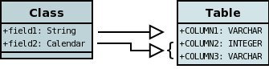

[[schema]]
= Datastore Schema
:_basedir: ../
:_imagesdir: images/

We have shown link:#classes[earlier] how you define MetaData for a classes basic persistence, notating which fields are persisted. 
The next step is to define how it maps to the datastore. Fields of a class are mapped to _columns_ of a _table_ (note that with some datastores it is not called
a 'table' or 'column', but the concept is similar and we use 'table' and 'column' here to represent the mapping). 
If you don't specify the table and column names, then DataNucleus will generate table and column names for you.

NOTE: You should specify your table and column names if you have an existing schema.
Failure to do so will mean that DataNucleus uses its own names and these will almost certainly not match what you have in the datastore.

There are several aspects to cover here

* link:#schema_names[Table/Column names] - mapping classes/fields to table/columns
* link:#schema_nulls_defaults[Column nullability and default value] - what values can be stored in a column 
* link:#schema_column_types[Column Types] - supported column types
* link:#schema_unmapped_columns[Columns with no field in the class] - where you have a column in an existent table but no associated Java field
* link:#schema_column_position[Position of a column in a table] - allowing ordering of columns in the schema
* link:#index[Index Constraints] - used to mark fields that are referenced often as indexes so that when they are used the performance is optimised.
* link:#unique[Unique Constraints] - placed on fields that should have a unique value. That is only one object will have a particular value.
* link:#fk[Foreign-Key Constraints] - used to interrelate objects, and allow the datastore to keep the integrity of the data in the datastore.
* link:#pk[Primary-Key Constraints] - allow the PK to be set, and also to have a name.
* link:#schema_rdbms_views[RDBMS Views] - mapping a class to an RDBMS View instead of a Table

[[schema_names]]
== Tables and Column names
 
The main thing that developers want to do when they set up the persistence of their data is to control the names of the 
tables and columns used for storing the classes and fields. This is an essential step when mapping to an existing schema,
because it is necessary to map the classes onto the existing database entities. Let's take an example

[source,java]
-----
public class Hotel
{
    private String name;
    private String address;
    private String telephoneNumber;
    private int numberOfRooms;
    ...
}
-----
      
In our case we want to map this class to a table called `ESTABLISHMENT`, and has columns `NAME`, `DIRECTION`, `PHONE` and `NUMBER_OF_ROOMS` (amongst other things). 
So we define our Meta-Data like this

[source,xml]
-----
<class name="Hotel" table="ESTABLISHMENT">
    <field name="name">
        <column name="NAME"/>
    </field>
    <field name="address">
        <column name="DIRECTION"/>
    </field>
    <field name="telephoneNumber">
        <column name="PHONE"/>
    </field>
    <field name="numberOfRooms">
        <column name="NUMBER_OF_ROOMS"/>
    </field>
</class>
-----

Alternatively, if you really want to embody schema info in your class, you can use annotations

[source,java]
-----
@PersistenceCapable(table="ESTABLISHMENT")
public class Hotel
{
    @Column(name="NAME")
    private String name;
    @Column(name="DIRECTION")
    private String address;
    @Column(name="PHONE")
    private String telephoneNumber;
    @Column(name="NUMBER_OF_ROOMS")
    private int numberOfRooms;
}
-----

So we have defined the table and the column names.
It should be mentioned that if you don't specify the table and column names then DataNucleus will generate names for the datastore identifiers. 
The table name will be based on the class name, and the column names will be based on the field names and the role of the field (if part of a relationship).

See also :-

* link:#datastore_identifiers[Identifier Guide] - defining the identifiers to use for table/column names
* link:metadata_xml.html#column[MetaData reference for <column> element]
* link:metadata_xml.html#primary-key[MetaData reference for <primary-key> element]
* link:annotations.html#Column[Annotations reference for @Column]
* link:annotations.html#PrimaryKey_Class[Annotations reference for @PrimaryKey]

[[schema_datastoreidentity]]
=== Column names for datastore-identity

When you select _datastore-identity_ a surrogate column will be added in the datastore. 
You need to be able to define the column name if mapping to an existing schema (or wanting to control the schema). 
So lets say we have the following

[source,java]
-----
public class MyClass // persisted to table `MYCLASS`
{
    ...
}

public class MySubClass extends MyClass // persisted to table `MYSUBCLASS`
{
    ...
}
-----

We want to define the names of the identity column in `MYCLASS` and `MYSUBCLASS`. Here's how we do it

[source,xml]
-----
<class name="MyClass" table="MYCLASS">
    <datastore-identity>
        <column name="MY_PK_COLUMN"/>
    </datastore-identity>
    ...
</class>
<class name="MySubClass" table="MYSUBCLASS">
    <datastore-identity>
        <column name="MYSUB_PK_COLUMN"/>
    </datastore-identity>
    ...
</class>
-----

Alternatively, you can specify these using annotations should you so wish.

[source,java]
-----
@PersistenceCapable(table="MYCLASS")
@DatastoreIdentity(column="MY_PK_COLUMN")
public class MyClass
{
    ...
}

@PersistenceCapable(table="MYSUBCLASS")
@DatastoreIdentity(column="MYSUB_PK_COLUMN")
public class MySubClass extends MyClass
{
    ...
}
-----

So we will have a PK column `MY_PK_COLUMN` in the table `MYCLASS`, and a PK column `MYSUB_PK_COLUMN` in the table `MYSUBCLASS` 
(and that corresponds to the `MY_PK_COLUMN` value in `MYCLASS`). We could also do
    
[source,xml]
-----
<class name="MyClass" table="MYCLASS">
    <datastore-identity>
        <column name="MY_PK_COLUMN"/>
    </datastore-identity>
    ...
</class>
<class name="MySubClass" table="MYSUBCLASS">
    <inheritance strategy="new-table"/>
    <primary-key>
        <column name="MYSUB_PK_COLUMN"/>
    </primary-key>
    ...
</class>
-----

See also :-

* link:mapping.html#inheritance[Inheritance Guide] - defining how to use inheritance between classes
* link:metadata_xml.html#column[MetaData reference for <column> element]
* link:metadata_xml.html#primary-key[MetaData reference for <primary-key> element]
* link:annotations.html#Column[Annotations reference for @Column]
* link:annotations.html#PrimaryKey_Class[Annotations reference for @PrimaryKey]

[[schema_applicationidentity]]
=== Column names for application-identity

When you select _application-identity_ you have some field(s) that form the "primary-key" of the class.
A common situation is that you have inherited classes and each class has its own table, and so the primary-key
column names can need defining for each class in the inheritance tree. So lets show an example how to do it
    
[source,java]
-----
public class MyClass // persisted to table `MYCLASS`
{
    long id; // PK field
    ...
}

public class MySubClass extends MyClass // persisted to table `MYSUBCLASS`
{
    ...
}
-----

Defining the column name for "MyClass.id" is easy since we use the same as shown previously "column" for the field.
Obviously the table "MYSUBCLASS" will also need a PK column. Here's how we define the column mapping
    
[source,xml]
-----
<class name="MyClass" identity-type="application" table="MYCLASS">
    <field name="myPrimaryKeyField" primary-key="true">
        <column name="MY_PK_COLUMN"/>
    </field>
    ...
</class>
<class name="MySubClass" identity-type="application" table="MYSUBCLASS">
    <inheritance strategy="new-table"/>
    <primary-key>
        <column name="MYSUB_PK_COLUMN" target="MY_PK_COLUMN"/>
    </primary-key>
    ...
</class>
-----

So we will have a PK column `MY_PK_COLUMN` in the table `MYCLASS`, and a PK column `MYSUB_PK_COLUMN` in the table `MYSUBCLASS`
(and that corresponds to the `MY_PK_COLUMN` value in `MYCLASS`). You can also use

[source,xml]
-----
<class name="MyClass" identity-type="application" table="MYCLASS">
    <field name="myPrimaryKeyField" primary-key="true">
        <column name="MY_PK_COLUMN"/>
    </field>
    ...
</class>
<class name="MySubClass" identity-type="application" table="MYSUBCLASS">
    <inheritance strategy="new-table">
        <join>
            <column name="MYSUB_PK_COLUMN" target="MY_PK_COLUMN"/>
        </join>
    </inheritance>
    ...
</class>
-----
See also :-

* link:mapping.html#inheritance[Inheritance Guide] - defining how to use inheritance between classes
* link:metadata_xml.html#inheritance[MetaData reference for <inheritance> element]
* link:metadata_xml.html#column[MetaData reference for <column> element]
* link:metadata_xml.html#primary-key[MetaData reference for <primary-key> element]
* link:annotations.html#Inheritance[Annotations reference for @Inheritance]
* link:annotations.html#Column[Annotations reference for @Column]
* link:annotations.html#PrimaryKey_Class[Annotations reference for @PrimaryKey]

[[schema_nulls_defaults]]
== Column nullability and default values

So we've seen how to specify the basic structure of a table, naming the table and its columns, and how to control the 
types of the columns. We can extend this further to control whether the columns are allowed to contain nulls and to set 
a default value for a column if we ever have need to insert into it and not specify a particular column. Let's take a 
related class for our hotel. Here we have a class to model the payments made to the hotel.

[source,java]
-----
public class Payment
{
    Customer customer;
    String bankTransferReference;
    String currency;
    double amount;
}
-----

In this class we can model payments from a customer of an amount. Where the customer pays by bank transfer we can save the
reference number. Since our hotel is in the United Kingdom we want the default currency to be pounds, or to use its ISO4217 currency code "GBP". 
In addition, since the bank transfer reference is optional we want that column to be nullable. So let's specify the MetaData for the class.

[source,xml]
-----
<class name="Payment">
    <field name="customer" persistence-capable="persistent" column="CUSTOMER_ID"/>
    <field name="bankTransferReference">
        <column name="TRANSFER_REF" allows-null="true"/>
    </field>
    <field name="currency">
        <column name="CURRENCY" default-value="GBP"/>
    </field>
    <field name="amount" column="AMOUNT"/>
</class>
-----

So we make use of the _allows-null_ and _default-value_ attributes. The table, when created by DataNucleus, will then provide the default and nullability that we require.
See also :-

* link:metadata_xml.html#column[MetaData reference for <column> element]
* link:annotations.html#Column[Annotations reference for @Column]

[[schema_column_types]]
== Column types

DataNucleus will provide a default type for any columns that it creates, but it will allow users to override this default.
The default that DataNucleus chooses is always based on the Java type for the field being mapped. For example a Java field
of type "int" will be mapped to a column type of INTEGER in RDBMS datastores. Similarly String will be mapped to VARCHAR. 
To override the default setting (and always the best policy if you are wanting your MetaData to give the same datastore definition with all JDO implementations) you do as follows

[source,xml]
-----
<class name="Payment">
    <field name="customer" persistence-capable="persistent" column="CUSTOMER_ID">
    <field name="bankTransferReference">
        <column name="TRANSFER_REF" jdbc-type="VARCHAR" length="255" allows-null="true"/>
    </field>
    <field name="currency">
        <column name="CURRENCY" jdbc-type="CHAR" length="3" default-value="GBP"/>
    </field>
    <field name="amount">
        <column name="AMOUNT" jdbc-type="DECIMAL" length="10" scale="2"/>
    </field>
</class>
-----

So we have defined `TRANSFER_REF` to use VARCHAR(255) column type, `CURRENCY` to use CHAR(3) column type, and `AMOUNT` to use
DECIMAL(10,2) column type. Please be aware that DataNucleus only supports persisting particular Java types to particular
JDBC/SQL types. We have demonstrated above the _jdbc-type_ attribute, but there is also an _sql-type_ 
attribute. This is to be used where you want to map to some specific SQL type (and will not be needed in the 
vast majority of cases - the _jdbc-type_ should generally be used).
    
See also :-

* link:mapping.html#field_types[Types Guide] - defining persistence of Java types
* link:mapping.html#schema_rdbms_types[RDBMS Types Guide] - defining mapping of Java types to available JDBC/SQL types
* link:metadata_xml.html#column[MetaData reference for <column> element]
* link:annotations.html#Column[Annotations reference for @Column]

[[schema_rdbms_types]]
=== Supported RDBMS Column Types

NOTE: Applicable to RDBMS.

As we saw in the link:mapping.html#field_types[Types Guide] DataNucleus supports the persistence of a large range of Java field types. 
With RDBMS datastores, we have the notion of tables/columns in the datastore and so each Java type is mapped across to a column or a set of columns in a table. 
It is important to understand this mapping when mapping to an existing schema for example. 
In RDBMS datastores a java type is stored using JDBC types. DataNucleus supports the use of the vast majority of the available JDBC types.

When persisting a Java type in general it is persisted into a single column. 
For example a String will be persisted into a VARCHAR column by default. 
Some types (e.g Color) have more information to store than we can conveniently persist into a single column and so use multiple columns. 
Other types (e.g Collection) store their information in other ways, such as foreign keys.
    

This table shows the Java types we saw earlier and whether they can be queried using JDOQL queries, 
and what JDBC types can be used to store them in your RDBMS datastore. Not all RDBMS datastores 
support all of these options. While DataNucleus always tries to provide a complete list sometimes 
this is impossible due to limitations in the underlying JDBC driver

[cols="4,1,1,6", options="header"]
|===
|Java Type
|Number Columns
|Queryable
|JDBC Type(s)

|boolean
|1
|icon:check[]
|*BIT*, CHAR ('Y','N'), BOOLEAN, TINYINT, SMALLINT, NUMERIC

|byte
|1
|icon:check[]
|*TINYINT*, SMALLINT, NUMERIC

|char
|1
|icon:check[]
|*CHAR*, INTEGER, NUMERIC

|double
|1
|icon:check[]
|*DOUBLE*, DECIMAL, FLOAT

|float
|1
|icon:check[]
|*FLOAT*, REAL, DOUBLE, DECIMAL

|int
|1
|icon:check[]
|*INTEGER*, BIGINT, NUMERIC

|long
|1
|icon:check[]
|*BIGINT*, NUMERIC, DOUBLE, DECIMAL, INTEGER

|short
|1
|icon:check[]
|*SMALLINT*, INTEGER, NUMERIC

|boolean[]
|1
|icon:check[] [5]
|LONGVARBINARY, BLOB

|byte[]
|1
|icon:check[] [5]
|LONGVARBINARY, BLOB

|char[]
|1
|icon:check[] [5]
|LONGVARBINARY, BLOB

|double[]
|1
|icon:check[] [5]
|LONGVARBINARY, BLOB

|float[]
|1
|icon:check[] [5]
|LONGVARBINARY, BLOB

|int[]
|1
|icon:check[] [5]
|LONGVARBINARY, BLOB

|long[]
|1
|icon:check[] [5]
|LONGVARBINARY, BLOB

|short[]
|1
|icon:check[] [5]
|LONGVARBINARY, BLOB

|java.lang.Boolean
|1
|icon:check[]
|*BIT*, CHAR('Y','N'), BOOLEAN, TINYINT, SMALLINT

|java.lang.Byte
|1
|icon:check[]
|*TINYINT*, SMALLINT, NUMERIC

|java.lang.Character
|1
|icon:check[]
|*CHAR*, INTEGER, NUMERIC

|java.lang.Double
|1
|icon:check[]
|*DOUBLE*, DECIMAL, FLOAT

|java.lang.Float
|1
|icon:check[]
|*FLOAT*, REAL, DOUBLE, DECIMAL

|java.lang.Integer
|1
|icon:check[]
|*INTEGER*, BIGINT, NUMERIC

|java.lang.Long
|1
|icon:check[]
|*BIGINT*, NUMERIC, DOUBLE, DECIMAL, INTEGER

|java.lang.Short
|1
|icon:check[]
|*SMALLINT*, INTEGER, NUMERIC

|java.lang.Boolean[]
|1
|icon:check[] [5]
|LONGVARBINARY, BLOB

|java.lang.Byte[]
|1
|icon:check[] [5]
|LONGVARBINARY, BLOB

|java.lang.Character[]
|1
|icon:check[] [5]
|LONGVARBINARY, BLOB

|java.lang.Double[]
|1
|icon:check[] [5]
|LONGVARBINARY, BLOB

|java.lang.Float[]
|1
|icon:check[] [5]
|LONGVARBINARY, BLOB

|java.lang.Integer[]
|1
|icon:check[] [5]
|LONGVARBINARY, BLOB

|java.lang.Long[]
|1
|icon:check[] [5]
|LONGVARBINARY, BLOB

|java.lang.Short[]
|1
|icon:check[] [5]
|LONGVARBINARY, BLOB

|java.lang.Number
|1
|icon:check[]
|

|java.lang.Object
|1
|
|LONGVARBINARY, BLOB

|java.lang.String [8]
|1
|icon:check[]
|*VARCHAR*, CHAR, LONGVARCHAR, CLOB, BLOB, DATALINK [6], UNIQUEIDENTIFIER [7], XMLTYPE [9]

|java.lang.StringBuffer [8]
|1
|icon:check[]
|*VARCHAR*, CHAR, LONGVARCHAR, CLOB, BLOB, DATALINK [6], UNIQUEIDENTIFIER [7], XMLTYPE [9]

|java.lang.String[]
|1
|icon:check[] [5]
|LONGVARBINARY, BLOB

|java.lang.Enum
|1
|icon:check[]
|LONGVARBINARY, BLOB, VARCHAR, INTEGER

|java.lang.Enum[]
|1
|icon:check[] [5]
|LONGVARBINARY, BLOB

|java.math.BigDecimal
|1
|icon:check[]
|*DECIMAL*, NUMERIC

|java.math.BigInteger
|1
|icon:check[]
|*NUMERIC*, DECIMAL

|java.math.BigDecimal[]
|1
|icon:check[] [5]
|LONGVARBINARY, BLOB

|java.math.BigInteger[]
|1
|icon:check[] [5]
|LONGVARBINARY, BLOB

|java.sql.Date
|1
|icon:check[]
|*DATE*, TIMESTAMP

|java.sql.Time
|1
|icon:check[]
|*TIME*, TIMESTAMP

|java.sql.Timestamp
|1
|icon:check[]
|*TIMESTAMP*

|java.util.ArrayList
|0
|icon:check[]
|

|java.util.BitSet
|0
|icon:times[]
|LONGVARBINARY, BLOB

|java.util.Calendar [3]
|1 or 2
|icon:times[]
|INTEGER, VARCHAR, CHAR

|java.util.Collection
|0
|icon:check[]
|

|java.util.Currency
|1
|icon:check[]
|*VARCHAR*, CHAR

|java.util.Date
|1
|icon:check[]
|*TIMESTAMP*, DATE, CHAR, BIGINT

|java.util.Date[]
|1
|icon:check[] [5]
|LONGVARBINARY, BLOB

|java.util.GregorianCalendar [2]
|1 or 2
|icon:times[]
|INTEGER, VARCHAR, CHAR

|java.util.HashMap
|0
|icon:check[]
|

|java.util.HashSet
|0
|icon:check[]
|

|java.util.Hashtable
|0
|icon:check[]
|

|java.util.LinkedHashMap
|0
|icon:check[]
|

|java.util.LinkedHashSet
|0
|icon:check[]
|

|java.util.LinkedList
|0
|icon:check[]
|

|java.util.List
|0
|icon:check[]
|

|java.util.Locale [8]
|1
|icon:check[]
|*VARCHAR*, CHAR, LONGVARCHAR, CLOB, BLOB, DATALINK [6], UNIQUEIDENTIFIER [7], XMLTYPE [9]

|java.util.Locale[]
|1
|icon:check[] [5]
|LONGVARBINARY, BLOB

|java.util.Map
|0
|icon:check[]
|

|java.util.Properties
|0
|icon:check[]
|

|java.util.PriorityQueue
|0
|icon:check[]
|

|java.util.Queue
|0
|icon:check[]
|

|java.util.Set
|0
|icon:check[]
|

|java.util.SortedMap
|0
|icon:check[]
|

|java.util.SortedSet
|0
|icon:check[]
|

|java.util.Stack
|0
|icon:check[]
|

|java.util.TimeZone [8]
|1
|icon:check[]
|*VARCHAR*, CHAR, LONGVARCHAR, CLOB, BLOB, DATALINK [6], UNIQUEIDENTIFIER [7], XMLTYPE [9]

|java.util.TreeMap
|0
|icon:check[]
|

|java.util.TreeSet
|0
|icon:check[]
|

|java.util.UUID [8]
|1
|icon:check[]
|*VARCHAR*, CHAR, LONGVARCHAR, CLOB, BLOB, DATALINK [6], UNIQUEIDENTIFIER [7], XMLTYPE [9]

|java.util.Vector
|0
|icon:check[]
|

|java.awt.Color [1]
|4
|icon:times[]
|INTEGER

|java.awt.Point [2]
|2
|icon:times[]
|INTEGER

|java.awt.image.BufferedImage [4]
|1
|icon:times[]
|LONGVARBINARY, BLOB

|java.net.URI [8]
|1
|icon:check[]
|*VARCHAR*, CHAR, LONGVARCHAR, CLOB, BLOB, DATALINK [6], UNIQUEIDENTIFIER [7], XMLTYPE [9]

|java.net.URL [8]
|1
|icon:check[]
|*VARCHAR*, CHAR, LONGVARCHAR, CLOB, BLOB, DATALINK [6], UNIQUEIDENTIFIER [7], XMLTYPE [9]

|java.io.Serializable
|1
|icon:times[]
|LONGVARBINARY, BLOB

|Persistable
|1
|icon:check[]
|[embedded]

|Persistable[]
|1
|icon:check[] [5]
|
|===

* *[1]* - _java.awt.Color_ - stored in 4 columns (red, green, blue, alpha). ColorSpace is not persisted.
* *[2]* - _java.awt.Point_ - stored in 2 columns (x and y).
* *[3]* - _java.util.Calendar_ - stored in 2 columns (milliseconds and timezone).
* *[4]* - _java.awt.image.BufferedImage_ is stored using JPG image format
* *[5]* - Array types are queryable if not serialised, but stored to many rows
* *[6]* - DATALINK JDBC type supported on DB2 only. Uses the SQL function DLURLCOMPLETEONLY to fetch from the datastore. You can override this using the select-function extension. 
See the link:metadata_xml.html#field_select_function[JDO MetaData reference].
* *[7]* - UNIQUEIDENTIFIER JDBC type supported on MSSQL only.
* *[8]* - Oracle treats an empty string as the same as NULL. To workaround this limitation DataNucleus replaces the empty string with the character \u0001.
* *[9]* - XMLTYPE JDBC type supported on Oracle only.

link:../extensions/extensions.html#rdbms_datastore_types[image:../images/nucleus_extensionpoint.png[]]
If you need to extend the provided DataNucleus capabilities in terms of its datastore types support you can utilise an extension point.
    

DataNucleus provides support for the majority of the JDBC types with RDBMS. The support is shown below.

[cols="2,1,3", options="header"]
|===
|JDBC Type
|Supported
|Restrictions

|ARRAY
|icon:check[]
|Only for PostgreSQL array type

|BIGINT
|icon:check[]
|

|BINARY
|icon:check[]
|Only for geospatial types on MySQL

|BIT
|icon:check[]
|

|BLOB
|icon:check[]
|

|BOOLEAN
|icon:check[]
|

|CHAR
|icon:check[]
|

|CLOB
|icon:check[]
|

|DATALINK
|icon:check[]
|Only on DB2

|DATE
|icon:check[]
|

|DECIMAL
|icon:check[]
|

|DISTINCT
|icon:times[]
|

|DOUBLE
|icon:check[]
|

|FLOAT
|icon:check[]
|

|INTEGER
|icon:check[]
|

|JAVA_OBJECT
|icon:times[]
|

|LONGVARBINARY
|icon:check[]
|

|LONGVARCHAR
|icon:check[]
|

|NCHAR
|icon:check[]
|

|NULL
|icon:times[]
|

|NUMERIC
|icon:check[]
|

|NVARCHAR
|icon:check[]
|

|OTHER
|icon:check[]
|

|REAL
|icon:check[]
|

|REF
|icon:times[]
|

|SMALLINT
|icon:check[]
|

|STRUCT
|icon:check[]
|Only for geospatial types on Oracle

|TIME
|icon:check[]
|

|TIMESTAMP
|icon:check[]
|

|TINYINT
|icon:check[]
|

|VARBINARY
|icon:check[]
|

|VARCHAR
|icon:check[]
|
|===

[[schema_unmapped_columns]]
== Columns with no field in the class

DataNucleus supports mapping of columns in the datastore that have no associated field in
the java class. These are useful where you maybe have a table used by other applications and dont use
some of the information in your Java model. DataNucleus needs to know about these columns so that it can
validate the schema correctly, and also insert particular values when inserting objects into the table.
You could handle this by defining your schema yourself so that the particular columns have "DEFAULT"
settings, but this way you allow DataNucleus to know about all information. So to give an example

[source,xml]
-----
<class name="Hotel" table="ESTABLISHMENT">
    <field name="name">
        <column name="NAME"/>
    </field>
    <field name="address">
        <column name="DIRECTION"/>
    </field>
    <field name="telephoneNumber">
        <column name="PHONE"/>
    </field>
    <field name="numberOfRooms">
        <column name="NUMBER_OF_ROOMS"/>
    </field>
    <column name="YEAR_ESTABLISHED" jdbc-type="INTEGER" insert-value="1980"/>
    <column name="MANAGER_NAME" jdbc-type="VARCHAR" insert-value="N/A"/>
</class>
-----

So in this example our table `ESTABLISHMENT` has the columns associated with the specified fields
and also has columns `YEAR_ESTABLISHED` (that is INTEGER-based and will be given a value of "1980" on any inserts) 
and `MANAGER_NAME` (VARCHAR-based and will be given a value of "N/A" on any inserts).

[[schema_column_position]]
== Field/Column Position in a Table

With some datastores (notably spreadsheets) it is desirable to be able to specify the relative position of a column in the schema. 
The default (for DataNucleus) is just to put them in ascending alphabetical order.
JDO allows definition of this using the _position_ attribute on a *column*.
Here's an example, using XML metadata    

[source,xml]
-----
<jdo>
    <package name="mydomain">
        <class name="Person" detachable="true" table="People">
            <field name="personNum">
                <column position="0"/>
            </field>
            <field name="firstName">
                <column position="1"/>
            </field>
            <field name="lastName">
                <column position="2"/>
            </field>
        </class>
    </package>
</jdo>
-----

and with annotations

[source,java]
-----
@PersistenceCapable(table="People")
public class Person
{
    @Column(position=0)
    long personNum;

    @Column(position=1)
    String firstName;

    @Column(position=2)
    String lastName;
}
-----

[[index]]
== Index Constraints

NOTE: Applicable to RDBMS, NeoDatis, MongoDB.

Many datastores provide the ability to have indexes defined to give performance benefits.
With RDBMS the indexes are specified on the table and the indexes to the rows are stored separately.
In the same way an ODBMS typically allows indexes to be specified on the fields of the class, and these 
are managed by the datastore. JDO provides a mechanism for defining indexes, and hence if a developer 
knows that a particular field is going to be highly used for querying, they can select that field to be 
indexed in their (JDO) persistence solution. 
Let's take an example class, and show how to specify this

[source,java]
-----
public class Booking
{
    private int bookingType;
    ...
}
-----

We decide that our _bookingType_ is going to be highly used and we want to index this in the persistence tool. To do this we define the Meta-Data for our class as

[source,xml]
-----
<class name="Booking">
    <field name="bookingType">
        <index name="BOOKING_TYPE_INDEX"/>
    </field>
</class>
-----
 
This will mean that DataNucleus will create an index in the datastore for the field and the index will have the name `BOOKING_TYPE_INDEX` (for datastores that support using named indexes). 
If we had wanted the index to provide uniqueness, we could have made this 

[source,xml]
-----
<index name="BOOKING_TYPE_INDEX" unique="true"/>
-----

This has demonstrated indexing the fields of a class. The above example will index together all columns for that field. 
In certain circumstances you want to be able to index from the column point of view. 
So we are thinking more from a database perspective. Here we define our indexes at the `<class>` level, like this

[source,xml]
-----
<class name="Booking">
    <index name="MY_BOOKING_INDEX">
        <column name="BOOKING"/>
    </index>
    ...
</class>
-----

This creates an index for the specified column (where the datastore supports columns i.e RDBMS).

=== Enhanced index creation

image:../images/nucleus_extension.png[]

Should you have need to tailor the index creation, for example to generate a particular type of index (where the datastore supports it), 
you can specify extended settings that is appended to the end of any _CREATE INDEX_ statement.

[source,xml]
-----
<class name="Booking">
    <index name="MY_BOOKING_INDEX">
        <extension vendor-name="datanucleus" key="extended-setting" value=" USING HASH"/>
    </index>
    ...
</class>
-----

or alternatively using annotations

[source,java]
-----
@Index(name-"MY_BOOKING_INDEX" extensions={@Extension(vendorName="datanucleus", key="extended-setting", value=" USING HASH")})
-----

See also :-

* link:metadata_xml.html#index[MetaData reference for <index> element]
* link:annotations.html#Index[Annotations reference for @Index]
* link:annotations.html#Index_Class[Annotations reference for @Index (class level)]

[[unique]]
== Unique Constraints

NOTE: Applicable to RDBMS, NeoDatis, MongoDB.

Some datastores provide the ability to have unique constraints defined on tables to give 
extra control over data integrity. JDO provides a mechanism for defining such unique constraints. 
Lets take the previous class, and show how to specify this

[source,xml]
-----
<class name="Booking">
    <field name="bookingType">
        <unique name="BOOKING_TYPE_CONSTRAINT"/>
    </field>
</class>
-----

So in an identical way to the specification of an index. This example specification will result in the 
column(s) for "bookingType" being enforced as unique in the datastore. In the same way you can specify 
unique constraints directly to columns - see the example above for indexes.

Again, as for index, you can also specify unique constraints at "class" level in the MetaData file. 
This is useful to specify where the composite of 2 or more columns or fields are unique. So with this example

[source,xml]
-----
<class name="Booking">
    <unique name="UNIQUE_PERF">
        <field name="performanceDate"/>
        <field name="startTime"/>
    </unique>

    <field name="performanceDate"/>
    <field name="startTime"/>
</class>
-----

The table for Booking has a unique constraint on the columns for the fields _performanceDate_ and _startTime_

See also :-

* link:metadata_xml.html#unique[MetaData reference for <unique> element]
* link:annotations.html#Unique[Annotations reference for @Unique]
* link:annotations.html#Unique_Class[Annotations reference for @Unique (class level)]

[[fk]]
== Foreign Key Constraints

NOTE: Applicable to RDBMS
 
When objects have relationships with one object containing, for example, a Collection of another object, 
it is common to store a foreign key in the datastore representation to link the two associated tables. 
Moreover, it is common to define behaviour about what happens to the dependent object when the owning object is deleted. 
Should the deletion of the owner cause the deletion of the dependent object maybe ? Lets take an example

[source,java]
-----
public class Hotel
{
    private Set rooms;
    ...
}

public class Room
{
    private int numberOfBeds;
    ...
}
-----

We now want to control the relationship so that it is linked by a named foreign key, and that we cascade delete the *Room* object when we delete the *Hotel*. 
We define the Meta-Data like this

[source,xml]
-----
<class name="Hotel">
    <field name="rooms">
        <collection element-type="com.mydomain.samples.hotel.Room"/>
        <foreign-key name="HOTEL_ROOMS_FK" delete-action="cascade"/>
    </field>
</class>
-----

So we now have given the datastore control over the cascade deletion strategy for objects stored in these tables. 
Please be aware that JDO provides link:persistence.html#dependent_fields[Dependent Fields] as a way of allowing cascade deletion. 
The difference here is that _Dependent Fields_ is controlled by DataNucleus, whereas foreign key delete actions are controlled by the datastore (assuming the datastore supports it even)

In the case of a 1-N relation using a join table the equivalent example would be

[source,java]
-----
public class Account
{
    ...

    @Persistent
    @Join(foreignKey="ACCOUNT_FK")
    @Element(foreignKey="ADDRESS_FK");
    Collection<Address> addresses;
}

public class Address
{
    ...
}
-----

or using XML metadata
    
[source,xml]
-----
<package name="com.mydomain">
    <class name="Account">
        ...
        <field name="addresses">
            <collection element-type="com.mydomain.Address"/>
            <join>
                <foreign-key name="ACCOUNT_FK"/>
            </join>
            <element>
                <foreign-key name="ADDRESS_FK"/>
            </element>
        </field>
    </class>

    <class name="Address">
        ...
    </class>
</package>
-----

image:../images/nucleus_extension.png[]

DataNucleus provides an extension that can give significant benefit to users. This is provided via the 
PersistenceManagerFactory _datanucleus.rdbms.constraintCreateMode_. This property has 2 values. 
The default is _DataNucleus_ which will automatically decide which foreign keys are required to satisfy 
the relationships that have been specified, whilst utilising the information provided in the MetaData 
for foreign keys. The other option is _JDO2_ which will simply create foreign keys that have been 
specified in the MetaData file(s).

Note that the _foreign-key_ for a 1-N FK relation can be specified as above, or under the _element_ element. 
Note that the _foreign-key_ for a 1-N Join Table relation is specified under _field_ for the FK from owner to join table, 
and is specified under _element_ for the FK from join table to element table.

In the special case of application-identity and inheritance there is a foreign-key from subclass to superclass. You can define this as follows

[source,xml]
-----
<class name="MySubClass">
    <inheritance>
        <join>
            <foreign-key name="ID_FK"/>
        </join>
    </inheritance>
</class>
-----

See also :-

* link:metadata_xml.html#foreignkey[MetaData reference for <foreignkey> element]
* link:annotations.html#ForeignKey[Annotations reference for @ForeignKey]
* link:persistence.html#cascading[Deletion of related objects using FK constraints]

[[pk]]
== Primary Key Constraints

NOTE: Applicable to RDBMS

In RDBMS datastores, it is accepted as good practice to have a primary key on all tables. 
You specify in other parts of the MetaData which fields are part of the primary key (if using 
applicatioin identity), or you define the name of the column DataNucleus should use for the primary
key (if using datastore identity). What these other parts of the MetaData don't allow is specifying 
the constraint name for the primary key. You can specify this if you wish, like this

[source,xml]
-----
<class name="Booking">
    <primary-key name="BOOKING_PK"/>
    ...
</class>
-----

When the schema is generated for this table, the primary key will be given the specified name, and will
use the column(s) specified by the identity type in use.

In the case where you have a 1-N/M-N relation using a join table you can specify the name of the primary 
key constraint used as follows

[source,xml]
-----
<class name="Hotel">
    <field name="rooms">
        <collection element-type="com.mydomain.samples.hotel.Room"/>
        <join>
            <primary-key name="HOTEL_ROOM_PK"/>
        </join>
    </field>
</class>
-----

This creates a PK constraint with name `HOTEL_ROOM_PK`.

See also :-

* link:metadata_xml.html#primary-key[MetaData reference for <primary-key> element]
* link:annotations.html#PrimaryKey[Annotations reference for @PrimaryKey]
* link:annotations.html#PrimaryKey_Class[Annotations reference for @PrimaryKey (class level)]

[[schema_rdbms_views]]
== RDBMS Views

NOTE: Applicable to RDBMS.

image:../images/nucleus_extension.png[]

The standard situation with an RDBMS datastore is to map classes to *Tables*. 
The majority of RDBMS also provide support for *Views*, providing the equivalent of a read-only SELECT across various tables. 
DataNucleus also provides support for _querying_ such Views (though not persisting into them). 
This provides more flexibility to the user where they have data and need to display it in their application. 
Support for Views is described below.

When you want to access data according to a View, you are required to provide a (persistable) class that will accept
the values from the View when queried, and Meta-Data for the class that defines the View and how it maps onto the provided class. 
Let's take an example. We have a View `SALEABLE_PRODUCT` in our database as follows, defined based on data in a `PRODUCT` table.

[source,sql]
-----
CREATE VIEW SALEABLE_PRODUCT (ID, NAME, PRICE, CURRENCY) AS
    SELECT ID, NAME, CURRENT_PRICE AS PRICE, CURRENCY FROM PRODUCT WHERE PRODUCT.STATUS_ID = 1
-----

So we define a class to represent the values from this *View*.

[source,java]
-----
package mydomain.views;

public class SaleableProduct
{
    String id;
    String name;
    double price;
    String currency;

    public String getId()
    {
        return id;
    }

    public String getName()
    {
        return name;
    }

    public double getPrice()
    {
        return price;
    }

    public String getCurrency()
    {
        return currency;
    }
}
-----

and then we define how this class is mapped to the *View*, here using XML but equally possible using annotations
    
[source,xml]
-----
<?xml version="1.0"?>
<!DOCTYPE jdo SYSTEM "file:/javax/jdo/jdo.dtd">
<jdo>
    <package name="mydomain.views">
        <class name="SaleableProduct" identity-type="nondurable" table="SALEABLE_PRODUCT">
            <field name="id"/>
            <field name="name"/>
            <field name="price"/>
            <field name="currency"/>

            <!-- This is the "generic" SQL92 version of the view. -->
            <extension vendor-name="datanucleus" key="view-definition" value="
CREATE VIEW SALEABLE_PRODUCT
(
    {this.id},
    {this.name},
    {this.price},
    {this.currency}
) AS
SELECT ID, NAME, CURRENT_PRICE AS PRICE, CURRENCY FROM PRODUCT
WHERE PRODUCT.STATUS_ID = 1"/>
        </class>
    </package>
</jdo>
-----

Please note the following

* We've defined our class as using "nondurable" identity. We do *not* need to do this, but in our particular case we don't require the identity lookup.
In DataNucleus up until 5.1.0.M3 this was a mandatory requirement, but we now allow any identity type.
* We've specified the "table", which in this case is the view name - otherwise DataNucleus would create a name for the view based on the class name.
* We've defined a DataNucleus extension _view-definition_ that defines the view for this class. If the view
doesn't already exist it doesn't matter since DataNucleus (when used with _autoCreateSchema_) will execute this construction definition.
* The _view-definition_ can contain macros utilising the names of the fields in the class, and hence
borrowing their column names (if we had defined column names for the fields of the class).
* You can also utilise other classes in the macros, and include them via a DataNucleus MetaData extension _view-imports_ (not shown here)
* If your *View* already exists you are still required to provide a _view-definition_ even though
DataNucleus will not be utilising it, since it also uses this attribute as the flag for whether it is a *View*
or a *Table* - just make sure that you specify the "table" also in the MetaData.
* If you have a relation to the class represented by a *View*, you cannot expect it to create an FK in the *View*. The *View* will map on to exactly
the members defined in the class it represents. i.e cannot have a 1-N FK uni relation to the class with the *View*.

We can now utilise this class within normal DataNucleus querying operation.
    
[source,java]
-----
Extent<SaleableProduct> e = pm.getExtent(SaleableProduct.class);
Iterator<SaleableProduct> iter = e.iterator();
while (iter.hasNext())
{
    SaleableProduct product = iter.next();
}
-----

Hopefully that has given enough detail on how to create and access views from with a DataNucleus-enabled application.

include::_mapping_secondary_tables.adoc[leveloffset=+1]
include::_mapping_datastore_identifiers.adoc[leveloffset=+1]

