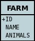
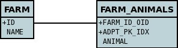
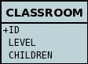
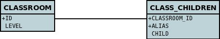

[[serialised]]
= Serialised Fields
:_basedir: ../
:_imagesdir: images/

JDO provides a way for users to specify that a field will be persisted _serialised_. 
This is of use, for example, to collections/maps/arrays which typically are stored using join tables or foreign-keys to other records. 
By specifying that a field is serialised a column will be added to store that field and the field will be serialised into it.

JDO's definition of serialising encompasses several types of fields. These are described below

* link:mapping.html#array_serialised[Serialised Array fields] - where you want to serialise the array into a single "BLOB" column.
* link:#serialise_collection[Serialised Collection fields] - where you want to serialise the collection into a single "BLOB" column.
* link:#serialise_collection_element[Serialised Collection elements] - where you want to serialise the collection elements into a single column in a join table.
* link:#serialise_map[Serialised Map fields] - where you want to serialise the map into a single "BLOB" column
* link:#serialise_map_key_value[Serialised Map keys/values] - where you want to serialise the map keys and/or values into single column(s) in a join table.
* link:#serialise_pc[Serialised persistable fields] - where you want to serialise a PC object into a single "BLOB" column.
* link:#serialise_reference[Serialised Reference (Interface/Object) fields] - where you want to serialise a reference field into a single "BLOB" column.
* link:#serialise_to_file[Serialised field to local disk] - not part of the JDO spec but available as an option for RDBMS datastores usage

Perhaps the most important thing to bear in mind when deciding to serialise a field is that that object must implement _java.io.Serializable_.

NOTE: Queries cannot be performed on map keys/values stored as serialised.

[[serialise_collection]]
== Serialised Collections

NOTE: Applicable to RDBMS, HBase, MongoDB

Collections are usually persisted by way of either a _join table_, or by use of a _foreign-key_ in the element table. 
In some situations it is required to store the whole collection in a single column in the table of the class being persisted. 
This prohibits the querying of such a collection, but will persist the collection in a single statement. Let's take an example. We have the following classes

[source,java]
-----
public class Farm
{
    Collection<Animal> animals;
    ...
}
public class Animal
{
    String name;
    Type type;
}
-----

and we want the _animals_ collection to be serialised into a single column in the table storing the *Farm* class, so we define our MetaData like this

[source,xml]
-----
<field name="animals" serialized="true">
    <collection element-type="Animal"/>
    <column name="ANIMALS"/>
</field>
-----

So we make use of the _serialized_ attribute of <field>. This specification results in a table like this

There are some other combinations of MetaData tags that result in serialising of the whole collection in the same way. These are as follows

* *Collection of non-_persistable_ elements, and no <join> is specified.*
Since the elements don't have a table of their own, the only option is to serialise the whole collection and it appears as a single BLOB field in the table of the main class.
* *Collection of _persistable_ elements, with "embedded-element" set to *true* and no <join> is specified.*
Since the elements are embedded and there is no join table, then the whole collection is serialised as above.

See also :-

* link:metadata_xml.html#field[MetaData reference for <field> element]
* link:annotations.html#Persistent[Annotations reference for @Persistent]
* link:annotations.html#Serialized[Annotations reference for @Serialized]

[[serialise_collection_element]]
== Serialised Collection Elements

NOTE: Applicable to RDBMS

In some situations you may want to serialise the element into a single column in the join table. Let's take an example. 
We have the same classes as in the previous case and we want the _animals_ collection to be stored in a join table, and the element serialised 
into a single column storing the "Animal" object. We define our MetaData like this

[source,java]
-----
@Persistent(table="FARM_ANIMALS")
@Element(serialised="true")
Collection<Animal> animals;
-----

[source,xml]
-----
<field name="animals" table="FARM_ANIMALS">
    <collection element-type="Animal" serialised-element="true"/>
    <join column="FARM_ID_OID"/>
</field>
-----

So we make use of the _serialized-element_ attribute of <collection>. This specification results in tables like this

See also :-

    * link:metadata_xml.html#collection">MetaData reference for <collection> element]
    * link:metadata_xml.html#join">MetaData reference for <join> element]
    * link:annotations.html#Element">Annotations reference for @Element]

[[serialise_map]]
== Serialised Maps

NOTE: Applicable to RDBMS, HBase, MongoDB

Maps are usually persisted by way of a _join table_, or very occasionaly using a _foreign-key_ in the value table. 
In some situations it is required to store the whole map in a single column in the table of the class being persisted. 
This prohibits the querying of such a map, but will persist the map in a single statement. Let's take an example. We have the following classes

[source,java]
-----
public class ClassRoom
{
    Map<String, Child> children;
    ...
}
public class Child
{
    ...
}
-----

and we want the _children_ map to be serialised into a single column in the table storing the *ClassRoom* class, so we define our MetaData like this

[source,xml]
-----
<field name="children" serialized="true">
    <map key-type="java.lang.String" value-type="Child"/>
    <column name="CHILDREN"/>
</field>
-----

So we make use of the _serialized_ attribute of <field>. This specification results in a table like this

There are some other combinations of MetaData tags that result in serialising of the whole map in the same way. These are as follows

* *Map<non-_persistable_, non-_persistable_>, and no <join> is specified.*
Since the keys/values don't have a table of their own, the only option is to serialise the whole map and it appears as a single BLOB field in the table of the main class.
* *Map<non-_persistable_, _persistable_>, with "embedded-value" set to *true*
and no <join> is specified.* Since the keys/values are embedded and there is no join table, then the whole map is serialised as above.

See also :-

* link:metadata_xml.html#map[MetaData reference for <map> element]
* link:annotations.html#Key[Annotations reference for @Key]
* link:annotations.html#Value[Annotations reference for @Value]
* link:annotations.html#Serialized[Annotations reference for @Serialized]

[[serialise_map_key_value]]
== Serialised Map Keys/Values

NOTE: Applicable to RDBMS

Maps are usually persisted by way of a _join table_, or very occasionaly using a _foreign-key_ in the value table. 
In the join table case you have the option of serialising the keys and/or the values each into a single (BLOB) column in the join table. 
This is performed in a similar way to serialised elements for collections, but this time using the "serialized-key", "serialized-value" attributes. 
We take the example in the previous section, with "a classroom of children" and the children stored in a map field. 
This time we want to serialise the child object into the join table of the map

[source,java]
-----
@Persistent(table="CLASS_CHILDREN")
@Value(serialised="true")
Map<String, Child> children;
-----

or using XML metadata

[source,xml]
-----
<class name="ClassRoom">
    ...
    <field name="children" table="CLASS_CHILDREN">
        <map key-type="java.lang.String" value-type="Child" serialized-value="true"/>
        <join column="CLASSROOM_ID"/>
        <key column="ALIAS"/>
        <value column="CHILD"/>
    </field>
</class>
<class name="Child"/>
-----

So we make use of the _serialized-value_ attribute of <map>. This results in a schema like this

See also :-

* link:metadata_xml.html#map">MetaData reference for <map> element]
* link:metadata_xml.html#join">MetaData reference for <join> element]
* link:metadata_xml.html#key">MetaData reference for <key> element]
* link:metadata_xml.html#value">MetaData reference for <value> element]
* link:annotations.html#Key">Annotations reference for @Key]
* link:annotations.html#Value">Annotations reference for @Value]

[[serialise_pc]]
== Serialised persistable Fields

NOTE: Applicable to RDBMS, HBase, MongoDB

A field that is a _persistable_ object is typically stored as a foreign-key relation between the container object and the contained object. 
In some situations it is not necessary that the contained object has an identity of its own, and for efficiency of access the contained object 
is required to be stored in a BLOB column in the containing object's datastore table. Let's take an example. We have the following classes

[source,java]
-----
public class ClassRoom
{
    ...
    Teacher teacher;
}

public class Teacher {...}
-----

and we want the _teacher_ object to be serialised into a single column in the table storing the *ClassRoom* class, so we define our MetaData like this

[source,java]
-----
@Serialized
Teacher teacher;
-----

or using XML metadata

[source,xml]
-----
<field name="teacher" serialized="true">
    <column name="TEACHER"/>
</field>
-----

So we make use of the _serialized_ attribute of <field>. This specification results in a table like this

[[serialise_reference]]
== Serialised Reference (Interface/Object) Fields

NOTE: Applicable to RDBMS

In some situations it is not necessary that the contained object has an identity of its own, and for efficiency of access the contained object is required 
to be stored in a BLOB column in the containing object's datastore table. Let's take an example using an interface field. 
We have the following classes

[source,java]
-----
public class ClassRoom
{
    Person teacher;
    ...
}
public interface Person {...}
public class Teacher implements Person {...}
-----

and we want the _teacher_ object to be serialised into a single column in the table storing the *ClassRoom* class, so we define our MetaData like this

[source,xml]
-----
<field name="teacher" serialized="true">
    <column name="TEACHER"/>
</field>
-----
So we make use of the _serialized_ attribute of <field>. This specification results in a table like this

See also :-

* link:metadata_xml.html#implements[MetaData reference for <implements> element]
* link:annotations.html#Serialized[Annotations reference for @Serialized]

[[serialise_to_file]]
== Serialised Field to Local File

NOTE: Applicable to RDBMS

If you have a non-relation field that implements Serializable you have the option of serialising it into a file on the local disk. 
This could be useful where you have a large file and don't want to persist very large objects into your RDBMS. 
Obviously this will mean that the field is no longer queryable, but then if its a large file you likely don't care about that. 
So let's give an example

[source,java]
-----
@Persistent
@Extension(vendorName="datanucleus", key="serializeToFileLocation" value="person_avatars")
AvatarImage image;
-----

Or using XML

[source,xml]
-----
<field name="image" persistence-modifier="persistent">
    <extension vendor-name="datanucleus" key="serializeToFileLocation" value="person_avatars"/>
</field>
-----

So this will now persist a file into a folder _person_avatars_ with filename as the String form of the identity of the owning object. 
In a real world example you likely will specify the extension value as an absolute path name, so you can place it anywhere in the local disk.
