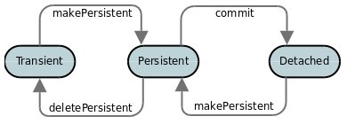
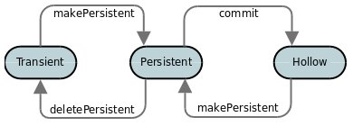

[[lifecycle]]
= Object Lifecycle
:_basedir: ../
:_imagesdir: images/

During the persistence process, an object goes through lifecycle changes. 
Below we demonstrate the primary object lifecycle changes for JDO.
JDO has a very high degree of flexibility and so can be configured to operate in different modes. 
The mode most consistent with JPA is shown below (this has the persistence property *datanucleus.DetachAllOnCommit* set to _true_).

So a newly created object is *transient*. You then persist it and it becomes *persistent*. 
You then commit the transaction and it is detached for use elsewhere in the application. 
You then attach any changes back to persistence and it becomes *persistent* again. 
Finally when you delete the object from persistence and commit that transaction it is in *transient* state.

An alternative JDO lifecycle occurs when you have *datanucleus.DetachAllOnCommit* as _false_. 
Now at commit the object moves into *hollow* state (still has its identity, but its field values are optionally unloaded). 
Set the persistence property *datanucleus.RetainValues* to not unset the values of any non-primary-key fields when migrating to *hollow* state.

With JDO there are actually some additional lifecycle states, notably when an object has a field changed, becoming _dirty_, 
so you get an object in "persistent-dirty", "detached-dirty" states for example. 
The average user doesn't need to know about these so we don't cover them here. 

See also :-

* link:#attach_detach[Attach/Detach of objects]

== Helper Methods

To inspect the lifecycle state of an object, simply call

[source,java]
-----
ObjectState state = JDOHelper.getObjectState(obj);
-----

JDO provides a series of other helper methods for lifecycle operations. These are documented on the http://db.apache.org/jdo/jdohelper.html[Apache JDO site].

Further to this DataNucleus provides yet more helper methods

[source,java]
-----
String[] fieldNames = NucleusJDOHelper.getDirtyFields(pc, pm);
String[] fieldNames = NucleusJDOHelper.getLoadedFields(pc, pm);
-----

These methods returns the names of the dirty/loaded fields in the supplied object. The _pm_ argument is only required if the object is detached

[source,java]
-----
Boolean dirty = NucleusJDOHelper.isDirty(pc, "fieldName", pm);
Boolean loaded = NucleusJDOHelper.isLoaded(pc, "fieldName", pm);
-----

These methods returns whether the specified field in the supplied object is dirty/loaded. The _pm_ argument is only required if the object is detached

