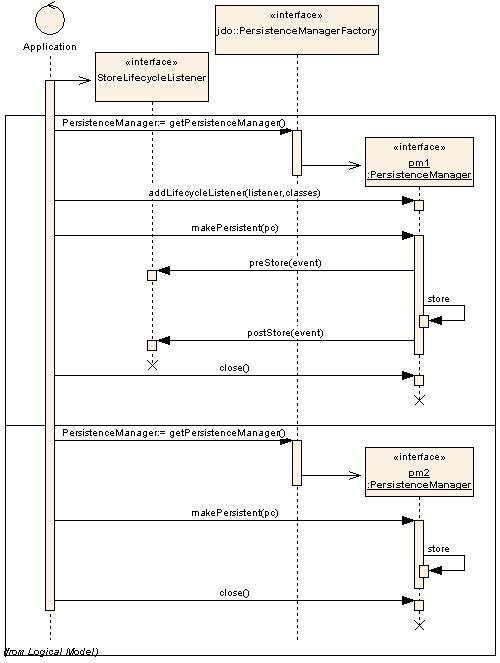
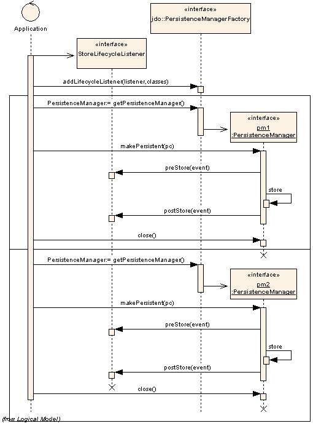

[[lifecycle_callbacks]]
= Lifecycle Callbacks
:_basedir: ../
:_imagesdir: images/

JDO defines a mechanism whereby a persistable class can be marked as a listener for lifecycle events. 
Alternatively a separate listener class can be defined to receive these events. 
Thereafter when entities of the particular class go through lifecycle changes events are passed to the provided methods. 
Let's look at the two different mechanisms

[[instance_callbacks]]
== Instance Callbacks

JDO defines an interface for persistable classes so that they can be notified of events in their own lifecycle and perform any 
additional operations that are needed at these checkpoints. This is a complement to the link:#lifecycle_listeners[Lifecycle Listeners]
interface which provides listeners for all objects of particular classes, with the events sent to a listener. 
With *InstanceCallbacks* the _persistable_ class is the destination of the lifecycle events. 
As a result the *Instance Callbacks* method is more intrusive than the method of _Lifecycle Listeners_ in that it requires methods adding
to each class that wishes to receive the callbacks.

The *InstanceCallbacks* interface is documented http://www.datanucleus.org/javadocs/javax.jdo/3.2/javax/jdo/InstanceCallbacks.html[here].

To give an example of this capability, let us define a class that needs to perform some operation just before it's object is deleted.

[source,java]
-----
public class MyClass implements InstanceCallbacks
{
    String name;

    ... (class methods)

    public void jdoPostLoad() {}
    public void jdoPreClear() {}
    public void jdoPreStore() {}

    public void jdoPreDelete()
    {
        // Perform some operation just before being deleted.
    }
}
-----

We have implemented _InstanceCallbacks_ and have defined the 4 required methods. Only one of these is of importance in this example.

These methods will be called just before storage in the data store (_jdoPreStore_), just before clearing (_jdoPreClear_), 
just after being loaded from the datastore (_jdoPostLoad_) and just before being deleted (_jdoPreDelete_).

JDO also has 2 additional callbacks to complement _InstanceCallbacks_. These are 
_AttachCallback_ image:../images/javadoc.png[Javadoc, link=http://www.datanucleus.org/javadocs/javax.jdo/3.2/javax/jdo/listener/AttachCallback.html]
and _DetachCallback_ image:../images/javadoc.png[Javadoc, link=http://www.datanucleus.org/javadocs/javax.jdo/3.2/javax/jdo/listener/AttachCallback.html].
If you want to intercept attach/detach events your class can implement these interfaces. You will then need to implement the following methods

[source,java]
-----
public interface AttachCallback
{
    public void jdoPreAttach();
    public void jdoPostAttach(Object attached);
}

public interface DetachCallback
{
    public void jdoPreDetach();
    public void jdoPostDetach(Object detached);
}
-----

[[lifecycle_listeners]]
== Lifecycle Listeners

JDO defines an interface for the PersistenceManager and PersistenceManagerFactory whereby a user can register a listener for persistence events. 
The user provides a listener for either all classes, or a set of defined classes,  and the JDO implementation calls methods 
on the listener when the required events occur. 
This provides the user application with the power to monitor the persistence process and, where necessary, append related behaviour. 
Specifying the listeners on the PersistenceManagerFactory has the benefits that these listeners will be added to all 
PersistenceManagers created by that factory, and so is for convenience really. 
This facility is a complement to the link:#instance_callbacks[Instance Callbacks] facility which allows interception of events on an instance by instance basis. 
The *Lifecycle Listener* process is much less intrusive than the process provided by _Instance Callbacks_, allowing a class 
external to the persistence process to perform the listening.

The *InstanceLifecycleListener* interface is documented
http://www.datanucleus.org/javadocs/javax.jdo/3.2/javax/jdo/listener/InstanceLifecycleListener.html[here].

To give an example of this capability, let us define a Listener for our persistence process.

[source,java]
-----
public class LoggingLifecycleListener implements CreateLifecycleListener, 
    DeleteLifecycleListener, LoadLifecycleListener, StoreLifecycleListener
{
    public void postCreate(InstanceLifecycleEvent event)
    {
        log.info("Lifecycle : create for " + 
            ((Persistable)event.getSource()).dnGetObjectId());
    }

    public void preDelete(InstanceLifecycleEvent event)
    {
        log.info("Lifecycle : preDelete for " + 
            ((Persistable)event.getSource()).dnGetObjectId());
    }

    public void postDelete(InstanceLifecycleEvent event)
    {
        log.info("Lifecycle : postDelete for " + 
            ((Persistable)event.getSource()).dnGetObjectId());
    }

    public void postLoad(InstanceLifecycleEvent event)
    {
        log.info("Lifecycle : load for " + 
            ((Persistable)event.getSource()).dnGetObjectId());
    }

    public void preStore(InstanceLifecycleEvent event)
    {
        log.info("Lifecycle : preStore for " + 
            ((Persistable)event.getSource()).dnGetObjectId());
    }

    public void postStore(InstanceLifecycleEvent event)
    {
        log.info("Lifecycle : postStore for " + 
            ((Persistable)event.getSource()).dnGetObjectId());
    }
}
-----

Here we've provided a listener to receive events for CREATE, DELETE, LOAD, and STORE of objects.
These are the main event types and in our simple case above we will simply log the event. 
All that remains is for us to register this listener with the PersistenceManager, or PersistenceManagerFactory

[source,java]
-----
pm.addInstanceLifecycleListener(new LoggingLifecycleListener(), null);
-----

When using this interface the user should always remember that the listener is called within the same transaction as the operation 
being reported and so any changes they then make to the objects in question will be reflected in that objects state.

Register the listener with the PersistenceManager or PersistenceManagerFactory provide different effects. 
Registering with the PersistenceManagerFactory means that all PersistenceManagers created by it will have the listeners registered on the PersistenceManagerFactory called. 
Registering the listener with the PersistenceManager will only have the listener called only on events raised only by the PersistenceManager instance.

The above diagram displays the sequence of actions for a listener registered only in the PersistenceManager. 
Note that a second PersistenceManager will not make calls to the listener registered in the first PersistenceManager.

The above diagram displays the sequence of actions for a listener registered in the PersistenceManagerFactory. 
All events raised in a PersistenceManager obtained from the PersistenceManagerFactory will make calls to the listener registered in the PersistenceManagerFactory.

DataNucleus supports the following instance lifecycle listener types

* *AttachLifecycleListener* - all attach events
* *ClearLifecycleListener* - all clear events
* *CreateLifecycelListener* - all object create events
* *DeleteLifecycleListener* - all object delete events
* *DetachLifecycleListener* - all detach events
* *DirtyLifecycleListener* - all dirty events
* *LoadLifecycleListener* - all load events
* *StoreLifecycleListener* - all store events

image:../images/nucleus_extension.png[]

The default JDO lifecycle listener _StoreLifecycleListener_ only informs the listener of the object being stored. 
It doesn't provide information about the fields being stored in that event. 
DataNucleus extends the JDO specification and on the "preStore" event it will return an instance of _org.datanucleus.api.jdo.FieldInstanceLifecycleEvent_ 
(which extends the JDO InstanceLifecycleEvent) and provides access to the names of the fields being stored.

[source,java]
-----
public class FieldInstanceLifecycleEvent extends InstanceLifecycleEvent
{
    ...

    /**
     * Accessor for the field names affected by this event
     * @return The field names
     */
    public String[] getFieldNames()
    ...
}
-----

If the store event is the persistence of the object then this will return all field names.
If instead just particular fields are being stored then you just receive those fields in the event. 
So the only thing to do to utilise this DataNucleus extension is cast the received event to _org.datanucleus.FieldInstanceLifecycleEvent_

