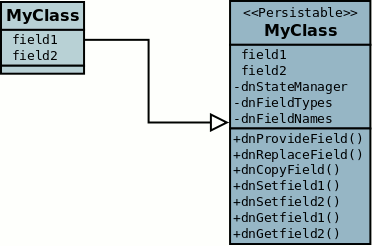
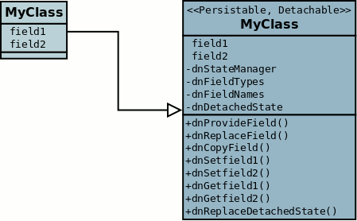

[[enhancer]]
= JDO Enhancement Guide (v{version})
:_basedir: ../
:_imagesdir: images/
:jdo:

DataNucleus requires that all classes that are persisted implement 
http://www.datanucleus.org/javadocs/core/5.0/org/datanucleus/enhancement/Persistable.html[Persistable].
Rather than requiring that a user add this themself, we provide an enhancer that will modify your compiled classes to implement all required methods.

* The use of this interface means that you get *transparent persistence*, and your classes always remain _your_ classes; ORM tools that use a mix of 
reflection and/or proxies are not totally transparent.
* DataNucleus' use of _Persistable_ provides transparent change tracking. When any change is made to an object the change creates a notification to 
DataNucleus allowing it to be optimally persisted. ORM tools that dont have access to such change tracking have to use reflection to detect changes. 
The performance of this process will break down as soon as you read a large number of objects, but modify just a handful, with these tools having to 
compare all object states for modification at transaction commit time.
* Other ORMs utilise bytecode enhancement : OpenJPA requires a similar bytecode enhancement process also, and EclipseLink and Hibernate both allow it as an 
option since they also now see the benefits of this approach over use of proxies and reflection. 
Read http://blog.bolkey.com/2009/05/hibernate-datanucleus-r1/[this comparison] of bytecode enhancement, and proxies to see the relative benefits.

In the DataNucleus bytecode enhancement contract there are 3 categories of classes. 
These are _PersistenceCapable_, _PersistenceAware_ and normal classes. The Meta-Data (XML or annotations) defines which classes fit into these categories. 
To give an example, we have 3 classes. Class _A_ is to be persisted in the datastore, class _B_ directly updates the fields of class _A_ 
but doesn't need persisting, and class _C_ is not involved in the persistence process. We would define these classes as follows

[source,java]
-----
@PersistenceCapable
public class A {...}

@PersistenceAware
public class B {...}

public class C {...}
-----

So our MetaData is mainly for those classes that are _PersistenceCapable_ and are to be persisted to the datastore.
For _PersistenceAware_ classes we simply notate that the class knows about persistence. 
We don't define MetaData for any class that has no knowledge of persistence.

You can read more about the precise details of the bytecode enhancement contract link:#enhancement_contract[later in this section].

NOTE: Note that whilst the JDO spec defines a contract for bytecode enhancement (_PersistenceCapable_), this is not used by DataNucleus, 
and instead we use our own _Persistable_ interface. This allows us to provide a more integrated solution.

The process is very quick and easy.

IMPORTANT: you *cannot* enhance classes that are in a JAR/WAR file. They must be unpacked, enhanced and then repacked.

IMPORTANT: If the MetaData is changed in any way during development, the classes should always be recompiled and re-enhanced afterwards.

How to use the DataNucleus Enhancer depends on what environment you are using. Below are some typical examples. 

* Post-compilation
** link:#maven[Using Maven via the DataNucleus Maven plugin]
** link:#ant[Using Ant]
** link:#manual[Manual invocation at the command line]
** link:tools.html#eclipse[Using the Eclipse DataNucleus plugin]
* At runtime
** link:#runtime[Runtime Enhancement]
** link:#api[Programmatically via an API]

[[maven]]
== Maven

Maven operates from a series of plugins. There is a DataNucleus plugin for Maven that allows enhancement of classes. 
Go to the Download section of the website and download this. Once you have the Maven plugin, you then need to set any properties for the 
plugin in your `pom.xml` file. Some properties that you may need to change are below

[cols="1,1,3", options="header"]
|===
|Property
|Default
|Description

|persistenceUnitName
|
|Name of the persistence-unit to enhance (if not using metadataIncludes etc)

|metadataDirectory
|${project.build.outputDirectory}
|Directory to use for enhancement files (classes/mappings).
For example, you could set this to ${project.build.testOutputDirectory} when enhancing Maven test classes

|metadataIncludes
|**/*.jdo, **/*.class
|Fileset to include for enhancement (if not using persistence-unit)

|metadataExcludes
|
|Fileset to exclude for enhancement (if not using persistence-unit)

|log4jConfiguration
|
|Config file location for Log4J (if using it)

|jdkLogConfiguration
|
|Config file location for java.util.logging (if using it)

|alwaysDetachable
|false
|Whether to enhance all classes as detachable irrespective of metadata

|ignoreMetaDataForMissingClasses
|false
|Whether to ignore when we have metadata specified for classes that aren't found

|verbose
|false
|Verbose output?

|quiet
|false
|No output?

|targetDirectory
|
|Where the enhanced classes are written (default is to overwrite them)

|fork
|true
|Whether to fork the enhancer process.
*Note that if you are running on Windows and have a large number of classes/mapping-files then this will result in a large command line, 
so set this option to false to avoid hitting Windows limit on command line length*

|generatePK
|true
|Generate a PK class (of name {MyClass}_PK) for cases where there are multiple PK fields yet no PK class is defined.

|generateConstructor
|true
|Generate a default constructor if not defined for the class being enhanced.

|detachListener
|false
|Whether to enhance classes to make use of a detach listener for attempts to access an undetached field (see link:#detachlistener[below])
|===

You will need to add `datanucleus-api-jdo.jar` into the CLASSPATH (of the plugin, or your project) for the enhancer to operate. 
Also if using JPA metadata then you also will need `datanucleus-api-jpa.jar` and `javax.persistence.jar` in the CLASSPATH.
You then run the Maven DataNucleus plugin, as follows

-----
mvn datanucleus:enhance
-----

This will enhance all classes found that correspond to the classes defined in the JDO files in your source tree. 
If you want to check the current status of enhancement you can also type

-----
mvn datanucleus:enhance-check
-----

Or alternatively, you could add the following to your POM so that enhancement is automatically performed after compilation

[source,xml]
-----
<build>
    ...
    <plugins>
        <plugin>
            <groupId>org.datanucleus</groupId>
            <artifactId>datanucleus-maven-plugin</artifactId>
            <version>5.0.2</version>
            <configuration>
                <log4jConfiguration>${basedir}/log4j.properties</log4jConfiguration>
                <verbose>true</verbose>
            </configuration>
            <executions>
                <execution>
                    <phase>process-classes</phase>
                    <goals>
                        <goal>enhance</goal>
                    </goals>
                </execution>
            </executions>
        </plugin>
    </plugins>
    ...
</build>
-----

If you wanted to enhance test classes as well, then use two executions

[source,xml]
-----
<build>
    ...
    <plugins>
        <plugin>
            <groupId>org.datanucleus</groupId>
            <artifactId>datanucleus-maven-plugin</artifactId>
            <version>5.0.2</version>
            <configuration>
                <log4jConfiguration>${basedir}/log4j.properties</log4jConfiguration>
                <verbose>true</verbose>
            </configuration>
            <executions>
                <execution>
                    <id>process-classes</id>
                    <phase>process-classes</phase>
                    <goals>
                        <goal>enhance</goal>
                    </goals>
                </execution>
                <execution>
                    <id>process-test-classes</id>
                    <phase>process-test-classes</phase>
                    <goals>
                        <goal>enhance</goal>
                    </goals>
                    <configuration>
                        <metadataDirectory>${project.build.testOutputDirectory}</metadataDirectory>
                    </configuration>
                </execution>
	</executions>
        </plugin>
    </plugins>
    ...
</build>
-----

Please refer to the link:tools.html#maven[Maven JDO guide] for more details.

[[ant]]
== Ant

Ant provides a powerful framework for performing tasks, and DataNucleus provides an Ant task to enhance classes.
You need to make sure that the `datanucleus-core.jar`, `datanucleus-api-jdo.jar`, `log4j.jar` (optional),
and `javax.jdo.jar` are in your CLASSPATH.
If using JPA metadata then you will also need `javax.persistence.jar` and `datanucleus-api-jpa.jar` in the CLASSPATH.
In the DataNucleus Enhancer Ant task, the following parameters are available

[cols="1,2,1", options="header"]
|===
|Parameter
|Description
|values

|dir
|Optional. Directory containing the JDO (class/metadata) files to use for enhancing. 
Uses ant build file directory if the parameter is not specified.
|

|destination
|Optional. Defining a directory where enhanced classes will be written. If omitted, the original classes are updated.
|

|alwaysDetachable
|Optional. Whether to enhance all classes as detachable irrespective of metadata
|

|ignoreMetaDataForMissingClasses
|Optional. Whether to ignore when we have metadata specified for classes that aren't found
|

|persistenceUnit
|Optional. Defines the "persistence-unit" to enhance.
|

|checkonly
|Whether to just check the classes for enhancement status. Will respond for each class with 
"ENHANCED" or "NOT ENHANCED". *This will disable the enhancement process and just perform these checks.*
|true, *false*

|verbose
|Whether to have verbose output.
|true, *false*

|quiet
|Whether to have no output.
|true, *false*

|generatePK
|Whether to generate PK classes as required.
|*true*, false

|generateConstructor
|Whether to generate a default constructor as required.
|*true*, false

|detachListener
|Whether to enhance classes to make use of a detach listener for attempts to access an undetached field (see link:#detachlistener[below])
|*false*, true

|filesuffixes
|Optional. Suffixes to accept for the input files. The Enhancer Ant Task will scan for the files having these suffixes under the directory specified by _dir_ option. 
The value can include comma-separated list of suffixes. If using annotations you can have "class" included as a valid suffix here or use the _fileset_.
|*jdo*

|fileset
|Optional. Defines the files to accept as the input files. Fileset enables finer control to which classes / metadata files are accepted to enhanced. 
If one or more files are found in the fileset, the Enhancer Ant Task will not scan for additional files defined by the option _filesuffixes_. 
For more information on defining a fileset, see the Apache Ant Manual for FileSet
|

|if
|Optional. The name of a property that must be set in order to the Enhancer Ant Task to execute.
|
|===

The enhancer task extends the Apache Ant Java task, thus all parameters available to the Java task are also available to the enhancer task.

So you could define something _like_ the following, setting up the parameters *enhancer.classpath*, *jdo.file.dir*, and *log4j.config.file* to suit your situation 
(the *jdo.file.dir* is a directory containing the JDO files defining the classes to be enhanced). 
The classes specified by the XML Meta-Data files, together with the XML Meta-Data files *must be* in the CLASSPATH 

NOTE: A CLASSPATH should contain a set of JAR's, and a set of directories. It should NOT explictly include
class files, and should NOT include parts of the package names. If in doubt please consult a Java book.

[source,xml]
-----
<target name="enhance" description="DataNucleus enhancement">
    <taskdef name="datanucleusenhancer" classpathref="enhancer.classpath" classname="org.datanucleus.enhancer.EnhancerTask" />
    <datanucleusenhancer classpathref="enhancer.classpath" dir="${jdo.file.dir}" failonerror="true" verbose="true">
        <jvmarg line="-Dlog4j.configuration=${log4j.config.file}"/>
    </datanucleusenhancer>
</target>
-----

You can also define the files to be enhanced using a *fileset*. 
When a *fileset* is defined, the Enhancer Ant Task will not scan for additional files, and the option _filesuffixes_ is ignored.

[source,xml]
-----
<target name="enhance" description="DataNucleus enhancement">
    <taskdef name="datanucleusenhancer" classpathref="enhancer.classpath" classname="org.datanucleus.enhancer.EnhancerTask" />
    <datanucleusenhancer dir="${jdo.file.dir}" failonerror="true" verbose="true">
        <fileset dir="${classes.dir}">
            <include name="**/*.jdo"/>
            <include name="**/acme/annotated/persistentclasses/*.class"/>
        </fileset>
        <classpath>
            <path refid="enhancer.classpath"/>
        </classpath>
    </datanucleusenhancer>
</target>
-----

You can disable the enhancement execution upon the existence of a property with the usage of the _if_ parameter.

[source,xml]
-----
<target name="enhance" description="DataNucleus enhancement">
    <taskdef name="datanucleusenhancer" classpathref="enhancer.classpath" classname="org.datanucleus.enhancer.EnhancerTask" if="aPropertyName"/>
    <datanucleusenhancer classpathref="enhancer.classpath" dir="${jdo.file.dir}" failonerror="true" verbose="true">
        <jvmarg line="-Dlog4j.configuration=${log4j.config.file}"/>
    </datanucleusenhancer>
</target>
-----

[[manual]]
== Manually

If you are building your application manually and want to enhance your classes you follow the instructions in this section. 
You invoke the enhancer as follows

-----
java -cp classpath  org.datanucleus.enhancer.DataNucleusEnhancer [options] [mapping-files] [class-files]
    where options can be
        -pu {persistence-unit-name} : Name of a "persistence-unit" to enhance the classes for
        -dir {directory-name} : Name of a directory that contains all model classes/mapping-files to enhance
        -d {target-dir-name} : Write the enhanced classes to the specified directory
        -checkonly : Just check the classes for enhancement status
        -v : verbose output
        -q : quiet mode (no output, overrides verbose flag too)
        -alwaysDetachable : enhance all classes as detachable irrespective of metadata
        -ignoreMetaDataForMissingClasses : ignore classes that have defined metadata but are missing
        -generatePK {flag} : generate any PK classes where needed 
                             ({flag} should be true or false - default=true)
        -generateConstructor {flag} : generate default constructor where needed 
                             ({flag} should be true or false - default=true)
        -detachListener {flag} : see link:#detachlistener[below] (set to true if required)

    where "mapping-files" and "class-files" are provided when not enhancing a persistence-unit, 
        and give the paths to the mapping files and class-files that define the classes being enhanced.

    where classpath must contain the following
        datanucleus-core.jar
        datanucleus-api-jdo.jar
        javax.jdo.jar
        log4j.jar (optional)
        javax.persistence.jar (optional - if using JPA metadata)
        datanucleus-api-jpa.jar (optional - if using JPA metadata)
        your classes
        your meta-data files
-----

The input to the enhancer should be _either_ a set of MetaData/class files _or_ the name of the "persistence-unit" to enhance. 
In the first option, if any classes have annotations then they must be specified. All classes and MetaData files should be in the CLASSPATH when enhancing. 
To give an example of how you would invoke the enhancer

[source,bash]
-----
# Linux/Unix :
java -cp target/classes:lib/datanucleus-core.jar:lib/javax.jdo.jar:lib/datanucleus-api-jdo.jar:lib/log4j.jar
     -Dlog4j.configuration=file:log4j.properties
     org.datanucleus.enhancer.DataNucleusEnhancer
     **/*.jdo

# Windows :
java -cp target\classes;lib\datanucleus-core.jar;lib\javax.jdo.jar;lib\datanucleus-api-jdo.jar;lib\log4j.jar
     -Dlog4j.configuration=file:log4j.properties
     org.datanucleus.enhancer.DataNucleusEnhancer
     target/classes/org/mydomain/mypackage1/package.jdo

[should all be on same line. Shown like this for clarity]
-----

So you pass in your JDO MetaData files (and/or the class files wihich use annotations) as the final  argument(s) in the list, and include the respective JAR's in the classpath (-cp).
The enhancer responds as follows

-----
DataNucleus Enhancer (version 5.0.1) for API "JDO"

DataNucleus Enhancer : Classpath
>>  /home/andy/work/myproject/target/classes
>>  /home/andy/work/myproject/lib/log4j.jar
>>  /home/andy/work/myproject/lib/javax.jdo.jar
>>  /home/andy/work/myproject/lib/datanucleus-core.jar
>>  /home/andy/work/myproject/lib/datanucleus-api-jdo.jar

ENHANCED (persistable): org.mydomain.mypackage1.Pack
ENHANCED (persistable): org.mydomain.mypackage1.Card
DataNucleus Enhancer completed with success for 2 classes. Timings : input=422 ms, enhance=490 ms, total=912 ms.
     ... Consult the log for full details
-----

If you have errors here relating to "Log4J" then you must fix these first. 
If you receive no output about which class was ENHANCED then you should look in the DataNucleus enhancer log for errors. 
The enhancer performs much error checking on the validity of the passed MetaData and the majority of errors are caught at this point. 
You can also use the DataNucleus Enhancer to check whether classes are enhanced. 
To invoke the enhancer in this mode you specify the *checkonly* flag. This will return a list of the classes, stating whether each class is enhanced for persistence under JDO or not. 
The classes need to be in the CLASSPATH. 
NOTE: A CLASSPATH should contain a set of JAR's, and a set of directories. It should NOT explictly include class files, and should NOT include parts of the package names. If in doubt please consult a Java book).

[[runtime]]
== Runtime Enhancement

To enable runtime enhancement, the _javaagent_ option must be set in the java command line. For example,

-----
java -javaagent:datanucleus-core.jar=-api=JDO Main
-----

The statement above will mean that all classes, when being loaded, will be processed by the ClassFileTransformer (except class in packages "java.*", "javax.*", "org.datanucleus.*").
This means that it can be slow since the MetaData search algorithm will be utilised for each.
To speed this up you can specify an argument to that command specifying the names of package(s) that should be processed (and all others will be ignored). Like this

-----
java -javaagent:datanucleus-core.jar=-api=JDO,mydomain.mypackage1,mydomain.mypackage2 Main
-----

so in this case only classes being loaded that are in _mydomain.mypackage1_ and _mydomain.mypackage2_ will be attempted to be enhanced.

Please take care over the following when using runtime enhancement

* When you have a class with a field of another persistable type, make sure that you mark that field as "persistent" (e.g `@Persistent`)
since with runtime enhancement at that point the related class is likely not yet enhanced may not be marked as persistent otherwise. *Be explicit*
* If the agent jar is not found make sure it is specified with an absolute path.

[[api]]
== Programmatic API

You could alternatively programmatively enhance classes from within your application. This is done as follows

[source,java]
-----
import javax.jdo.JDOEnhancer;

JDOEnhancer enhancer = JDOHelper.getEnhancer();
enhancer.setVerbose(true);
enhancer.addPersistenceUnit("MyPersistenceUnit");
enhancer.enhance();
-----

This will look in `META-INF/persistence.xml` and enhance all classes defined by that unit.

NOTE: You will need to load the enhanced version of the class into a different ClassLoader after performing this operation to use them.
See https://github.com/datanucleus/samples-jdo/tree/master/dynamic_api_usage[this guide]

[[enhancement_contract]]
== Enhancement Contract Details

=== Persistable

JDO allows implementations to bytecode-enhance persistable classes to implement some interface to provide them with change tracking etc.
DataNucleus provides its own byte-code enhancer (in the `datanucleus-core.jar`) to enhance users entity classes to implement this _Persistable_ interface.
If we start off with the following class

[source,java]
-----
@Entity
public class MyClass
{
    String field1;
    String field2;
    ...
}
-----

This is bytecode enhanced for JDO to implement
http://www.datanucleus.org/javadocs/core/5.0/org/datanucleus/enhancement/Persistable.html[Persistable], and optionally
http://www.datanucleus.org/javadocs/core/5.0/org/datanucleus/enhancement/Detachable.html[Detachable].
If we simply make the class _Persistable_ then it will look something like this

The example above doesn't show all _Persistable_ methods, but demonstrates that all added methods and fields are prefixed with "dn" to distinguish them from the users own methods and fields. 
Also each persistent field of the class will be given a dnGetXXX, dnSetXXX method so that accesses of these fields are intercepted so that DataNucleus can manage their "dirty" state.

If a class has the _detachable_ attribute set to _true_ then it will also be enhanced to implement _Detachable_ and will look something like this

Again, the example above doesn't show all methods added for the Detachable interface but the main thing to know is that the detached state 
(object id of the datastore object, the version of the datastore object when it was detached, and which fields were detached is stored in "dnDetachedState").
Please see the JDO spec for more details.

=== Byte-Code Enhancement Myths

Some groups (e.g Hibernate) perpetuated arguments against "byte-code enhancement" saying that it was somehow 'evil'. The most common were :-

* _Slows down the code-test cycle_. This is erroneous since you only need to enhance just before test and the provided tools for Ant, Eclipse and Maven all do the enhancement job automatically and rapidly.
* _Is less "lazy" than the proxy approach since you have to load the object as soon as you get a pointer to it_. 
In a 1-1 relation you *have to load* the object then since you would cause issues with null pointers otherwise. 
With 1-N relations you load the elements of the collection/map only when you access them and not the collection/map. Hardly an issue then is it!
* _Fail to detect changes to public fields unless you enhance your client code_. Firstly very few people will be writing code with 
public fields since it is bad practice in an OO design, and secondly, this is why we have "PersistenceAware" classes.

So as you can see, there are no valid reasons against byte-code enhancement, and the pluses are that runtime detection of dirty events on 
objects is much quicker, hence your persistence layer operates faster without any need for iterative reflection-based checks.
The fact is that Hibernate itself also now has a mode whereby you can do bytecode enhancement although not the default mode of Hibernate. 
So maybe it wasn't so evil after all ?

=== Decompilation

Many people will wonder what actually happens to a class upon bytecode enhancement. 
In simple terms the necessary methods and fields are added so as to implement _Persistable_. 
If you want to check this, just use a Java decompiler such as http://jd.benow.ca/[JD]. 
It has a nice GUI allowing you to just select your class to decompile and shows you the source.

[[detachlistener]]
== Detach Listener

By default when you access the field of a detached object the bytecode enhanced class will check if that field is detached and throw a _JDODetachedFieldAccessException_ if it was not detached. 
An alternative to this is to register a listener for such exceptions, and enable use of this listener when enhancing your classes. 
To enhance your classes to do this set the *detachListener* to _true_ and then register the listener like this

[source,java]
-----
org.datanucleus.util.DetachListener.setInstance(myListener);
-----

where _myListener_ is an instance of a class that extends/implements
http://www.datanucleus.org/javadocs/core/latest/org/datanucleus/util/DetachListener.html[_org.datanucleus.util.DetachListener_]

== Use with Scala

DataNucleus can be used easily enough with Scala. Please consult 
https://github.com/frgomes/poc-scala-datanucleus[this proof of concept] provided by a DataNucleus JDO user.

Note also that DataNucleus comes with a `datanucleus-scala` plugin for use at runtime to provide support for some Scala concepts.

