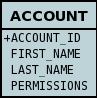
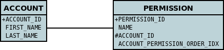

[[arrays]]
= Arrays
:_basedir: ../
:_imagesdir: images/

JPA defines support the persistence of arrays but only arrays of byte, Byte, char, Character. DataNucleus supports all types of arrays, as follows

* link:#array_singlecolumn[Single Column] - the array is byte-streamed into a single column in the table of the containing object.
* link:#array_join_nonpc[Simple array stored in JoinTable] - the array is stored in a "join" table, with a column in that table storing each element of the array
* link:#array_join[Entity array via JoinTable] - the array is stored via a "join" table, with FK across to the element Entity.
* link:#array_fk[Entity array via ForeignKey] - the array is stored via a FK in the element Entity.

[[array_singlecolumn]]
== Single Column Arrays (serialised)

Let's suppose you have a class something like this

[source,java]
-----
public class Account
{
    byte[] permissions;

    ...
}
-----

So we have an *Account* and it has a number of permissions, each expressed as a byte. 
We want to persist the permissions in a single-column into the table of the account. We then define MetaData something like this

[source,xml]
-----
<entity class="Account">
    <table name="ACCOUNT"/>
    <attributes>
        ...
        <basic name="permissions">
            <column name="PERMISSIONS"/>
            <lob/>
        </basic>
        ...
    </attributes>
</entity>
-----

This results in a datastore schema as follows

DataNucleus supports persistence of the following array types in this way :
_boolean[], byte[], char[], double[], float[], int[], long[], short[], Boolean[], Byte[], Character[], Double[], Float[], Integer[], Long[], Short[], BigDecimal[], BigInteger[]_

NOTE: When using PostgreSQL you can persist an array of _int, short, long, Integer, Short, Long_ into a column of type _int array_, or an array of _String_ into a column of type _text array_.

See also :-

* link:metadata_xml.html#basic[MetaData reference for <basic> element]
* link:annotations.html#Basic[Annotations reference for @Basic]

[[array_join_nonpc]]
== Simple array stored in join table

If you want an array of non-entity objects be stored in a "join" table, you can follow this example.
We have an *Account* that stores a Collection of addresses. These addresses are simply Strings. We define the annotations like this

[source,java]
-----
@Entity
public class Account
{
    ...

    @ElementCollection
    @CollectionTable(name="ACCOUNT_ADDRESSES")
    String[] addresses;
}
-----

or using XML metadata

[source,xml]
-----
<entity class="mydomain.Account">
    <attributes>
        ...
        <element-collection name="addresses">
            <collection-table name="ACCOUNT_ADDRESSES"/>
        </element-collection>
    </attributes>
</entity>
-----

In the datastore the following is created

image:../images/relationship_1_N_primitive_collection_db.png[]

Use `@Column` on the field/method to define the column details of the element in the join table.

[[array_join]]
== Entity array persisted into Join Tables

DataNucleus will support arrays persisted into a join table. Let's take the example of a class Account with an array of Permission objects, so we have

[source,java]
-----
public class Account
{
    ...

    Permission[] permissions;
}

public class Permission
{
    ...
}
-----

So an *Account* has an array of *Permission(s)*, and both of these objects are entities. We want to persist the relationship using a join table. We define the MetaData as follows

[source,java]
-----
@Entity
public class Account
{
    ...

    @OneToMany
    @JoinTable(name="ACCOUNT_PERMISSIONS", joinColumns={@Column(name="ACCOUNT_ID")}, inverseJoinColumns={@Column(name="PERMISSION_ID")})
    @OrderColumn(name="PERMISSION_ORDER_IDX")
    Permission[] permissions;
}

@Entity
public class Permission
{
    ...
}
-----

or using XML metadata

[source,xml]
-----
<entity class="mydomain.Account">
    <attributes>
        ...
        <one-to-many name="permissions">
            <join-table name="ACCOUNT_PERMISSIONS">
                <join-column name="ACCOUNT_ID"/>
                <inverse-join-column name="PERMISSION_ID"/>
            </join-table>
            <order-column name="PERMISSION_ORDER_IDX"/>
        </one-to-many>
    </attributes>
</entity>
<entity name="Permission" table="PERMISSION">
</entity>
-----

This results in a datastore schema as follows

[[array_fk]]
== Entity array persisted using Foreign-Keys

DataNucleus will support arrays persisted via a foreign-key in the element table. This is only applicable when the array is an entity. 
Let's take the same example above. So we have

[source,java]
-----
public class Account
{
    ...

    Permission[] permissions;
}

public class Permission
{
    ...
}
-----

So an *Account* has an array of *Permission(s)*, and both of these objects are entities. 
We want to persist the relationship using a foreign-key in the table for the Permission class. We define the MetaData as follows

[source,java]
-----
@Entity
public class Account
{
    @OneToMany
    @JoinColumn(name="ACCOUNT_ID")
    @OrderColumn(name="PERMISSION_ORDER_IDX")
    Permission[] permissions;

    ....
}

@Entity
public class Permission
{
    ...
}
-----

or using XML metadata

[source,xml]
-----
<entity class="mydomain.Account">
    <attributes>
        ...
        <one-to-many name="permissions">
            <join-column name="ACCOUNT_ID"/>
            <order-column name="PERMISSION_ORDER_IDX"/>
        </one-to-many>
    </attributes>
</entity>
<entity name="Permission" table="PERMISSION">
</entity>
-----

This results in a datastore schema as follows

