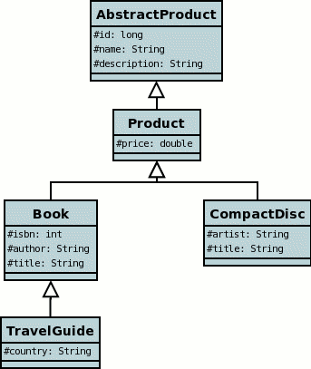
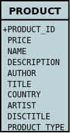
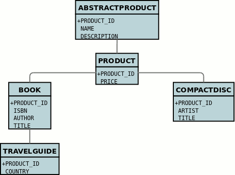
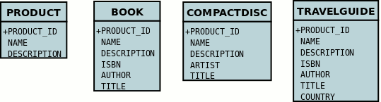

[[inheritance]]
= Inheritance
:_basedir: ../
:_imagesdir: images/

In Java it is a normal situation to have inheritance between classes. With JPA you have choices to make as to how you want to persist your classes for the inheritance tree. 
For each inheritance tree (for the root class) you select how you want to persist those classes information. You have the following choices.

* The _default strategy_ is to select a class to have its fields persisted in the table of the base class. There is only one table per inheritance hierarchy. 
In JPA this is known as link:#inheritance_singletable[SINGLE_TABLE]
* The next way is to have a table for each class in the inheritance hierarchy, and for each table to only hold columns for the fields of that class. 
Fields of superclasses are persisted into the table of the superclass. Consequently to get all field values for a subclass object a join is made
of all tables of superclasses. In JPA this is referred to as link:#inheritance_joined[JOINED]
* The third way is like _JOINED_ except that each table will also contain columns for all inherited fields. 
In JPA this is referred to as link:#inheritance_tableperclass[TABLE_PER_CLASS]

In order to demonstrate the various inheritance strategies we need an example. Here are a few simple classes representing products in a (online) store. 
We have an abstract base class, extending this to provide something that we can represent any product by. We then provide a few specialisations for 
typical products. We will use these classes later when defining how to persistent these objects in the different inheritance strategies

As mentioned, the default JPA strategy is "SINGLE_TABLE", namely that the base class will have a table and all subclasses will be persisted into that same table. 
So if you don't specify an "inheritance strategy" in your root class this is what you will get.

NOTE: *You must specify the identity of objects in the root persistable class of the inheritance hierarchy*. You cannot redefine it down the inheritance tree

See also:-

* link:metadata_xml.html#inheritance[MetaData reference for <inheritance> element]
* link:metadata_xml.html#discriminator-column[MetaData reference for <discriminator-column> element]
* link:annotations.html#Inheritance[Annotations reference for @Inheritance]
* link:annotations.html#DiscriminatorColumn[Annotations reference for @DiscriminatorColumn]

[[inheritance_discriminator]]
== Discriminator

NOTE: Applicable to RDBMS, HBase, MongoDB

A _discriminator_ is an extra "column" stored alongside data to identify the class of which that information is part. 
It is useful when storing objects which have inheritance to provide a quick way of determining the object type on retrieval. 
A discriminator in JPA will store the specified value (or the class name if you provide no value). You specify a discriminator as follows

[source,xml]
-----
<entity name="mydomain.Product">
    <discriminator-column name="OBJECT" discriminator-type="STRING"/>
    <discriminator-value>MyClass</discriminator-value>
    ...
-----

or with annotations

[source,java]
-----
@Entity
@DiscriminatorColumn(name="OBJECT_TYPE", discriminatorType=DiscriminatorType.STRING)
@DiscriminatorValue("MyClass")
public class Product {...}
-----

[[inheritance_singletable]]
== Strategy : SINGLE_TABLE

NOTE: Applicable to RDBMS

"SINGLE_TABLE" strategy is where the root class has a table and all subclasses are also persisted into that table. 
This corresponds to JDOs "new-table" for the root class and "superclass-table" for all subclasses. 
This has the advantage that retrieval of an object is a single DB call to a single table. 
It also has the disadvantage that the single table can have a very large number of columns, and database readability and performance can suffer, 
and additionally that a discriminator column is required. In our example, lets ignore the *AbstractProduct* class for a moment and 
assume that *Product* is the base class (with the "id"). We have no real interest in having separate tables for the *Book* and *CompactDisc* classes 
and want everything stored in a single table _PRODUCT_. We change our MetaData as follows

[source,xml]
-----
<entity name="Product">
    <inheritance strategy="SINGLE_TABLE"/>
    <discriminator-value>PRODUCT</discriminator-value>
    <discriminator-column name="PRODUCT_TYPE" discriminator-type="STRING"/>
    <attributes>
        <id name="id">
            <column name="PRODUCT_ID"/>
        </id>
        ...
    </attributes>
</entity>
<entity name="Book">
    <discriminator-value>BOOK</discriminator-value>
     ...
</entity>
<entity name="TravelGuide">
    <discriminator-value>TRAVELGUIDE</discriminator-value>
    ...
</entity>
<entity name="CompactDisc">
    <discriminator-value>COMPACTDISC</discriminator-value>
    ...
</entity>
-----

or using annotations

[source,java]
-----
@Entity
@Inheritance(strategy=InheritanceType.SINGLE_TABLE)
@DiscriminatorValue("PRODUCT")
@DiscriminatorColumn(name="PRODUCT_TYPE", discriminatorType=DiscriminatorType.STRING)
public class Product {...}

@Entity
@DiscriminatorValue("BOOK")
public class Book {...}

@Entity
@DiscriminatorValue("TRAVELGUIDE")
public class TravelGuide {...}

@Entity
@DiscriminatorValue("COMPACTDISC")
public class CompactDisc {...}
-----
 
This change of use of the *inheritance* element has the effect of using the PRODUCT table for all classes, containing the fields 
of *Product*, *Book*, *CompactDisc*, and *TravelGuide*. You will also note that we used a /discriminator-column_ element for 
the *Product* class. The specification above will result in an extra column (called PRODUCT_TYPE) being added to the PRODUCT table, 
and containing the "discriminator-value" of the object stored. 
So for a Book it will have "BOOK" in that column for example. This column is used in discriminating which row in the database is of which type. 
The final thing to note is that in our classes *Book* and *CompactDisc* we have a field that is identically named. 
With *CompactDisc* we have defined that its column will be called DISCTITLE since both of these fields will be persisted into the same table 
and would have had identical names otherwise - this gets around the problem.

In the above example, when we insert a TravelGuide object into the datastore, a row will be inserted into the PRODUCT table only.

NOTE: When using SINGLE-TABLE DataNucleus will always use a discriminator (default column name is DTYPE).

    
[[inheritance_joined]]
== Strategy : JOINED

NOTE: Applicable to RDBMS

"JOINED" strategy means that each entity in the inheritance hierarchy has its own table and that the table
of each class only contains columns for that class. Inherited fields are persisted into the tables of the superclass(es). 
This corresponds to JDO2s "new-table" (for all classes in the inheritance hierarchy).
This has the advantage of being the most normalised data definition. 
It also has the disadvantage of being slower in performance since multiple tables will need to be accessed to 
retrieve an object of a sub-type. Let's try an example using the simplest to understand strategy *JOINED*. 
We have the classes defined above, and we want to persist our classes each in their own table.
We define the Meta-Data for our classes like this

[source,xml]
-----
<entity class="AbstractProduct">
    <inheritance strategy="JOINED"/>
    <attributes>
        <id name="id">
            <column name="PRODUCT_ID"/>
        </id>
        ...
    </attributes>
</entity>
<entity class="Product">
    ...
</entity>
<entity class="Book">
    ...
</entity>
<entity class="TravelGuide">
    ...
</entity>
<entity class="CompactDisc">
    ...
</entity>
-----

or using annotations

[source,java]
-----
@Entity
@Inheritance(strategy=InheritanceType.JOINED)
public class Product {...}
-----

So we will have 5 tables - ABSTRACTPRODUCT, PRODUCT, BOOK, COMPACTDISC, and TRAVELGUIDE. 
They each contain just the fields for that class (and not any inherited fields, except the identity to join with).

In the above example, when we insert a TravelGuide object into the datastore, a row will be inserted into ABSTRACTPRODUCT, PRODUCT, BOOK, and TRAVELGUIDE.

[[inheritance_tableperclass]]
== Strategy : TABLE_PER_CLASS

NOTE: Applicable to all datastores

This strategy is like "JOINED" except that in addition to each class having its own table, the table also holds columns for all inherited fields. 
So taking the same classes as used above

[source,xml]
-----
<entity class="AbstractProduct">
    <inheritance strategy="TABLE_PER_CLASS"/>
    <attributes>
        <id name="id">
            <column name="PRODUCT_ID"/>
        </id>
        ...
    </attributes>
</entity>
<entity class="Product">
    ...
</entity>
<entity class="Book">
    ...
</entity>
<entity class="TravelGuide">
    ...
</entity>
<entity class="CompactDisc">
    ...
</entity>
-----

or using annotations

[source,java]
-----
@Entity
@Inheritance(strategy=InheritanceType.TABLE_PER_CLASS)
public class Product {...}
-----

This then implies a datastore schema as follows

So any object of explicit type *Book* is persisted into the table BOOK. 
Similarly any *TravelGuide* is persisted into the table TRAVELGUIDE, etc.
In addition if any class in the inheritance tree is abstract then it won't have a table since there cannot be any instances of that type.
*DataNucleus currently has limitations when using a class using this inheritance as the element of a collection.*

[[inheritance_mappedsuperclass]]
== Mapped Superclasses

JPA defines entities called "mapped superclasses" for the situation where you dont persist an actual object of a superclass type 
but that all subclasses of that type that are entities will also persist the values for the fields of the "mapped superclass". 
That is a "mapped superclass" has no table to store its objects in a datastore. Instead its fields are stored in the tables of 
its subclasses. Let's take an example

[source,xml]
-----
<mapped-superclass class="AbstractProduct">
    <attributes>
        <id name="id">
            <column name="PRODUCT_ID"/>
        </id>
        ...
    </attributes>
</mapped-superclass>

<entity class="Product">
    ...
</entity>
-----

In this case we will have a table for *Product* and the fields of *AbstractProduct* will be stored
in this table. If the mapping information (column names etc) for these fields need setting then you should use <attribute-override> in the MetaData for *Product*.
