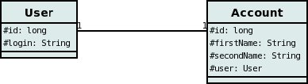

[[many_one_relations]]
= N-1 Relations
:_basedir: ../
:_imagesdir: images/

You have a N-to-1 relationship when an object of a class has an associated object of another class (only one 
associated object) and several of this type of object can be linked to the same associated object. From the
other end of the relationship it is effectively a 1-N, but from the point of view of the object in question,
it is N-1. You can create the relationship in 2 ways depending on whether the 2 classes know about each other
(bidirectional), or whether only the "N" side knows about the other class (unidirectional). 
These are described below.

NOTE: For RDBMS a N-1 relation is stored as a foreign-key column(s). For non-RDBMS it is stored as a String "column" storing the 'id' (possibly with the class-name 
included in the string) of the related object.

[[many_one_fk]]
== Unidirectional with ForeignKey

For this case you could have 2 classes, *User* and *Account*, as below.

so the *Account* class ("N" side) knows about the *User* class ("1" side), but not vice-versa. A particular user could be related to several accounts. 
If you define the Meta-Data for these classes as follows

[source,xml]
-----
<entity-mappings>
    <entity class="User">
        <table name="USER"/>
        <attributes>
            <id name="id">
                <column name="USER_ID"/>
            </id>
            ...
        </attributes>
    </entity>

    <entity class="Account">
        <table name="ACCOUNT"/>
        <attributes>
            <id name="id">
                <column name="ACCOUNT_ID"/>
            </id>
            ...
            <many-to-one name="user"/>
        </attributes>
    </entity>
</entity-mappings>
-----

alternatively using annotations

[source,java]
-----
public class Account
{
    ...

    @ManyToOne
    User user;
}
-----

This will create 2 tables in the database, one for *User* (with name _USER_), and one for *Account* (with name _ACCOUNT_), 
and a foreign-key in the _ACCOUNT_ table, just like for the case of a link:mapping.html#one_one_uni[@OneToOne relation].

Note that in the case of non-RDBMS datastores there is simply a "column" in the _ACCOUNT_ "table", storing the "id" of the related object*

[[many_one_join]]
== Unidirectional with JoinTable

For this case you could have 2 classes, *User* and *Account*, as below.

so the *Account* class ("N" side) knows about the *User* class ("1" side), but not vice-versa, and are using a join table. A particular user could be related to several accounts. 
If you define the Meta-Data for these classes as follows

[source,xml]
-----
<entity-mappings>
    <entity class="User">
        <table name="USER"/>
        <attributes>
            <id name="id">
                <column name="USER_ID"/>
            </id>
            ...
        </attributes>
    </entity>

    <entity class="Account">
        <table name="ACCOUNT"/>
        <attributes>
            <id name="id">
                <column name="ACCOUNT_ID"/>
            </id>
            ...
            <many-to-one name="user">
                <join-table name="ACCOUNT_USER"/>
            </many-to-one>
        </attributes>
    </entity>
</entity-mappings>
-----

alternatively using annotations

[source,java]
-----
public class Account
{
    ...

    @ManyToOne
    @JoinTable(name="ACCOUNT_USER")
    User user;
}
-----

This will create 3 tables in the database, one for *User* (with name _USER_), one for *Account* (with name _ACCOUNT_), and a join table (with name _ACCOUNT_USER_), as shown below.

image:../images/relationship_N_1_uni_db.png[]

*Note that in the case of non-RDBMS datastores there is no join-table, simply a "column" in the _ACCOUNT_ "table", storing the "id" of the related object*

== Bidirectional

This relationship is described in the guide for link:mapping.html#one_to_many_collection[1-N relationships]. In particular there are 2 ways to define the 
relationship for RDBMS : the link:mapping.html#one_to_many_collection_join_bi[first] uses a Join Table to hold the relationship, whilst the 
link:mapping.html#one_to_many_collection_fk_bi[second] uses a Foreign Key in the "N" object to hold the relationship. 
For non-RDBMS datastores each side will have a "column" (or equivalent) in the "table" of the N side storing the "id" of the related (owning) object.
Please refer to the 1-N relationships bidirectional relations since they show this exact relationship.

