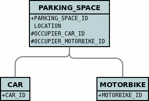
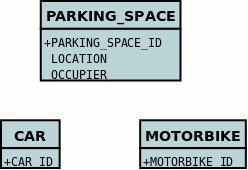

[[objectss]]
= java.lang.Object
:_basedir: ../
:_imagesdir: images/

image:../images/nucleus_extension.png[]

JPA doesn't specify support for persisting fields of type java.lang.Object, however DataNucleus does support this where the values of that field 
are entities themselves.  This follows the same general process as for link:mapping.html#interfaces[Interfaces] since both 
interfaces and java.lang.Object are basically _references_ to some entity.

NOTE: java.lang.Object cannot be used to persist non-entities with fixed schema datastore (e.g RDBMS). Think of how you would expect it to be stored if you think it ought to

DataNucleus allows the following ways of persisting Object fields :-

* *per-implementation* : a FK is created for each "implementation" so that the datastore can provide referential integrity. The other advantage is that since there are FKs then
querying can be performed. The disadvantage is that if there are many implementations then the table can become large with many columns not used
* *identity* : a single column is added and this stores the class name of the "implementation" stored, as well as the identity of the object. The disadvantages are that
no querying can be performed, and that there is no referential integrity.
* *xcalia* : a slight variation on "identity" whereby there is a single column yet the contents of that column are consistent with what Xcalia XIC JDO implementation stored there.

The user controls which one of these is to be used by specifying the _extension_ *mapping-strategy* on the field containing the interface. 
The default is "per-implementation"

[[objects_one_one]]
== 1-1/N-1 Object Relation

Let's suppose you have a field in a class and you have a selection of possible persistable class that could be stored there, so you decide to make the field a _java.lang.Object_. 
So let's take an example. We have the following class

[source,java]
-----
public class ParkingSpace
{
    String location;
    Object occupier;
}
-----

So we have a space in a car park, and in that space we have an occupier of the space. We have some legacy data and so can't make the 
type of this "occupier" an interface type, so we just use _java.lang.Object_. Now we know that we can only have particular types of objects stored there 
(since there are only a few types of vehicle that can enter the car park).
 So we define our annotations like this

[source,java]
-----
@Entity
public class ParkingSpace
{
    String location;

    @OneToOne
    @Extension(key="implementation-classes", value="mydomain.samples.vehicles.Car,mydomain.samples.vehicles.Motorbike")
    Object occupier;
}
-----

This will result in the following database schema.

So DataNucleus adds foreign keys from the ParkingSpace table to all of the possible implementation tables for the _occupier_ field.

In conclusion, when using "per-implementation" mapping for any java.lang.Object field in a class to be persisted (as non-serialised), you *must* define the possible 
"implementation" classes that can be stored there.

If we use *mapping-strategy* of "identity" then we get a different datastore schema.

[source,java]
-----
public class ParkingSpace
{
    String location;

    @OneToOne
    @Extension(key="implementation-classes", value="mydomain.samples.vehicles.Car,mydomain.samples.vehicles.Motorbike")
    @Extension(key="mapping-strategy", value="identity")
    Object occupier;
}
-----

and the datastore schema becomes

and the column "OCCUPIER" will contain strings such as _com.mydomain.samples.object.Car:1_ allowing retrieval of the related implementation object.

[[objects_one_many]]
== 1-N Object Relation

You can have a Collection/Map containing elements of java.lang.Object. You specify this in the same way as you would any Collection/Map. 
DataNucleus supports having a Collection of references with multiple implementation types as long as you use a join table relation.

[[objects_serialised]]
== Serialised Objects

By default a field of type _java.lang.Object_ is stored as an instance of the underlying entity in the table of that object. 
If either your Object field represents non-entities or you simply wish to serialise the Object into the same table as the owning object, 
you need to specify it as "lob", like this

[source,java]
-----
public class MyClass
{
    @Lob
    Object myObject;
}
-----

Please refer to the link:mapping.html#serialised_reference[serialised fields guide] for more details of storing objects in this way.
