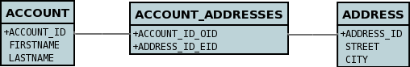
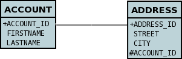

[[one_many_relations]]
= 1-N Relations
:_basedir: ../
:_imagesdir: images/

You have a 1-N (one to many) when you have one object of a class that has a Collection of objects of another class. 
*Please note that Collections allow duplicates, and so the persistence process reflects this with the choice of primary keys*. 
There are two principal ways in which you can represent this in a datastore : *Join Table* (where a join table is used to provide the relationship mapping 
between the objects), and *Foreign-Key* (where a foreign key is placed in the table of the object contained in the Collection.

The various possible relationships are described below.

* link:#one_many_join_uni[Collection<Entity> - Unidirectional using join table]
* link:#one_many_fk_uni[Collection<Entity> - Unidirectional using foreign-key]
* link:#one_many_join_bi[Collection<Entity> - Bidirectional using join table]
* link:#one_many_fk_bi[Collection<Entity> - Bidirectional using foreign-key]
* link:#one_many_list[List<Entity>]
* link:#one_many_nonpc_join[Collection<Simple> using join table]
* link:#one_many_nonpc_converter[Collection<Simple> using AttributeConverter into single column]
* link:#one_many_shared_join[Collection<Entity> using shared join table] (DataNucleus Extension)
* link:#one_many_shared_fk[Collection<Entity> using shared foreign key] (DataNucleus Extension)
* link:#one_many_map_join_simple_pc[Map<Simple, Entity> using join table]
* link:#one_many_map_join_pc_pc[Map<Entity, Entity> using join table]
* link:#one_many_map_join_simple_simple[Map<Simple, Simple> using join table]
* link:#one_many_map_converter_simple_simple[Map<Simple, Simple> using AttributeConverter into single column]
* link:#one_many_map_join_pc_simple[Map<Entity, Simple> using join table]
* link:#one_many_map_fk_uni_key[Map<Simple,Entity> - Unidirectional using foreign-key (key stored in the value class)]
* link:#one_many_map_fk_bi_key[Map<Simple,Entity> - Bidirectional using foreign-key (key stored in the value class)]

NOTE: RDBMS supports the full range of options on this page, whereas other datastores (ODF, Excel, HBase, MongoDB, etc) persist the Collection in a 
column in the owner object (as well as a column in the non-owner object when bidirectional) rather than using join-tables or foreign-keys since those concepts are RDBMS-only.

== equals() and hashCode()

*Important : The element of a Collection ought to define the methods _equals_ and _hashCode_ so that updates are detected correctly.* 
This is because any Java Collection will use these to determine equality and whether an element is _contained_ in the Collection.
Note also that the hashCode() should be consistent throughout the lifetime of a persistable object. 
By that we mean that it should *not* use some basis before persistence and then use some other basis (such as the object identity) after persistence in the equals/hashCode methods.

[[one_many_join_uni]]
== Collection<Entity> Unidirectional JoinTable

We have 2 sample classes *Account* and *Address*. These are related in such a way as *Account* contains a _Collection_ of objects of type *Address*, yet each *Address* 
knows nothing about the *Account* objects that it relates to. Like this

[source,java]
-----
public class Account
{
    Collection<Address> addresses

    ...
}

public class Address
{
    ...
}
-----

If you define the annotations of the classes like this

[source,java]
-----
public class Account
{
    ...

    @OneToMany
    @JoinTable(name="ACCOUNT_ADDRESSES", 
        joinColumns={@JoinColumn(name="ACCOUNT_ID_OID")},
        inverseJoinColumns={@JoinColumn(name="ADDRESS_ID_EID")})
    Collection<Address> addresses
}

public class Address
{
    ...
}
-----

or using XML

[source,xml]
-----
<entity-mappings>
    <entity class="Account">
        <table name="ACCOUNT"/>
        <attributes>
            ...
            <one-to-many name="addresses">
                <join-table name="ACCOUNT_ADDRESSES">
                    <join-column name="ACCOUNT_ID_OID"/>
                    <inverse-join-column name="ADDRESS_ID_EID"/>
                </join-table>
            </one-to-many>
        </attributes>
    </entity>

    <entity class="Address">
        <table name="ADDRESS"/>
         ...
    </entity>
</entity-mappings>
-----

NOTE: The crucial part is the `join-table` element on the field element (`@JoinTable` annotation) - this signals to JPA to use a join table.

This will create 3 tables in the database, one for *Address*, one for *Account*, and a join table, as shown below.

The join table is used to link the 2 classes via foreign keys to their primary key. This is useful where you want to retain the independence of one class from the other class.

If you wish to fully define the schema table and column names etc, follow these tips

* To specify the name of the table where a class is stored, specify the _table_ element below the *class* element
* To specify the names of the columns where the fields of a class are stored, specify the  _column_ attribute on the `basic` element.
* To specify the name of the join table, specify the _join-table_ element below the *one-to-many* element with the collection.
* To specify the names of the join table columns, use the `join-column` and `inverse-join-column` elements below the `join-table` element.
* If the field type is Set then the join table will be given a primary key (since a Set cannot have duplicates), whereas for other Collection types 
it will not have a primary key (since duplicates are allowed).

[[one_many_fk_uni]]
== Collection<Entity> Unidirectional FK

We have the same classes *Account* and *Address* as above for the join table case, but this time we will store the "relation" as a _foreign key_ in the *Address* class. 
So we define the annotations like this

[source,java]
-----
public class Account
{
    ...

    @OneToMany
    @JoinColumn(name="ACCOUNT_ID")
    Collection<Address> addresses
}

public class Address
{
    ...
}
-----

or using XML metadata

[source,xml]
-----
<entity-mappings>
    <entity class="Account">
        <table name="ACCOUNT"/>
        <attributes>
            ...
            <one-to-many name="addresses">
                <join-column name="ACCOUNT_ID"/>
            </one-to-many>
        </attributes>
    </entity>

    <entity class="Address">
        <table name="ADDRESS"/>
        ...
    </entity>
</entity-mappings>
-----

NOTE: you MUST specify the join-column here otherwise it defaults to a join table with JPA!

There will be 2 tables, one for *Address*, and one for *Account*. If you wish to specify the names of the column(s) used in the schema for the foreign key in the *Address* 
table you should use the _join-column_ element within the field of the collection.

In terms of operation within your classes of assigning the objects in the relationship. You have to take your *Account* object and add the *Address* 
to the *Account* collection field since the *Address* knows nothing about the *Account*.

If you wish to fully define the schema table and column names etc, follow these tips

* To specify the name of the table where a class is stored, specify the _table_ element below the *class* element
* To specify the names of the columns where the fields of a class are stored, specify the _column_ attribute on the *basic* element.

TIP: Since each Address object can have at most one owner (due to the "Foreign Key") this mode of persistence will not allow duplicate values in the Collection. 
If you want to allow duplicate Collection entries, then use the "Join Table" variant above.

[[one_many_join_bi]]
== Collection<Entity> Bidirectional JoinTable

We have our 2 sample classes *Account* and *Address*. These are related in such a way as *Account* contains a _Collection_ of objects of type *Address*, 
and now each *Address* has a reference to the *Account* object that it relates to. Like this

[source,java]
-----
public class Account
{
    Collection<Address> addresses;

    ...
}

public class Address
{
    Account account;

    ...
}
-----

If you define the annotations for these classes as follows

[source,java]
-----
public class Account
{
    ...

    @OneToMany(mappedBy="account")
    @JoinTable(name="ACCOUNT_ADDRESSES", 
        joinColumns={@JoinColumn(name="ACCOUNT_ID_OID")},
        inverseJoinColumns={@JoinColumn(name="ADDRESS_ID_EID")})
    Collection<Address> addresses;
}

public class Address
{
    ...

    @ManyToOne
    Account account;
}
-----

or alternatively using XML

[source,xml]
-----
<entity-mappings>
    <entity class="Account">
        <table name="ACCOUNT"/>
        <attributes>
            ...
            <one-to-many name="addresses" mapped-by="account">
                <join-table name="ACCOUNT_ADDRESSES">
                    <join-column name="ACCOUNT_ID_OID"/>
                    <inverse-join-column name="ADDRESS_ID_EID"/>
                </join-table>
            </one-to-many>
        </attributes>
    </entity>

    <entity class="Address">
        <table name="ADDRESS"/>
        <attributes>
            ...
            <many-to-one name="account"/>
        </attributes>
    </entity>
</entity-mappings>
-----

NOTE: The crucial part is the `join-table` element on the field element (or `@JoinTable` annotation) - this signals to JPA to use a join table.

This will create 3 tables in the database, one for *Address*, one for *Account*, and a join table, as shown below.

The join table is used to link the 2 classes via foreign keys to their primary key. This is useful where you want to retain the independence of one class from the other class.

If you wish to fully define the schema table and column names etc, follow these tips

* To specify the name of the table where a class is stored, specify the _table_ element below the `<class>` element
* To specify the names of the columns where the fields of a class are stored, specify the _column_ attribute on the `<basic>` element.
* To specify the name of the join table, specify the _join-table_ element below the `<one-to-many>` element with the collection.
* To specify the names of the join table columns, use the `<join-column>` and `<inverse-join-column>` elements below the `<join-table>` element.
* If the field type is a Set then the join table will be given a primary key (since a Set cannot have duplicates), whereas for other Collection types no primary key is assigned.
* When forming the relation please make sure that *you set the relation at BOTH sides* since DataNucleus would have no way of knowing which end is correct if you only set one end.

[[one_many_fk_bi]]
== Collection<Entity> Bidirectional FK

We have the same classes *Account* and *Address* as above for the join table case, but this time we will store the "relation" as a _foreign key_ in the *Address* class. 
If you define the annotations for these classes as follows

[source,java]
-----
public class Account
{
    ...

    @OneToMany(mappedBy="account")
    @JoinColumn(name="ACCOUNT_ID")
    Collection<Address> addresses
}

public class Address
{
    ...

    @ManyToOne
    Account account;
}
-----

or alternatively using XML metadata

[source,xml]
-----
<entity-mappings>
    <entity class="Account">
        <table name="ACCOUNT"/>
        <attributes>
            ...
            <one-to-many name="addresses" mapped-by="account">
                <join-column name="ACCOUNT_ID"/>
            </one-to-many>
        </attributes>
    </entity>

    <entity class="Address">
        <table name="ADDRESS"/>
        <attributes>
            ...
            <many-to-one name="account"/>
        </attributes>
    </entity>
</entity-mappings>
-----

NOTE: The crucial part is the _mapped-by_ attribute of the field on the "1" side of the relationship. This tells the JPA implementation to look for a field 
called _account_ on the *Address* class.

This will create 2 tables in the database, one for *Address* (including an `ACCOUNT_ID` to link to the `ACCOUNT` table), and one for *Account*. 
Notice the subtle difference to this set-up to that of the *Join Table* relationship earlier.

If you wish to fully define the schema table and column names etc, follow these tips

* To specify the name of the table where a class is stored, specify the _table_ element below the *class*element
* To specify the names of the columns where the fields of a class are stored, specify the _column_ attribute on the *basic* element.
* When forming the relation please make sure that *you set the relation at BOTH sides* since DataNucleus would have no way of knowing which end is correct if you only set one end.

TIP: Since each Address object can have at most one owner (due to the "Foreign Key") this mode of persistence will not allow duplicate values in the Collection. 
If you want to allow duplicate Collection entries, then use the "Join Table" variant above.

[[one_many_list]]
== Using a List

In the case of the relation field being a List (i.e ordered), you define the relation just like you would for a Collection (above) but then define whether 
you want the relation to be either _ordered_ or _indexed_. 

In the case of _ordered_ you would add the following to the metadata of the field

[source,java]
-----
@OrderBy("city")
-----

or using XML

[source,xml]
-----
<order-by>city</order-by>
-----

This means that when the elements of the List are retrieved then they will be ordered according to the _city_ field of the element.

If instead you want an _indexed_ list then the elements will have an index stored against them, hence preserving the order in which they were in the original List. This
adds a surrogate column to either the table of the element (when using _foreign key_) or to the join table.

[source,java]
-----
@OrderColumn("ORDERING")
-----

or using XML

[source,xml]
-----
<order-column>ORDERING</order-column>
-----

[[one_many_nonpc_join]]
== Collection<Simple> via JoinTable

All of the examples above show a 1-N relationship between 2 entities.
If you want the element to be primitive or Object types then follow this section. For example, when you have a Collection of Strings. 
This will be persisted in the same way as the "Join Table" examples above. A join table is created to hold the collection elements. 
Let's take our example. We have an *Account* that stores a Collection of addresses. 
These addresses are simply Strings. We define the annotations like this

[[source,java]]
-----
@Entity
public class Account
{
    ...

    @ElementCollection
    @CollectionTable(name="ACCOUNT_ADDRESSES")
    Collection<String> addresses;
}
-----

or using XML metadata

[source,xml]
-----
<entity class="mydomain.Account">
    <attributes>
        ...
        <element-collection name="addresses">
            <collection-table name="ACCOUNT_ADDRESSES"/>
        </element-collection>
    </attributes>
</entity>
-----

In the datastore the following is created

image:../images/relationship_1_N_primitive_collection_db.png[]

The `ACCOUNT` table is as before, but this time we only have the "join table". Use `@Column` on the field/method to define the column details of the element in the join table.

[[one_many_nonpc_converter]]
== Collection<Simple> using AttributeConverter via column

Just like in the above example, here we have a Collection of simple types. In this case we are wanting to store this Collection into a single column in the owning table. 
We do this by using a JPA AttributeConverter.

[source,java]
-----
public class Account
{
    ...

    @ElementCollection
    @Convert(CollectionStringToStringConverter.class)
    @Column(name="ADDRESSES")
    Collection<String> addresses;
}
-----

and then define our converter. You can clearly define your conversion process how you want it. You could, for example, convert the
Collection into comma-separated strings, or could use JSON, or XML, or some other format.

[source,java]
-----
public class CollectionStringToStringConverter implements AttributeConverter<Collection<String>, String>
{
    public String convertToDatabaseColumn(Collection<String> attribute)
    {
        if (attribute == null)
        {
            return null;
        }

        StringBuilder str = new StringBuilder();
        ... convert Collection to String
        return str.toString();
    }

    public Collection<String> convertToEntityAttribute(String columnValue)
    {
        if (columnValue == null)
        {
            return null;
        }

        Collection<String> coll = new HashSet<String>();
        ... convert String to Collection
        return coll;
    }
}
-----

[[one_many_shared_join]]
== Collection<Entity> via Shared JoinTable

image:../images/nucleus_extension.png[]

The relationships using join tables shown above rely on the join table relating to the relation in question.
DataNucleus allows the possibility of sharing a join table between relations. The example below demonstrates this. 
We take the example as link:#one_many_join_uni[show above] (1-N Unidirectional Join table relation), and extend *Account* to have 2 collections of *Address* records. 
One for home addresses and one for work addresses, like this

[source,java]
-----
public class Account
{
    Collection<Address> workAddresses;

    Collection<Address> homeAddresses;

    ...
}
-----

We now change the metadata we had earlier to allow for 2 collections, but sharing the join table

[source,java]
-----
import org.datanucleus.api.jpa.annotations.SharedRelation;

public class Account
{
    @OneToMany
    @JoinTable(name="ACCOUNT_ADDRESSES", 
        joinColumns={@JoinColumn(name="ACCOUNT_ID_OID")},
        inverseJoinColumns={@JoinColumn(name="ADDRESS_ID_EID")})
    @SharedRelation(column="ADDRESS_TYPE", value="work")
    Collection<Address> workAddresses;

    @OneToMany
    @JoinTable(name="ACCOUNT_ADDRESSES", 
        joinColumns={@JoinColumn(name="ACCOUNT_ID_OID")},
        inverseJoinColumns={@JoinColumn(name="ADDRESS_ID_EID")})
    @SharedRelation(column="ADDRESS_TYPE", value="home")
    Collection<Address> homeAddresses;

    ...
}
-----

or using XML metadata

[source,xml]
-----
<entity-mappings>
    <entity class="Account">
        <table name="ACCOUNT"/>
        <attributes>
            ...
            <one-to-many name="workAddresses">
                <join-table name="ACCOUNT_ADDRESSES">
                    <join-column name="ACCOUNT_ID_OID"/>
                    <inverse-join-column name="ADDRESS_ID_EID"/>
                </join-table>
                <extension key="relation-discriminator-column" value="ADDRESS_TYPE"/>
                <extension key="relation-discriminator-value" value="work"/>
                <!--extension key="relation-discriminator-pk" value="true"/-->
            </one-to-many>
            <one-to-many name="homeAddresses">
                <join-table name="ACCOUNT_ADDRESSES">
                    <join-column name="ACCOUNT_ID_OID"/>
                    <inverse-join-column name="ADDRESS_ID_EID"/>
                </join-table>
                <extension key="relation-discriminator-column" value="ADDRESS_TYPE"/>
                <extension key="relation-discriminator-value" value="home"/>
                <!--extension key="relation-discriminator-pk" value="true"/-->
            </one-to-many>
        </attributes>
    </entity>

    <entity class="Address">
        <table name="ADDRESS"/>
         ...
    </entity>
</entity-mappings>
-----

So we have defined the same join table for the 2 collections `ACCOUNT_ADDRESSES`, and the same columns in the join table, meaning that we will be 
sharing the same join table to represent both relations. The important step is then to define the 3 DataNucleus _extension_ tags. 
These define a column in the join table (the same for both relations), and the value that will be populated when a row of that collection is
inserted into the join table. In our case, all "home" addresses will have a value of "home" inserted into this column, and all "work" addresses will have "work" inserted. 
This means we can now identify easily which join table entry represents which relation field.

This results in the following database schema

image:../images/relationship_1_N_uni_join_shared_db.png[]

[[one_many_shared_fk]]
== Collection<Entity> via Shared FK

image:../images/nucleus_extension.png[]

The relationships using foreign keys shown above rely on the foreign key relating to the relation in question.
DataNucleus allows the possibility of sharing a foreign key between relations between the same classes. 
The example below demonstrates this. We take the example as link:#one_many_fk_uni[show above] (1-N Unidirectional Foreign Key relation), 
and extend *Account* to have 2 collections of *Address* records. One for home addresses and one for work addresses, like this

[source,java]
-----
public class Account
{
    Collection<Address> workAddresses;

    Collection<Address> homeAddresses;

    ...
}
-----

We now change the metadata we had earlier to allow for 2 collections, but sharing the join table

[source,java]
-----
import org.datanucleus.api.jpa.annotations.SharedRelation;

public class Account
{
    ...

    @OneToMany
    @SharedRelation(column="ADDRESS_TYPE", value="work")
    Collection<Address> workAddresses;

    @OneToMany
    @SharedRelation(column="ADDRESS_TYPE", value="home")
    Collection<Address> homeAddresses;

    ...
}
-----

or using XML metadata

[source,xml]
-----
<entity-mappings>
    <entity class="Account">
        <table name="ACCOUNT"/>
        <attributes>
            ...
            <one-to-many name="workAddresses">
                <join-column name="ACCOUNT_ID_OID"/>
                <extension key="relation-discriminator-column" value="ADDRESS_TYPE"/>
                <extension key="relation-discriminator-value" value="work"/>
            </one-to-many>
            <one-to-many name="homeAddresses">
                <join-column name="ACCOUNT_ID_OID"/>
                <extension key="relation-discriminator-column" value="ADDRESS_TYPE"/>
                <extension key="relation-discriminator-value" value="home"/>
            </one-to-many>
        </attributes>
    </entity>

    <entity class="Address">
        <table name="ADDRESS"/>
        ...
    </entity>
</entity-mappings>
-----

We have defined the same foreign key for the 2 collections, named `ACCOUNT_ID_OID`, The important step is then to define the 2 DataNucleus _extension_ tags (`@SharedRelation` annotation). 
These define a column in the element table (the same for both relations), and the value that will be populated when a row of that collection is inserted into the element table. 
In our case, all "home" addresses will have a value of "home" inserted into this column, and all "work" addresses will have "work" inserted. 
This means we can now identify easily which element table entry represents which relation field.

This results in the following database schema

image:../images/relationship_1_N_uni_fk_shared_db.png[]

[[one_many_map_join_simple_pc]]
== Map<Simple, Entity> via JoinTable

We have a class *Account* that contains a Map of Address objects.
Here our key is a simple type (in this case a String) and the values are entities. Like this

[source,java]
-----
public class Account
{
    Map<String, Address> addresses;

    ...
}

public class Address {...}
-----

If you define the annotations for these classes as follows

[source,java]
-----
@Entity
public class Account
{
    @OneToMany
    @JoinTable
    Map<String, Address> addresses;

    ...
}

@Entity
public class Address {...}
-----

This will create 3 tables in the datastore, one for *Account*, one for *Address* and a join table also containing the key.

image:../images/relationship_1_N_uni_map_simple_pc_db.png[]

You can configure the names of the key column(s) in the join table using the _joinColumns_ attribute of `@CollectionTable`, or the names of the value 
column(s) using `@Column` for the field/method.

NOTE: The column `ADPT_PK_IDX` is added by DataNucleus _when_ the column type of the key is not valid to be part of a primary key (with the RDBMS being used). 
If the column type of your key is acceptable for use as part of a primary key then you will not have this `ADPT_PK_IDX` column.

[[one_many_map_join_simple_simple]]
== Map<Simple, Simple> via JoinTable

Here our keys and values are of simple types (in this case a String). Like this

[source,java]
-----
public class Account
{
    Map<String, String> addresses;

    ...
}
-----

If you define the annotations for these classes as follows

[source,java]
-----
@Entity
public class Account
{
    @ElementCollection
    @CollectionTable
    Map<String, String> addresses;

    ...
}
-----

This results in just 2 tables. The "join" table contains both the key AND the value.

image:../images/relationship_1_N_uni_map_simple_simple_db.png[]

You can configure the names of the key column(s) in the join table using the _joinColumns_ attribute of `@CollectionTable`, or the names of the value 
column(s) using `@Column` for the field/method.

Please note that the column `ADPT_PK_IDX` is added by DataNucleus _when_ the column type of the key is not valid to be part of a primary key 
(with the RDBMS being used). If the column type of your key is acceptable for use as part of a primary key then you will not have this `ADPT_PK_IDX` column.

[[one_many_map_converter_simple_simple]]
== Map<Simple, Simple> using AttributeConverter via column

Just like in the above example, here we have a Map of simple types. In this case we are wanting to store this Map into a single column in the owning table. 
We do this by using a JPA AttributeConverter.

[source,java]
-----
public class Account
{
    ...

    @ElementCollection
    @Convert(MapStringStringToStringConverter.class)
    @Column(name="ADDRESSES")
    Map<String, String> addresses;
}
-----

and then define our converter. You can clearly define your conversion process how you want it. You could, for example, convert the
Map into comma-separated strings, or could use JSON, or XML, or some other format.

[source,java]
-----
public class MapStringStringToStringConverter implements AttributeConverter<Map<String, String>, String>
{
    public String convertToDatabaseColumn(Map<String, String> attribute)
    {
        if (attribute == null)
        {
            return null;
        }

        StringBuilder str = new StringBuilder();
        ... convert Map to String
        return str.toString();
    }

    public Map<String, String> convertToEntityAttribute(String columnValue)
    {
        if (columnValue == null)
        {
            return null;
        }

        Map<String, String> map = new HashMap<String, String>();
        ... convert String to Map
        return map;
    }
}
-----

[[one_many_map_join_pc_pc]]
== Map<Entity, Entity> via JoinTable

We have a class *Account* that contains a Map of Address objects. Here our key is an entity type and the values is an entity type also. Like this

[source,java]
-----
public class Account
{
    Map<Name, Address> addresses;

    ...
}

public class Name {...}

public class Address {...}
-----

If you define the annotations for these classes as follows

[source,java]
-----
@Entity
public class Account
{
    @OneToMany
    @JoinTable
    Map<Name, Address> addresses;

    ...
}

@Entity
public class Name {...}

@Entity
public class Address {...}
-----

This will create 4 tables in the datastore, one for *Account*, one for *Name*, one for *Address* and a join table to link them.

image:../images/relationship_1_N_uni_map_pc_pc_db.png[]

You can configure the names of the key column(s) in the join table using the _joinColumns_ attribute of `@JoinTable`, or the names of the value 
column(s) using `@Column` for the field/method.

NOTE: The column `ADPT_PK_IDX` is added by DataNucleus _when_ the column type of the key is not valid to be part of a primary key (with the RDBMS being used). 
If the column type of your key is acceptable for use as part of a primary key then you will not have this `ADPT_PK_IDX` column.

[[one_many_map_join_pc_simple]]
== Map<Entity, Simple> via JoinTable

Here our key is an entity type and the value is a simple type (in this case a String).

NOTE: JPA does NOT properly allow for this in its specification. Other implementations introduced the following hack so we also provide it.
Note that there is no `@OneToMany` annotation here so this is seemingly not a relation to JPA (hence our description of this as a hack). Anyway use it to workaround JPA's lack of feature.

If you define the Meta-Data for these classes as follows

[source,java]
-----
@Entity
public class Account
{
    @ElementCollection
    @JoinTable
    Map<Address, String> addressLookup;

    ...
}

@Entity
public class Address {...}
-----

This will create 3 tables in the datastore, one for *Account*, one for *Address* and a join table also containing the value.

You can configure the names of the columns in the join table using the _joinColumns_ attributes of the various annotations.

[[one_many_map_fk_uni_key]]
== Map<Simple,Entity> Unidirectional FK (key stored in value)

In this case we have an object with a Map of objects and we're associating the objects using a foreign-key in the table of the value. 
We're using a field (_alias_) in the Address class as the key of the map.

[source,java]
-----
public class Account
{
    Map<String, Address> addresses;

    ...
}

public class Address
{
    String alias;

    ...
}
-----

In this relationship, the *Account* class has a Map of *Address* objects, yet the *Address* knows nothing about the *Account*. 
In this case we don't have a field in the Address to link back to the Account and so DataNucleus has to use columns in the datastore representation of 
the *Address* class. So we define the annotations like this

[source,java]
-----
@Entity
public class Account
{
    @OneToMany
    @MapKey(name="alias")
    @JoinColumn(name="ACCOUNT_ID_OID")
    Map<String, Address> addresses;

    ...
}

@Entity
public class Address
{
    String alias;

    ...
}
-----

or using XML metadata

[source,xml]
-----
<entity-mappings>
    <entity class="Account">
        <table name="ACCOUNT"/>
        <attributes>
            ...
            <one-to-many name="addresses">
                <map-key name="alias"/>
                <join-column name="ACCOUNT_ID_OID"/>
            </one-to-many>
        </attributes>
    </entity>

    <entity class="Address">
        <table name="ADDRESS"/>
        <attributes>
            ...
            <basic name="alias">
                <column name="KEY" length="20"/>
            </basic>
        </attributes>
    </entity>
</entity-mappings>
-----

Again there will be 2 tables, one for *Address*, and one for *Account*. If you wish to specify the names of the columns used in the schema for the foreign key in the 
*Address* table you should use the _join-column_ element within the field of the map.

image:../images/relationship_1_N_map_key_in_value_db.png[]

In terms of operation within your classes of assigning the objects in the relationship. You have to take your *Account* object and add the *Address* to the *Account* map field since the 
*Address* knows nothing about the *Account*. Also be aware that each *Address* object can have only one owner, since it has a single foreign key to the *Account*.

[[one_many_map_fk_bi_key]]
== Map<Simple,Entity> Bidirectional FK (key stored in value)

In this case we have an object with a Map of objects and we're associating the objects using a foreign-key in the table of the value.

[source,java]
-----
public class Account
{
    long id;

    Map<String, Address> addresses;

    ...
}

public class Address
{
    long id;

    String alias;

    Account account;

    ...
}
-----

With these classes we want to store a foreign-key in the value table `ADDRESS`, and we want to use the "alias" field in the Address class as the key to the map. 
If you define the Meta-Data for these classes as follows

-----
<entity-mappings>
    <entity class="Account">
        <table name="ACCOUNT"/>
        <attributes>
            ...
            <one-to-many name="addresses" mapped-by="account">
                <map-key name="alias"/>
            </one-to-many>
        </attributes>
    </entity>

    <entity class="Address">
        <table name="ADDRESS"/>
        <attributes>
            ...
            <basic name="alias">
                <column name="KEY" length="20"/>
            </basic>
            <many-to-one name="account">
                <join-column name="ACCOUNT_ID_OID"/>
            </many-to-one>
        </attributes>
    </entity>
</entity-mappings>
-----

This will create 2 tables in the datastore. One for *Account*, and one for *Address*. 
The table for *Address* will contain the key field as well as an index to the *Account* record (notated by the _mapped-by_ tag).

image:../images/relationship_1_N_map_key_in_value_db.png[]

