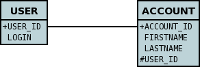

[[one_one_relations]]
= 1-1 Relations
:_basedir: ../
:_imagesdir: images/

You have a 1-to-1 relationship when an object of a class has an associated object of another class (only 
one associated object). It could also be between an object of a class and another object of the same class 
(obviously). You can create the relationship in 2 ways depending on whether the 2 classes know about each 
other (bidirectional), or whether only one of the classes knows about the other class (unidirectional). 
These are described below.

NOTE: For RDBMS a 1-1 relation is stored as a foreign-key column(s). For non-RDBMS it is stored as a String "column" storing the 'id' 
(possibly with the class-name included in the string) of the related object.

NOTE: DataNucleus does not support a 1-1 relation using a join table. It is not a use-case that is very common. 
You could look at N-1 unidirectional using join table if you really want to do this

[[one_one_uni]]
== Unidirectional

For this case you could have 2 classes, *User* and *Account*, as below.

[source,java]
-----
public class Account
{
    User user;
}

public class User
{
    ...
}
-----

so the *Account* class knows about the *User* class, but not vice-versa. If you define the annotations for these classes as follows

[source,java]
-----
@Entity
public class Account
{
    ...

    @OneToOne
    @JoinColumn(name="USER_ID")
    User user;
}

@Entity
public class User
{
    ...
}
-----

or using XML metadata

[source,xml]
-----
<entity-mappings>
    <entity class="User">
        <table name="USER"/>
        <attributes>
            <id name="id">
                <column name="USER_ID"/>
            </id>
            ...
    </entity>

    <entity class="Account">
        <table name="ACCOUNT"/>
        <attributes>
            <id name="id">
                <column name="ACCOUNT_ID"/>
            </id>
            ...
            <one-to-one name="user">
                <join-column name="USER_ID"/>
            </one-to-one>
        </attributes>
    </entity>
</entity-mappings>
-----

This will create 2 tables in the database, one for *User* (with name _USER_), and one for *Account* (with name _ACCOUNT_ and a column _USER_ID_), as shown below.

image:../images/relationship_1_1_uni_db.png[]

NOTE: *Account* has the object reference to *User* (and so is the "owner" of the relation) and so its table holds the foreign-key

NOTE: If you call _EntityManager.remove()_ on the end of a 1-1 unidirectional relation without the relation and that object is related to another object, 
an exception will typically be thrown (assuming the datastore supports foreign keys). To delete this record you should remove the other objects association first.

[[one_one_bi]]
== Bidirectional

For this case you could have 2 classes, *User* and *Account* again, but this time as below. Here the *Account* class knows about the *User* class, and also vice-versa.

[source,java]
-----
public class Account
{
    User user;

    ...
}

public class User
{
    Account account;

    ...
}
-----

We create the 1-1 relationship with a single foreign-key. To do this you define the annotations as

[source,java]
-----
@Entity
public class Account
{
    ...

    @OneToOne
    @JoinColumn(name="USER_ID")
    User user;
}

@Entity
public class User
{
    ...

    @OneToOne(mappedBy="user")
    Account account;

    ...
}
-----

or using XML metadata

[source,xml]
-----
<entity-mappings>
    <entity class="User">
        <table name="USER"/>
        <attributes>
            <id name="id">
                <column name="USER_ID"/>
            </id>
            ...
            <one-to-one name="account" mapped-by="user"/>
        </attributes>
    </entity>

    <entity class="Account">
        <table name="ACCOUNT"/>
        <attributes>
            <id name="id">
                <column name="ACCOUNT_ID"/>
            </id>
            ...
            <one-to-one name="user">
                <join-column name="USER_ID"/>
            </one-to-one>
        </attributes>
    </entity>
</entity-mappings>
-----

The difference is that we added _mapped-by_ to the field of *User* making it bidirectional (and putting the FK at the other side for RDBMS)

This will create 2 tables in the database, one for *User* (with name _USER_), and one for *Account* (with name _ACCOUNT_). For RDBMS it includes a _USER_ID_
column in the _ACCOUNT_ table, like this

For other types of datastore it will have a _USER_ID_ column in the _ACCOUNT_ table and a _ACCOUNT_ column in the _USER_ table.

NOTE: When forming the relation please make sure that *you set the relation at BOTH sides* since DataNucleus would have no way of knowing which end is correct if you only set one end.

