[[maven]]
= Netbeans
:_basedir: ../
:_imagesdir: images/

*This guide is based around Netbeans v7.0*

Perhaps the most important step in developing applications with DataNucleus is the enhancement of compiled classes. 
http://netbeans.org[NetBeans] provides a convenient way of integrating this procedure into the build process without the need for any additional tools or plugins. 
This is possible because NetBeans has native integration with Maven and Ant. 
Any DataNucleus project based on Maven will open and run as is with Netbeans. No changes are needed in the project nor in Netbeans. 
When using Ant Class enhancement thus becomes a simple matter of adding a new task to the existing `build.xml` generated by NetBeans.

This tutorial shows how to integrate DataNucleus with NetBeans 7.0 to simplify the development of JDO applications. 
*Please contribute any updates to this guide that you have since the developers of DataNucleus don't use Netbeans* 

== Requirements

The following components are required to complete this tutorial successfully:

* http://sourceforge.net/projects/datanucleus/files/datanucleus-accessplatform/[DataNucleus AccessPlatform]
* http://sourceforge.net/projects/datanucleus/files/datanucleus-samples/[DataNucleus Samples]
* http://netbeans.org/downloads/index.html[NetBeans]
* http://sourceforge.net/projects/hsqldb/files/[Hsqldb]

== Maven : Working with a DataNucleus Maven Project

NetBeans has native integration with Maven. If your project builds with Maven then it will also build with NetBeans without any change. 
Unzip the sample project to _$home/DNSamples/datanucleus-samples-jdo-tutorial-3.0_

The sample project comes with a `pom.xml`. When you try to open this project NetBeans will automatically detect it as maven project.

Start Netbeans

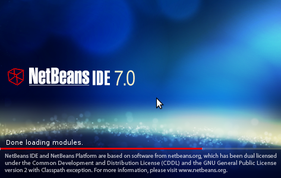

*Open Maven Project*

image:../images/netbeans/open_project.png[]

*Clean Build the project*

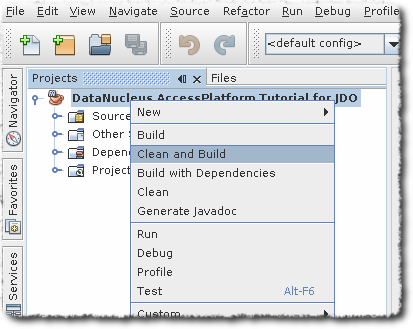

You will see a success message as below
-----
BUILD SUCCESS

Total time: 5.406s
Finished at: Fri Aug 05 09:23:53 IST 2011
Final Memory: 14M/108M
-----

*Run Main Class*

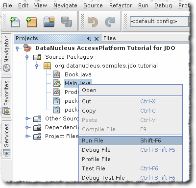

The results can be seen in the output window

-----
DataNucleus AccessPlatform with JPA

Persisting products
Product and Book have been persisted

Retrieving Extent for Products
>> Book : JRR Tolkien - Lord of the Rings by Tolkien
>> Product : Sony Discman [A standard discman from Sony]

Executing Query for Products with price below 150.00
>> Book : JRR Tolkien - Lord of the Rings by Tolkien

Deleting all products from persistence
Deleted 2 products

End of Tutorial

BUILD SUCCESS
Total time: 6.221s
Finished at: Fri Aug 05 09:27:43 IST 2011
Final Memory: 7M/106M
-----

== Setting up NetBeans for DataNucleus ANT use

The first thing to do is to register the DataNucleus components in the *Library Manager* of NetBeans 7 so that these become available to any project created with the IDE. 
This involves creating a new library and adding the JAR files to it, as shown in the following screenshots

*Open Library Manager*

image:../images/netbeans/ant_library.png[]

*Add New Library with Name DN3* - Repeat the process for DN3Deps

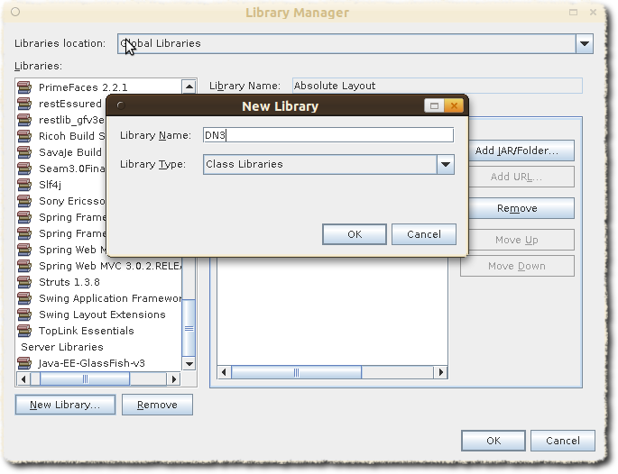

*Add all the libraries* under _$home/datanucleus-accessplatform-full-deps-3.0.0-release/lib_ to DN3. 
Add all the libraries under _$home/datanucleus-accessplatform-full-deps-3.0.0-release/deps_ to DN3Deps

Once this is done, the NetBeans 7 will add the JAR files to the classpath whenever the newly-created DN3 and DN3Deps library is selected for a project.

== Ant : Setting up a new project

Delete `pom.xml` from the downloaded samples project. NetBeans treats any folder with `pom.xml` as a Maven project. 
Copy the `datanucleus.properties` to src/java in the downloaded samples project.

*Now create a new project from existing sources.*

image:../images/netbeans/ant_new_project.png[]

Remember to Select *Java Project with Existing Source*

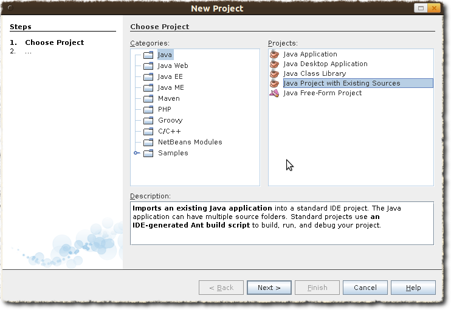

*Click Next and Add Folder*. The source folder should point to _datanucleus-samples-jdo-tutorial-3.0/src/java_

image:../images/netbeans/new_java_project_existing_sources.png[]

*Then click Next and Finish*

Now we have the sucessfuly created the sample project using Ant

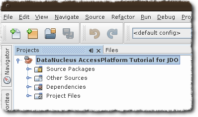

*Add the Libraries* created in first set to this project. Right-Click on Libraries in the Projects Tab

image:../images/netbeans/ant_add_libraries.png[]

*Add DN3 library* to your project. Also add DN3Deps 
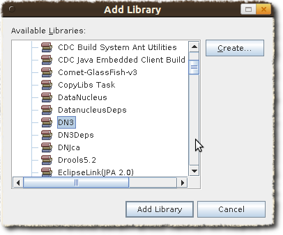

We also need to *add JDBC support to our project*. Add this using add "Add jars" option.
Right-Click on Libraries in the Projects Tab and select "Add jars"

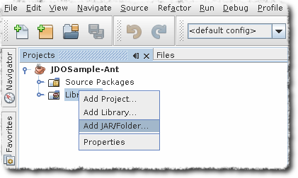

Add hsqldb

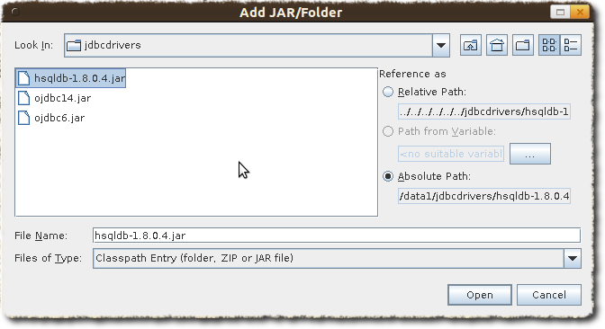

== Ant : Enhancing the classes

The enhancement process needs to be defined and integrated into the build process. 
As stated in the introduction, this requires a simple change to the `nbbuild.xml` file.

*TypeSafe Queries :-* Datanucleus generates additional code for supporting Criteria queries. 
Ensure that "Enable Annotation processing" check box is selected, which is under Project Properties | build | compiling 

Click on the *Files* tab, expand the project tree, then open `nbbuild.xml`

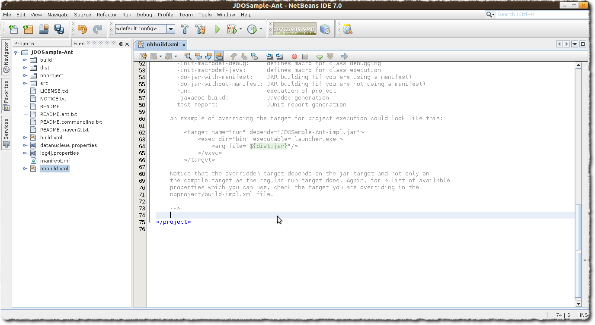

Override the * -post-compile * task/target with the following Ant instructions. 

[source,xml]
-----
<target name="-post-compile" depends="init">
    <path id="module.enhancer.classpath">
        <pathelement path="${javac.classpath}"/>
        <pathelement location="${build.classes.dir}"/>
    </path>
    <taskdef name="datanucleusenhancer" classpathref="module.enhancer.classpath" classname="org.datanucleus.enhancer.EnhancerTask"/>
    <echo message="start datanucleusenhancer"/>
    <datanucleusenhancer classpathref="module.enhancer.classpath" dir="${build.classes.dir}" verbose="true">
        <fileset dir="${build.classes.dir}">
            <include name="**/*.class"/>
        </fileset>
    </datanucleusenhancer>
    <echo message="end datanucleusenhancer"/>
</target>
-----

This target is the most convenient for enhancing classes because it occurs just after
all classes have been compiled and is called in any case, whether the project is being built, tested or deployed. 
This ensures that classes are always enhanced.

*Ensure that the Compile on Save option is turned off.* 

*Enable Annotation Processing should be turned ON*

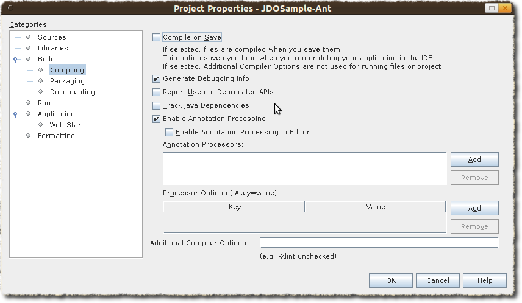

== Ant : Building the project

The project can now be built, with the knowledge that the classes will be enhanced in the process.

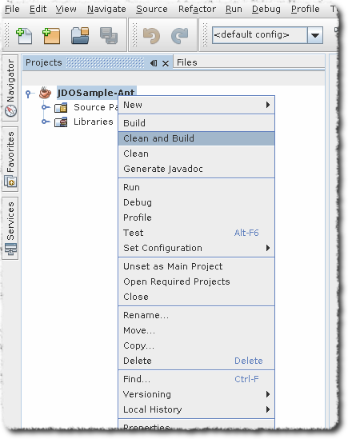

Output window will show some thing similar to this

-----
BUILD SUCCESSFUL (total time: 2 seconds)
-----

Run the main class. The output window will show as below

-----
Product and Book have been persisted

Retrieving Extent for Products
>> Book : JRR Tolkien - Lord of the Rings by Tolkien
>> Product : Sony Discman [A standard discman from Sony]

Executing Query for Products with price below 150.00
>> Book : JRR Tolkien - Lord of the Rings by Tolkien

Deleting all products from persistence
Deleted 2 products

End of Tutorial
BUILD SUCCESSFUL (total time: 2 seconds)
-----

== Conclusion

This concludes our tutorial on how to integrate DataNucleus with NetBeans 7. 
As can be seen, thanks to NetBeans project system based on Ant and Native Maven support, development of JDO applications is largely simplified. 
This tutorial was provided by a user of this software, Kiran Kumar.
